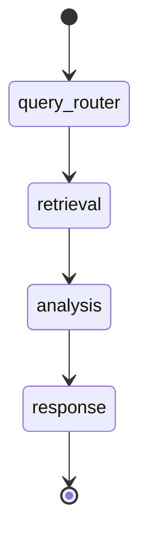
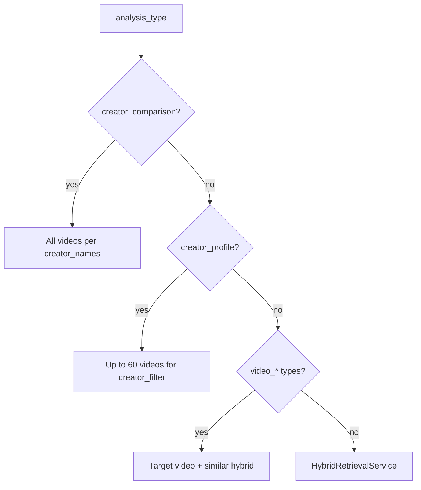
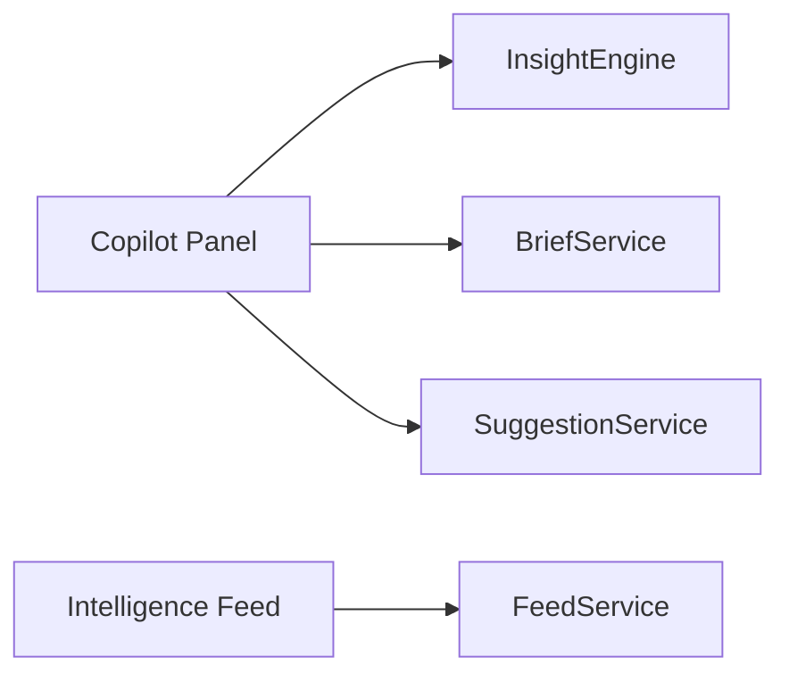

# AI Systems

ContentGraph Lite uses **three AI layers** that work together:

1. **Embeddings + hybrid retrieval** (always-on semantic search)
2. **LangGraph analytics pipeline** (chat: route → retrieve → analyze → respond)
3. **Copilot intelligence** (deterministic SQL insights + briefs, no full graph per page load)

Specialized **intelligence services** (hooks, scripts, video, comments, creators) are called from both REST APIs and the LangGraph `analysis` node.

---

## LangGraph Flow

### Graph build (`ai/graph.py`)

Per chat request, `AIChatService` builds a compiled graph with shared `AsyncSession`:

| Dependency | Used in |
|------------|---------|
| `ChatOpenAI` (gpt-4o-mini, temp 0.3) | router, analysis (some paths), response |
| `VideoService` | retrieval |
| `CreatorProfileService` | retrieval + analysis |
| `HookIntelligenceService` | analysis |
| `ScriptIntelligenceService` | analysis |
| `VideoIntelligenceService` | analysis |

---

## Node 1: Query Router

**File:** `backend/app/ai/nodes/query_router.py`

### Inputs

| Field | Source |
|-------|--------|
| `query` | User message |

### Outputs (structured `RouteDecision`)

| Field | Description |
|-------|-------------|
| `analysis_type` | One of 16 `AnalysisType` values |
| `search_terms` | Keywords for retrieval |
| `creator_filter` | Primary creator name |
| `creator_names` | 2–4 names for comparisons |
| `hook_type` | curiosity, identity, etc. |
| `topic` | Hook/script topic |
| `script_tone`, `script_duration` | Script generation params |
| `video_id` | Numeric ID when user references a video |

### Prompt strategy

- System prompt `ROUTER_SYSTEM` lists all analysis types with examples
- Uses `llm.with_structured_output(RouteDecision)` (Pydantic)
- Regex fallback extracts `video_id` from phrases like "video 42"

### Analysis types

| Type | Typical user question |
|------|----------------------|
| `creator_profile` | "What makes X successful?" |
| `creator_comparison` | "Compare X vs Y" |
| `creator_analysis` | Creator performance/tactics |
| `hook_analysis` | Which hooks work |
| `hook_generation` | Generate new hooks |
| `hook_comparison` | Compare hook types/creators |
| `script_generation` | Write a script |
| `script_analysis` | Analyze speaking style |
| `video_breakdown` | Why did this video work |
| `transcript_analysis` | Themes in transcript |
| `viral_analysis` | Viral factors / frameworks |
| `audience_analysis` | Audience reactions from comments |
| `comments_analysis` | Sentiment/themes in comments |
| `trend_analysis` | Cross-catalog trends |
| `title_analysis` | Title patterns |
| `general_chat` | Broad/unclear questions |

---

## Node 2: Retrieval

**File:** `backend/app/ai/nodes/retrieval.py`

### Logic branches

### Inputs

- `query`, `analysis_type`, `creator_filter`, `creator_names`, `search_terms`, `video_id`

### Outputs

- `relevant_videos: list[VideoSnapshot]` (id, title, views, transcript snippet, match_source, similarity)

### Retrieval details

| Mode | Behavior |
|------|----------|
| Creator comparison | Full catalogs per creator (up to 50 each) |
| Creator profile | Up to 60 videos for one creator |
| Video-focused types | Loads target video; may add semantically similar videos |
| Default | `VideoService.hybrid_retrieve()` with extracted keywords |
| Audience/comments | May attach comment snippets via `CommentsService` |

### Hybrid scoring (`HybridRetrievalService`)

| Signal | Role |
|--------|------|
| Title pgvector cosine | Primary semantic match |
| Transcript pgvector cosine | Deep content match |
| Keyword ILIKE | Boost on title/creator/transcript |
| Comment text match | Boost parent video + `comment_snippet` |
| Views normalization | Popularity prior |
| Creator filter | +0.08 boost when creator matches |

Weights: semantic 0.50, title 0.20, transcript 0.30, views 0.25, keyword 0.15 (combined in scoring function).

---

## Node 3: Analysis

**File:** `backend/app/ai/nodes/analysis.py`

### Inputs

- `analysis_type`, `relevant_videos`, filters, `video_id`, generation params

### Outputs

- `structured_analytics: StructuredAnalytics` (typed sub-objects)
- `metrics: AnalyticsMetrics` (counts, avg views, title stats)
- `analysis_results` (string summary for response node)

### Per-type processing

| analysis_type | Service / method | LLM? |
|---------------|------------------|------|
| `creator_profile` | `CreatorIntelService.generate_profile` + DB upsert | Yes |
| `creator_comparison` | `compare_creators` | Yes |
| `creator_analysis` | `CreatorAnalyticsService.analyze_with_llm` | Yes |
| `hook_analysis` | `HookAnalyticsService.analyze_with_llm` | Yes |
| `hook_generation` | `HookIntelligenceService.generate` | Yes |
| `hook_comparison` | `HookIntelligenceService.compare` | Yes |
| `script_generation` | `ScriptIntelligenceService.generate` | Yes |
| `script_analysis` | `ScriptIntelligenceService.analyze` | Yes |
| `video_breakdown` | `VideoIntelligenceService.breakdown` | Mixed |
| `transcript_analysis` | `VideoIntelligenceService.transcript_analysis` | Mixed |
| `viral_analysis` | `VideoIntelligenceService.viral_analysis` | Mixed |
| `audience_analysis` | `AudienceIntelligenceService` | Mostly deterministic |
| `comments_analysis` | Comments aggregation + LLM summary | Partial |
| `trend_analysis` | `TrendAnalyticsService` + LLM | Yes |
| `title_analysis` | `TitleAnalyticsService` + LLM | Yes |
| `general_chat` | Metrics only + light synthesis | Minimal |

### Structured output shape

`StructuredAnalytics` (`schemas/analytics.py`) holds **one primary payload** matching `analysis_type`:

- `creator_profile`, `creator_comparison`
- `hook`, `hook_generation`, `hook_comparison`
- `script_generation`, `script_analysis`
- `video_breakdown`, `transcript_analysis`, `viral_analysis`
- `audience_analysis`, `comments_analysis`
- `title`, `creator`, `trend`
- Always includes `metrics: AnalyticsMetrics`

---

## Node 4: Response

**File:** `backend/app/ai/nodes/response.py`

### Inputs

- `structured_analytics`, `analysis_results`, `relevant_videos`, `query`

### Outputs

- `insights: list[str]` — 3–6 bullet insights for UI chips
- `final_response: str` — Markdown answer for chat

### Prompt strategy

- `RESPONSE_SYSTEM` instructs creator-focused, actionable tone
- References structured data — avoids inventing metrics
- Produces scannable markdown (headings, bullets)

### Post-chat suggestions

`SuggestionService` (outside graph) returns rule-based follow-ups from `analysis_type` + entities — **no extra LLM call**.

---

## Embeddings

**Service:** `EmbeddingService`

| Setting | Default |
|---------|---------|
| Model | `text-embedding-3-small` |
| Dimensions | 1536 |
| Stored on | `videos.title_embedding`, `videos.transcript_embedding` |

### When embeddings are created

1. After Sheets sync: `embed_all_missing()` for titles
2. After transcript fetch: embed truncated transcript (`transcript_embed_max_chars`)

### Usage

- pgvector `<=>` cosine distance in SQL
- Same embedding model for query and documents

---

## Creator Intelligence

### Profile generation

- Aggregates videos, titles, transcripts, hook patterns
- LLM produces: `content_style`, `top_topics`, `hook_patterns`, `communication_style`, `emotional_triggers`, `audience_type`, `creator_summary`
- Persisted in `creator_profiles` table
- Regenerated on demand via chat or creator page refresh

### Creator page analytics

Deterministic charts: views distribution, hook type breakdown, topic frequency — `CreatorPageService`.

### Comparison

Loads video catalogs for 2–4 creators, LLM compares hooks, topics, avg views, positioning.

---

## Hook Intelligence

### Indexing (non-LLM)

1. `HookExtractionService` scans title + first ~N chars of transcript
2. Classifies into types (`hook_types.py`)
3. `HookIndexService.rebuild_index()` wipes and rebuilds `hook_patterns`

### Fields per hook

- `hook_text`, `hook_type`, `effectiveness_score`, `confidence_score`
- `keywords`, `emotional_triggers` (JSONB)

### Generation / comparison (LLM)

- Uses creator profile + top indexed hooks as context
- Returns ranked hook lines with rationale

---

## Script Intelligence

### Generation inputs

- `creator_name`, `topic`, `hook_type`, `tone`, `duration`
- Pulls creator profile + sample transcripts/hooks

### Outputs

- Full script outline: hook, sections, CTA
- Style notes aligned to creator

### Analysis

- Parses pasted script or creator transcript style
- Returns pacing, vocabulary, structure feedback

---

## Video Intelligence

**Service:** `VideoIntelligenceService`

| Capability | Method | Logic |
|------------|--------|-------|
| Breakdown | `breakdown` | Title hooks, structure, performance vs creator avg |
| Transcript | `transcript_analysis` | `TranscriptAnalyzer` themes, CTAs, key moments |
| Viral | `viral_analysis` | Factors vs catalog baseline |
| Full payload | API `GET /videos/{id}/intelligence` | Combined for UI |

Deterministic parsing reduces token cost; LLM enriches narrative sections when invoked from LangGraph.

---

## Comments Intelligence

### Ingestion

- YouTube Data API: top comments by relevance
- Max per video: `COMMENTS_MAX_PER_VIDEO` (default 25)
- Enrich limit per sync: `COMMENTS_ENRICH_LIMIT` (default 15 videos)

### Sentiment (`sentiment.py`)

Rule-based lexicon → `positive` | `negative` | `neutral` + `emotional_tags` JSON array

### Audience intelligence

`AudienceIntelligenceService` aggregates:

- Pain points (keyword clusters)
- Questions (comment patterns ending with ?)
- Desires / praise themes
- Sentiment distribution

### LangGraph types

- `audience_analysis` — strategic audience brief
- `comments_analysis` — quantitative comment breakdown

---

## Copilot Intelligence

Separate from LangGraph — optimized for **fast panel loads**.

### InsightEngine

SQL aggregates over videos, hooks, comments:

- Hook type outperforming catalog average
- Creator view spikes
- Comment sentiment skew
- Underused hook opportunities

### BriefService

Template + data-driven sections:

- Creator brief, video brief, audience brief, trend brief

### FeedService

Deterministic cards: viral trends, rising keywords, hook opportunities, anomalies

### Personalization

`PersonalizationInput` boosts insights for `viewedCreators` and `recentSearches`.

---

## Ranking & Insights Generation Summary

| Layer | Ranking mechanism |
|-------|-------------------|
| Semantic search | Cosine similarity + hybrid score |
| Hook index | `effectiveness_score` from views + pattern confidence |
| Chat retrieval | Hybrid score, creator catalog override |
| Copilot feed | Recency + magnitude of statistical delta |
| LLM insights | Prompt-constrained bullets from structured analytics only |

---

## Configuration Dependencies

| Variable | Required for |
|----------|------------|
| `OPENAI_API_KEY` | Chat, embeddings, LLM intelligence |
| `YOUTUBE_API_KEY` | Comments fetch |
| Google Sheets credentials | Sync |

Without OpenAI: chat returns 503; semantic search may fail on embed. Without YouTube: comments features empty but rest works.

---

## Related Docs

- [BACKEND_ARCHITECTURE.md](./BACKEND_ARCHITECTURE.md)
- [API_REFERENCE.md](./API_REFERENCE.md) — `/chat` contract
- [USER_GUIDE.md](./USER_GUIDE.md) — example prompts
