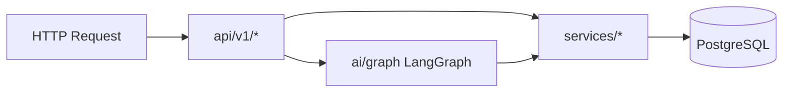
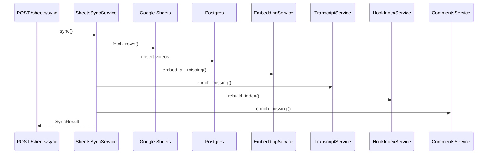

# Backend Architecture

ContentGraph Lite backend is a **FastAPI** application using **async SQLAlchemy 2.x**, **Alembic** migrations, and **PostgreSQL with pgvector**. Business logic lives in `services/`; AI orchestration in `ai/`; HTTP contracts in `schemas/` and `api/v1/`.

---

## Application Entry

| File | Role |
|------|------|
| `backend/app/main.py` | Creates FastAPI app, CORS, `/health`, mounts `api_router` at `/api/v1` |
| `backend/app/core/config.py` | Pydantic `Settings` from `.env` |
| `backend/app/db/session.py` | Async engine, `get_db`, `ensure_pgvector_extension()` on startup |
| `backend/app/api/v1/router.py` | Aggregates all v1 routers |



---

## FastAPI Structure

### Router modules (`backend/app/api/v1/`)

| Router | Prefix | Tag | Purpose |
|--------|--------|-----|---------|
| `sheets.py` | `/sheets` | sheets | Google Sheets sync |
| `videos.py` | `/videos` | videos | CRUD-ish video access, search, intelligence |
| `creators.py` | `/creators` | creators | Creator list, profile, page analytics, compare |
| `hooks.py` | `/hooks` | hooks | Hook workspace, search, generate, compare, reindex |
| `scripts.py` | `/scripts` | scripts | Script workspace, generate, analyze, compare |
| `analytics.py` | `/analytics` | analytics | Dashboard aggregates |
| `research.py` | `/research` | research | Saved insights + notes workspace |
| `copilot.py` | `/copilot` | copilot | Sidebar panel, feed, briefs |
| `chat.py` | `/chat` | chat | LangGraph AI chat |

Each route is thin: validate input → instantiate service → return Pydantic `response_model`.

### Dependency injection

- `get_db` yields `AsyncSession` per request
- LangGraph graph is built per chat request inside `AIChatService` with the same session

---

## SQLAlchemy Models

Located in `backend/app/models/`.

| Model | Table | Key relationships |
|-------|-------|-------------------|
| `Video` | `videos` | Parent for comments, hook_patterns |
| `Comment` | `comments` | `video_id` → `videos.id` CASCADE |
| `HookPattern` | `hook_patterns` | Optional `video_id` → `videos.id` CASCADE |
| `CreatorProfile` | `creator_profiles` | One row per `creator_name` (unique) |
| `SavedInsight` | `saved_insights` | Standalone research artifacts |
| `ResearchNote` | `research_notes` | Optional `creator_name` index |

### Video model highlights

- `title_embedding`, `transcript_embedding`: `Vector(1536)` via `pgvector.sqlalchemy`
- `transcript`: full text from youtube-transcript-api
- Indexed: `creator_name`, `views_count`

---

## Alembic Migrations

Path: `backend/alembic/versions/`

| Revision | File | Adds |
|----------|------|------|
| 001 | `001_create_videos.py` | `videos` table + indexes |
| 002 | `002_add_title_embedding.py` | `title_embedding` vector column |
| 003 | `003_add_transcript.py` | `transcript`, `transcript_embedding` |
| 004 | `004_create_creator_profiles.py` | `creator_profiles` |
| 005 | `005_create_research.py` | `saved_insights`, `research_notes` |
| 006 | `006_create_hook_patterns.py` | `hook_patterns` |
| 007 | `007_create_comments.py` | `comments` |

Run: `alembic upgrade head` from `backend/` (see [DEVELOPMENT_SETUP.md](./DEVELOPMENT_SETUP.md)).

---

## Services Layer

### Core data services

| Module | Purpose | Key methods |
|--------|---------|-------------|
| `video_service.py` | Video queries, snapshots for LangGraph | `list_videos`, `get_detail`, `top_videos`, creator-scoped lists |
| `embeddings/embedding_service.py` | OpenAI embeddings → pgvector | `embed_text`, `embed_all_missing`, title + transcript |
| `transcripts/transcript_service.py` | Fetch + store transcripts | `enrich_missing`, uses youtube-transcript-api |
| `retrieval_service.py` | Hybrid semantic retrieval | `hybrid_retrieve`, `semantic_search`, `semantic_search_for_creator` |

### Google Sheets ingestion

| Module | Path | Flow |
|--------|------|------|
| `GoogleSheetsClient` | `backend/google_sheets/client.py` | Service account reads range |
| `SheetsSyncService` | `backend/google_sheets/sync_service.py` | Upsert videos → embeddings → transcripts → hook reindex → comments |



### Analytics (`services/analytics/`)

Deterministic dashboard intelligence (no LLM):

| File | Responsibility |
|------|----------------|
| `dashboard_service.py` | Orchestrates dashboard response |
| `pattern_detection.py` | Anomalies, spikes, keyword trends |
| `title_analytics.py` | Title length/word patterns |
| `hook_analytics.py` | Hook type distribution |
| `creator_analytics.py` | Per-creator rollups |
| `trend_analytics.py` | Cross-catalog trends |
| `_video_data.py` | Shared video loading helpers |

### Creator intelligence (`services/creator_intelligence/`)

| Service | Purpose |
|---------|---------|
| `creator_profile_service.py` | Generate/cache LLM creator profiles in `creator_profiles` |
| `creator_analysis_service.py` | Structured creator performance analytics |
| `creator_page_service.py` | Creator page charts + metrics (`CreatorPageAnalytics`) |

### Hooks (`services/hooks/`)

| Module | Role |
|--------|------|
| `hook_types.py` | Taxonomy: curiosity, identity, contrarian, etc. |
| `hook_extraction.py` | Rule/regex extraction from titles + transcript openings |
| `hook_index_service.py` | Full rebuild of `hook_patterns` on sync |
| `hook_intelligence_service.py` | Generate/compare hooks via LLM + indexed data |

### Scripts (`services/scripts/`)

| Module | Role |
|--------|------|
| `script_intelligence_service.py` | Generate scripts, analyze style, compare creators' script patterns |

### Video intelligence (`services/video_intelligence/`)

| Module | Role |
|--------|------|
| `transcript_analyzer.py` | Deterministic themes, CTAs, pacing signals |
| `video_intelligence_service.py` | Full `VideoIntelligence` payload for video detail API + LangGraph |

### Comments (`services/comments/`)

| Module | Role |
|--------|------|
| `comments_service.py` | YouTube Data API fetch, upsert top N comments |
| `sentiment.py` | Lexicon-based sentiment + emotional tags |
| `audience_intelligence_service.py` | Pain points, questions, desires aggregation |

### Research (`services/research/`)

| Module | Role |
|--------|------|
| `research_service.py` | CRUD insights/notes, search, markdown export |

### AI chat (`services/ai_chat_service.py`)

1. `build_analytics_graph(db)`
2. `graph.ainvoke({"query": message})`
3. Maps `GraphState` → `ChatResult` (reply, structured analytics, suggestions)

### Copilot (`services/copilot/`)

| Service | Purpose |
|---------|---------|
| `copilot_service.py` | Panel assembly, feed, research assistant, creator slug resolution |
| `insight_engine.py` | SQL-driven smart insights (hooks, views, comments) |
| `brief_service.py` | Scannable AIBrief for creator/video/audience/trend |
| `feed_service.py` | Intelligence feed cards |
| `suggestion_service.py` | Chat follow-ups + research tag hints |

---

## AI Package (`backend/app/ai/`)

### LangGraph graph (`graph.py`)

Linear 4-node pipeline:

```
START → query_router → retrieval → analysis → response → END
```

Services injected at build time:
- `VideoService`, `CreatorProfileService`, `HookIntelligenceService`, `ScriptIntelligenceService`, `VideoIntelligenceService`

### Nodes (`backend/app/ai/nodes/`)

| Node | File | Input state | Output state |
|------|------|-------------|--------------|
| query_router | `query_router.py` | `query` | `analysis_type`, filters, `search_terms`, `video_id`, etc. |
| retrieval | `retrieval.py` | routing + filters | `relevant_videos: list[VideoSnapshot]` |
| analysis | `analysis.py` | videos + type | `structured_analytics`, `analysis_results` |
| response | `response.py` | analytics | `insights`, `final_response` |

### State (`state.py`)

`AnalysisType` union covers 16 analysis modes including `audience_analysis`, `comments_analysis`, `script_generation`, etc.

---

## Semantic Retrieval

`HybridRetrievalService` scoring weights:

| Signal | Weight role |
|--------|-------------|
| Combined semantic | 0.50 |
| Title vector sim | 0.20 |
| Transcript vector sim | 0.30 |
| Views normalization | 0.25 |
| Keyword boost | 0.15 |
| Comment text boost | Adds parent video with snippet |

Used by:
- `GET /videos/semantic-search`
- `GET /creators/{name}/semantic-search`
- LangGraph `retrieval` node

---

## Embeddings

`EmbeddingService`:
- Model: `text-embedding-3-small` (configurable)
- Dimensions: 1536
- Stores in `videos.title_embedding` and `videos.transcript_embedding`
- Cosine distance via pgvector operators in raw SQL / SQLAlchemy

---

## Schemas (`backend/app/schemas/`)

Pydantic v2 models mirror API contracts:

- `video.py`, `creator.py`, `hooks.py`, `scripts.py`, `analytics.py`, `chat.py`, `copilot.py`, `research.py`, `comments.py`, `video_intelligence.py`, `common.py`

`StructuredAnalytics` in `analytics.py` is a discriminated union-style payload returned inside chat responses.

---

## Important File Map

```
backend/
├── app/
│   ├── main.py
│   ├── api/v1/          # HTTP routes
│   ├── ai/              # LangGraph
│   ├── core/config.py
│   ├── db/
│   ├── models/
│   ├── schemas/
│   └── services/        # Business logic
├── alembic/
├── google_sheets/       # Ingestion
└── credentials/         # service_account.json (not in git)
```

---

## Error Handling Patterns

- Missing OpenAI key → `503` on `/chat`
- Missing creator/video for briefs → `404`
- Sheets misconfiguration → sync raises with descriptive error
- YouTube API optional: comments enrichment skips if `YOUTUBE_API_KEY` empty

---

## Related Docs

- [AI_SYSTEMS.md](./AI_SYSTEMS.md) — node prompts and analysis types
- [DATABASE_SCHEMA.md](./DATABASE_SCHEMA.md) — full table reference
- [API_REFERENCE.md](./API_REFERENCE.md) — HTTP contract
