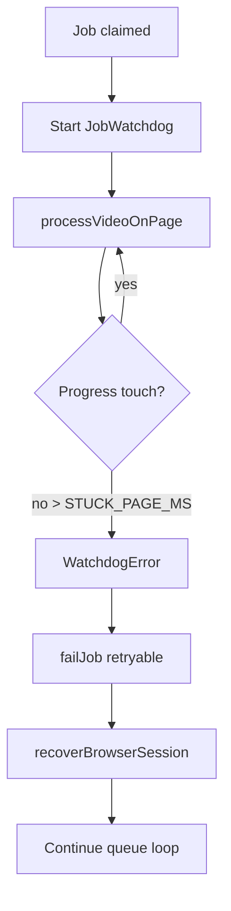

# Browser Ingestion — Production Stabilization

Additive queue + local Playwright worker. Extension performs ingest; worker only automates UI.

## Architecture (unchanged)

```
tm1 /browser-ingestion → Postgres queue
home laptop worker     → claim / complete / fail (polling)
Playwright + Chrome    → existing extension → POST /transcripts/ingest + /comments/ingest
```

## File map

| Area | Paths |
|------|--------|
| Queue API | `backend/app/api/v1/browser_ingestion.py`, `services/browser_ingestion/` |
| Worker core | `worker/src/index.ts` |
| Watchdog | `worker/src/watchdog.ts` |
| Safety limits | `worker/src/safety-limits.ts` (persisted `~/.contentgraph-worker/state/`) |
| Extension check | `worker/src/extension-compat.ts` |
| Failure taxonomy | `worker/src/failure-taxonomy.ts` |
| Metrics / logs | `worker/src/metrics.ts`, `worker/src/logger.ts` |
| UI | `frontend/components/browser-ingestion/` |
| Onboarding UX | `setup-wizard.tsx`, `worker-live-status.tsx`, `info-cards.tsx` |
| Labels | `frontend/lib/browser-ingestion-labels.ts` |
| Wizard state | `frontend/lib/browser-ingestion-onboarding-storage.ts` (localStorage) |

## Operator onboarding flow

1. Open **`/browser-ingestion`** — setup wizard at top (7 steps).
2. **Download worker** zip → unzip on laptop.
3. Install **Chrome extension** (link to `/extension`).
4. Extension **Options** → paste API URL + extension key (if used).
5. Click **Generate worker token** on dashboard → paste into `worker/.env` as `WORKER_TOKEN`.
6. Terminal: `cd worker && npm install && npx playwright install chromium && npm start`.
7. Dashboard shows **Worker connected** → **Start ingestion**.

Wizard progress is stored in the browser (localStorage). Token is stored locally for copy convenience only.

### UI components (summary)

| Component | Purpose |
|-----------|---------|
| `SetupWizard` | 7-step guide, copy blocks, token generation |
| `WorkerCtaBanner` | Offline CTA / online pulse |
| `WorkerLiveStatus` | Sticky health card, daily limit bar, friendly phase |
| `BrowserIngestionInfoCards` | Laptop + why cards |
| `CopyCodeBlock` | Monospace + one-click copy |
| `BrowserJobsTablePanel` | Friendly failures, “What happened?” details |

### UX decisions

- Human-readable phases (no `extracting_transcript` in UI).
- Token generated from UI via existing `POST /workers/register` (no new backend).
- Extension key not exposed by API — operator pastes from admin; optional localStorage for copy.
- Screenshots referenced by path only (files stay on laptop).
- Start ingestion blocked until worker heartbeat is seen.

## Watchdog flow



Default `STUCK_PAGE_MS=180000` (3 min without UI progress).

## Recovery flow

| Trigger | Action |
|---------|--------|
| Watchdog stuck | `failJob` (retryable) → close browser → new context → continue |
| Browser crash / target closed | Same + `failure_category=browser_crash` |
| Worker process restart | Jobs in `processing` requeued when heartbeat missing >45s |
| Stuck job >15 min (server) | Requeued to `queued` (existing) |
| Periodic | Restart browser every `RESTART_BROWSER_EVERY_JOBS` (default 20) |
| Memory growth | `restart_recommended` flag in heartbeat |

Queue state stays in Postgres — recovery never drops jobs.

## Failure taxonomy

| Category | Typical cause | Retryable |
|----------|---------------|-----------|
| `youtube_blocked` | Bot check, geo, age gate | No |
| `transcript_unavailable` | No captions | No |
| `comments_disabled` | Comments off | No |
| `extension_error` | Panel/DOM mismatch | Yes |
| `browser_crash` | Chrome closed | Yes |
| `timeout` | Navigation / watchdog | Yes |
| `unknown` | Other | Yes |

## Recommended limits / day

| Profile | `MAX_JOBS_PER_DAY` | `MAX_CONSECUTIVE_FAILURES` | `COOLDOWN_MINUTES` |
|---------|-------------------|--------------------------|-------------------|
| Conservative (old laptop) | 80–120 | 3 | 45 |
| Default | 200 | 5 | 30 |
| Aggressive | 400 | 8 | 20 |

Set `0` on `MAX_JOBS_PER_DAY` for unlimited (not recommended).

## Realistic throughput / hour

| Mode | Videos/hour |
|------|-------------|
| transcript only | 40–80 |
| both | **20–40** |

With watchdog restarts and consent popups, plan **~15–25/hour** sustained on an older laptop.

## Hardware recommendations

- 8 GB RAM minimum, 16 GB preferred
- SSD for Chromium profile (`CHROME_USER_DATA_DIR`)
- Stable residential IP (purpose of browser worker)
- MacBook / Linux laptop; Windows works with Playwright Chromium

## Local setup

```bash
cd worker && npm install && npx playwright install chromium
cp .env.example .env   # WORKER_TOKEN, limits, STUCK_PAGE_MS
npm start
```

Register worker once: `POST /api/v1/browser-ingestion/workers/register`

## Deploy

```bash
alembic upgrade head   # 019+ if not applied
./scripts/build-browser-worker-zip.sh
docker compose -f docker-compose.yml -f docker-compose.prod.yml up -d --build
```

## Troubleshooting (operators)

| Symptom | What to do |
|---------|----------------|
| “Not connected” | Run `npm start` in `worker/`; check `WORKER_TOKEN` in `.env` |
| Browser never opens | Run `npx playwright install chromium`; check `BROWSER_CHANNEL=chromium` |
| Extension incompatible | Update extension from `/extension` zip; match `REQUIRED_EXTENSION_VERSION` |
| Daily limit reached | Wait until tomorrow or raise `BROWSER_INGESTION_MAX_JOBS_PER_DAY` |
| All jobs fail YouTube blocked | Use home Wi‑Fi; sign in to YouTube once in worker Chromium profile |
| Stuck on one video | Worker watchdog will retry; or pause run and retry failed |

## FAQ

**Why does Chrome open automatically?**  
The worker uses Playwright Chromium + your extension to open each YouTube video — same as you would manually.

**Why must the laptop stay online?**  
The worker runs on your laptop, not the server. If the laptop sleeps, processing stops.

**Why not run this on the VPS?**  
YouTube blocks many cloud IPs. Home/residential IP works more reliably.

**Why is residential IP important?**  
YouTube treats datacenter traffic as higher risk for automation blocks.

**Can I close Chrome?**  
No — leave Chrome open while the worker runs. You can minimize it.

**What happens if the laptop sleeps?**  
Heartbeats stop; jobs stay queued. Wake the laptop and run `npm start` again.

## Smoke test checklist

- [ ] Setup wizard visible; steps mark complete
- [ ] Generate token + copy works; toast “Copied”
- [ ] Worker offline → large CTA “Start worker on your laptop”
- [ ] Worker online → green “Worker connected” + live phase when processing
- [ ] Extension compat: wrong version → worker exits, UI shows **Extension outdated**
- [ ] Daily limit: set `MAX_JOBS_PER_DAY=2`, run 3 jobs → worker stops claiming, badge on UI
- [ ] Consecutive failures → cooldown, status `cooldown` on dashboard
- [ ] Kill Chrome mid-job → job requeued, worker recovers
- [ ] Stop worker 60s → processing job requeued, worker **offline**
- [ ] Job fail → expandable row with category, screenshot path, retry history
- [ ] Heartbeat shows memory, uptime, phase, daily progress
- [ ] `/transcripts/api-ingestion` unchanged

## Known limitations

- Screenshots live on laptop only (path in UI, not uploaded)
- Single worker / single Chromium profile
- Extension version must match `REQUIRED_EXTENSION_VERSION`
- YouTube DOM changes require extension update, not worker-only fix
- No distributed queue; one home machine at a time
