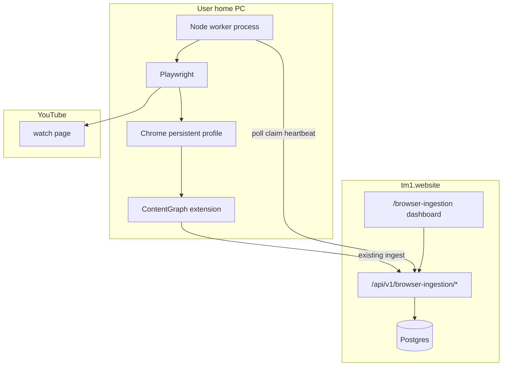

# Browser Ingestion Worker — Architecture Analysis

**Status:** Analysis + implementation plan only — **no code yet**.  
**Date:** 2026-05-26  
**Goal:** Automate existing Chrome extension transcript/comments flow from a **local home PC** (residential IP) via Playwright, without rewriting ingest, Sheets, or embeddings.

---

## Executive summary

| Question | Answer |
|----------|--------|
| Why this feature? | Server API ingestion hits **YouTube IP blocks** on cloud VPS; extension on a home PC works today |
| Core principle | Worker **clicks extension UI** → extension calls **existing** `POST /transcripts/ingest` and `POST /comments/ingest` |
| Stack | tm1 dashboard + FastAPI queue + **Node.js worker** + Playwright + Chrome + unpacked extension |
| MVP scope | 1 worker, 1 Chrome, sequential jobs, HTTP polling (no WebSocket) |
| Extension changes | **None required for MVP**; optional additive `data-cg-*` hooks in Phase 1b for reliable waits |
| Biggest risks | YouTube DOM changes, extension panel state, headed Chrome on laptop, job duration variance |

---

## 1. Problem statement

### Current paths

| Path | Where YouTube is contacted | IP | Works on tm1 VPS? |
|------|---------------------------|-----|-------------------|
| Chrome extension (manual) | User browser | Home/residential | N/A (user machine) |
| API transcript ingestion | `youtube-transcript-api` on server | Cloud/datacenter | **Often blocked** (`RequestBlocked`) |
| Sheets sync enrich | Same API on server | Cloud | Same issue |

### Desired path

```
tm1.website (queue + dashboard)
        ↓ HTTP poll / heartbeat
Local worker (old laptop at home)
        ↓ Playwright drives Chrome
YouTube watch page + ContentGraph panel
        ↓ existing buttons
Extension content.js → background.js → POST /api/v1/.../ingest
        ↓ unchanged
TranscriptIngestService / CommentsIngestService → DB → Sheets → embeddings
```

**Non-goals for MVP:** distributed workers, WebSocket, server-side scraping, bypassing extension, modifying ingest services.

---

## 2. Existing extension flow (must preserve)

### Files (do not rewrite)

| File | Role |
|------|------|
| `extension/manifest.json` | MV3, content script on `youtube.com/watch*` |
| `extension/content.js` | Panel UI, DOM extract, `chrome.runtime.sendMessage` |
| `extension/background.js` | `fetch` to `{apiBase}/transcripts/ingest` and `/comments/ingest` |
| `extension/options.js` | `apiBase`, `extensionApiKey` in `chrome.storage.sync` |

### Transcript sequence (manual today)

1. User opens `https://www.youtube.com/watch?v={id}`
2. Panel `#cg-transcript-panel` injected
3. User opens YouTube Transcript UI (or worker automates `openTranscriptPanel()` via… **cannot call from Playwright directly** — must click UI or use extension's Extract which calls `openTranscriptPanel()` internally)
4. Click **`[data-action="extract-transcript"]`** → `handleExtractTranscript()` → DOM scrape → enables Save
5. Click **`[data-action="save-transcript"]`** → `SAVE_TRANSCRIPT` message → `POST /transcripts/ingest`
6. Status **`[data-status="transcript"]`** gets `.cg-ok` / `.cg-warn` / `.cg-error` with multi-line text (`✓ Saved to ContentGraph…`)

### Comments sequence

1. Click **`[data-action="extract-comments"]`** → scroll, Top sort, scrape pool, select top 20
2. Click **`[data-action="save-comments"]`** → `POST /comments/ingest`
3. Status **`[data-status="comments"]`** → formatted save result

### Backend ingest (unchanged)

| Endpoint | Service | Auth |
|----------|---------|------|
| `POST /api/v1/transcripts/ingest` | `TranscriptIngestService` | Optional `X-Extension-Key` |
| `POST /api/v1/comments/ingest` | `CommentsIngestService` | Same |

Extension options must point worker Chrome to `https://tm1.website/api/v1` and the same API key as production.

### Success detection for automation (MVP)

Playwright waits on **extension panel**, not API responses directly:

| Step | Wait condition |
|------|----------------|
| Extract transcript done | `[data-status="transcript"].cg-ok` and text contains `characters extracted` OR Save button not disabled |
| Save transcript done | `[data-status="transcript"].cg-ok` and text contains `Saved to ContentGraph` |
| Extract comments done | `[data-status="comments"].cg-ok` and text contains `top comments` |
| Save comments done | `[data-status="comments"].cg-ok` and text contains `Saved` |

**Failure signals:** `.cg-error` on status, or timeout (e.g. 120s per phase).

Optional **Phase 1b** (additive extension, ~20 lines): dispatch `window` event or set `data-cg-phase="transcript_saved"` for deterministic waits — not required if status strings are stable.

---

## 3. Target architecture



### Component responsibilities

| Component | Owns |
|-----------|------|
| **Dashboard** | Enqueue jobs, show worker online/offline, progress, download worker zip |
| **Backend queue** | Job rows, worker registry, heartbeats, stats |
| **Worker** | Chrome lifecycle, navigate URL, click extension buttons, report status |
| **Extension** | Extract + ingest (unchanged) |
| **Ingest services** | DB, embeddings, Sheets (unchanged) |

---

## 4. Playwright + Chromium + extension integration

### Recommended approach: `launchPersistentContext`

Use **one persistent user data directory** per machine so extension install + options survive restarts.

```typescript
// Conceptual — not production code yet
const extensionPath = path.resolve(__dirname, "../extension"); // or copied unpacked zip
const userDataDir = path.join(os.homedir(), ".contentgraph-worker", "chromium-profile");

const context = await chromium.launchPersistentContext(userDataDir, {
  channel: "chromium",         // Playwright Chromium; reliable MV3 extension injection
  headless: false,             // MV3 extensions unreliable in headless
  slowMo: 50,                  // optional stability on slow laptops
  viewport: { width: 1280, height: 900 },
  args: [
    `--disable-extensions-except=${extensionPath}`,
    `--load-extension=${extensionPath}`,
    "--no-first-run",
    "--no-default-browser-check",
  ],
});
```

**Why Chromium channel:** On macOS, system Google Chrome can fail to inject MV3 content scripts when launched with `--load-extension`. Playwright Chromium is the supported worker default.

**Why persistent context:** Extension loaded once; `chrome.storage.sync` (api base, API key) persists in profile.

### Chromium profile strategy

| Item | Path / policy |
|------|----------------|
| Profile dir | `~/.contentgraph-worker/chromium-profile` (configurable) |
| Extension install | Load unpacked from repo `extension/` or from dashboard ZIP |
| First-time setup | User opens `chrome://extensions`, confirms Developer mode once, OR worker docs include one-time setup script |
| Options | Pre-seed via extension options page once: `apiBase`, `extensionApiKey` |
| YouTube login | **Not required** for most public videos; optional login in profile for age-gated content |
| Cookies / consent | Worker script clicks common consent buttons before panel actions (selectors maintained in worker) |

### Page automation flow (per job)

```
1. context.pages()[0] or newPage → goto video_url (canonical watch URL)
2. waitForSelector('#cg-transcript-panel', { timeout: 30_000 })
3. Ensure panel visible (remove .cg-hidden if closed)
4. [transcript phase]
   a. click [data-action="extract-transcript"]
   b. wait status transcript .cg-ok (max 90s)
   c. click [data-action="save-transcript"] (enabled)
   d. wait status contains "Saved to ContentGraph" (max 60s)
5. [comments phase]
   a. click [data-action="extract-comments"]
   b. wait status comments .cg-ok (max 90s)
   c. click [data-action="save-comments"]
   d. wait status contains "Saved" (max 60s)
6. report success to backend
7. optional: short delay 2–5s (rate kindness)
```

**Job modes** (queue field `mode`):

| mode | Steps |
|------|--------|
| `transcript` | 4 only |
| `comments` | 5 only |
| `both` | 4 + 5 (default MVP) |

### What Playwright must NOT do

- Call `/transcripts/ingest` or `/comments/ingest` directly
- Scrape transcript text from DOM for server upload (duplicates extension logic)
- Write to Postgres

### Extension automation risks & mitigations

| Risk | Mitigation |
|------|------------|
| Panel closed (`.cg-hidden`) | Worker clicks header or removes hidden class via evaluate only if needed; prefer reload page |
| Extract before transcript UI ready | Extension already calls `openTranscriptPanel()` — rely on it |
| Save disabled | Wait until `save-transcript` not `[disabled]` |
| YouTube layout A/B | Stable `data-action` attributes (already in extension) |
| Service worker sleep | Keep one tab open; periodic noop navigation |
| Long videos / slow laptop | Generous timeouts; heartbeat shows current phase |

---

## 5. Backend queue design

### New tables (additive migration `019_browser_ingestion.py`)

#### `browser_ingestion_workers`

| Column | Type | Notes |
|--------|------|-------|
| id | int PK | |
| name | varchar | e.g. "home-laptop" |
| token_hash | varchar | bcrypt/hash of worker secret |
| status | varchar | `offline` \| `online` \| `paused` |
| current_action | varchar | `idle`, `opening_youtube`, `extracting_transcript`, … |
| current_job_id | int FK nullable | |
| current_video_url | varchar nullable | |
| last_heartbeat_at | timestamptz | |
| stats_json | jsonb | processed_today, success, failed, etc. |
| created_at | timestamptz | |

#### `browser_ingestion_jobs`

| Column | Type | Notes |
|--------|------|-------|
| id | int PK | |
| video_id | int FK videos | |
| video_url | varchar | denormalized for worker |
| title | varchar | |
| creator_name | varchar | |
| mode | varchar | `transcript` \| `comments` \| `both` |
| status | varchar | `queued` \| `processing` \| `success` \| `failed` \| `skipped` |
| retry_count | int default 0 | |
| max_retries | int default 2 | |
| error_message | text | |
| worker_id | int FK nullable | claimer |
| claimed_at | timestamptz | |
| finished_at | timestamptz | |
| result_json | jsonb | extension status snippets, ingest responses if captured |

**Indexes:** `(status, id)` for claim; `(video_id, mode)` unique partial for dedup optional.

### Job selection rules (enqueue)

Mirror API ingestion safety:

- Only videos **in catalog** (`videos` table)
- Default: missing transcript for `mode` including transcript; missing comments for `mode` including comments
- `limit`, `creator_filter`, `latest_only` on dashboard Start (reuse patterns from `TranscriptApiIngestionRunService._select_videos_for_run`)

Do **not** re-enqueue if job already `success` for same video+mode unless admin Retry.

### Worker ↔ backend API (MVP)

Prefix: `/api/v1/browser-ingestion`

| Method | Path | Auth | Purpose |
|--------|------|------|---------|
| `POST` | `/workers/register` | Admin/session or one-time setup key | Create worker → `{ worker_id, token }` |
| `POST` | `/workers/heartbeat` | `Authorization: Bearer {token}` | online, action, stats |
| `POST` | `/workers/pause` | Bearer | worker or dashboard |
| `POST` | `/workers/resume` | Bearer | |
| `GET` | `/dashboard` | Public or session | stats + active worker + recent jobs |
| `POST` | `/runs/start` | Public/session | enqueue N jobs (like api-ingestion start) |
| `POST` | `/jobs/claim` | Bearer | returns next `queued` job or 204 |
| `POST` | `/jobs/{id}/complete` | Bearer | success + optional result_json |
| `POST` | `/jobs/{id}/fail` | Bearer | error + retry → requeue if under max |
| `POST` | `/jobs/retry-failed` | session | reset failed → queued |

**Claim semantics:** `SELECT … WHERE status='queued' ORDER BY id FOR UPDATE SKIP LOCKED LIMIT 1` → `processing`, set `worker_id`.

**Heartbeat:** every 10–15s while running; dashboard marks worker `offline` if `last_heartbeat_at` > 45s.

### Polling model (no WebSocket)

| Actor | Interval | Calls |
|-------|----------|-------|
| Worker main loop | 2s idle / immediate after job | `heartbeat`, `claim` |
| Dashboard | 3s when run active | `GET /dashboard` |

Worker process is **started locally** by user (`npm start`); dashboard **Start worker** is documentation + env check, not remote start (cannot wake home PC). Dashboard buttons map to **queue control** (enqueue / pause / retry), not OS process control.

Clarify UX copy: **"Start"** on web = enqueue jobs; **"Run worker on your PC"** = CLI.

---

## 6. Local worker app (`/worker`)

### Package layout

```
worker/
├── package.json
├── tsconfig.json
├── README.md
├── .env.example
└── src/
    ├── index.ts           # CLI entry, main loop
    ├── config.ts          # API URL, token, paths
    ├── api-client.ts      # heartbeat, claim, complete
    ├── browser-session.ts # launchPersistentContext lifecycle
    ├── job-processor.ts   # one video pipeline
    ├── extension-ui.ts    # selectors + waits
    └── youtube-page.ts    # consent, navigation
```

### Dependencies

- `playwright` (+ installed Chromium)
- `dotenv`
- `pino` or simple console logging

### Config (`.env`)

```env
CONTENTGRAPH_API_URL=https://tm1.website/api/v1
WORKER_TOKEN=...
EXTENSION_PATH=/path/to/unpacked/extension
BROWSER_CHANNEL=chromium
CHROME_USER_DATA_DIR=~/.contentgraph-worker/chromium-profile
JOB_DELAY_MS=3000
```

### CLI commands (MVP)

```bash
npm install
npx playwright install chromium # if needed
cp .env.example .env            # paste token from dashboard
npm start                         # loop: heartbeat + claim + process
```

### Distribution from dashboard

- Zip: `contentgraph-browser-worker.zip` = `worker/` + pinned `extension/` copy + README
- Build script: `scripts/build-browser-worker-zip.sh` (parallel to `build-extension-zip.sh`)
- Version pin worker ↔ extension compatibility in manifest version check log

---

## 7. Frontend: `/browser-ingestion`

### Route

- `frontend/app/browser-ingestion/page.tsx` → `BrowserIngestionPage`
- Nav: More menu + command palette (like api-ingestion)

### Sections (match api-ingestion ops style)

1. **Worker status card** — online/offline dot, last heartbeat, current action, current video URL
2. **Today's stats** — processed, success, failed (from worker heartbeat or DB aggregates)
3. **Queue card** — queued / processing / success / failed counts; Start enqueue form (limit, creator, mode)
4. **Progress** — optional run-level bar when batch enqueued
5. **Jobs table** — paginated, filters (reuse api-ingestion patterns)
6. **Setup card** — Download worker, extension zip link, token generation, env example

### Controls clarification

| UI label | Actual effect |
|----------|----------------|
| Download worker | Static zip / git instructions |
| Enqueue videos | `POST /runs/start` |
| Pause queue | Workers finish current job then stop claiming; or `workers.status=paused` |
| Resume | Allow claim again |
| Retry failed | Reset job rows |

**Cannot** start Node process on user's laptop from browser (security).

---

## 8. Security model

| Layer | Mechanism |
|-------|-----------|
| Worker → API | Bearer token per worker row (rotate via dashboard) |
| Extension → API | Existing `X-Extension-Key` in Chrome options (same key as manual use) |
| Dashboard → API | Same as other ops pages (open or light auth — match api-ingestion) |
| Token storage | Worker `.env` only; never commit |

**Threat:** stolen worker token → claim jobs, cannot inject arbitrary ingest without extension running on attacker machine with extension configured.

---

## 9. Comparison to API transcript ingestion

| | API ingestion | Browser worker |
|--|---------------|----------------|
| Runs on | tm1 server | User home PC |
| YouTube access | youtube-transcript-api | Real browser |
| IP | Cloud (blocked) | Residential (works) |
| Throughput | Higher if unblocked | ~1 video / 1–3 min |
| Ops cost | Low | Need machine online |
| Extension | Not used | Required |

**Coexist:** Both queues independent; same catalog videos; same ingest endpoints.

---

## 10. Risks register

| # | Risk | Severity | Mitigation |
|---|------|----------|------------|
| R1 | YouTube blocks home IP if too aggressive | Medium | Delay between jobs; daily caps in enqueue |
| R2 | Extension DOM changes | High | `data-action` contract; optional automation hooks |
| R3 | Playwright + MV3 flakiness | Medium | Headed Chrome; single tab; retries per phase |
| R4 | Laptop sleeps / network drop | Medium | Heartbeat offline; jobs requeued on timeout |
| R5 | Video not in catalog | Low | Pre-filter enqueue; extension shows same error as manual |
| R6 | No transcript on video | Low | Detect `.cg-error` "No transcript rows"; mark job failed/skipped |
| R7 | Operator expects dashboard to start PC worker | Medium | Clear copy + README |
| R8 | Extension/API key mismatch | Medium | Setup wizard in README; dashboard shows test ping |
| R9 | Long-running job stuck | Medium | Job timeout (15 min) → fail + requeue |
| R10 | Two workers claim same job | Low | `SKIP LOCKED` claim |

---

## 11. What we explicitly do NOT change

- `extension/content.js` logic paths (MVP uses clicks only)
- `extension/background.js` ingest URLs
- `TranscriptIngestService`, `CommentsIngestService`
- `SheetsTranscriptWritebackService`, comments writeback
- Retrieval / chat / API ingestion routes
- Existing `/extension` onboarding page (add link only)

---

## 12. Implementation plan (phased)

### Phase 0 — Docs & scaffolding (0.5 day)

- [x] This architecture doc
- [ ] Review with stakeholder

### Phase 1 — Backend queue + API (1.5–2 days)

- Migration `019_browser_ingestion`
- Models + `BrowserIngestionService` (claim, complete, enqueue, heartbeat)
- Router `app/api/v1/browser_ingestion.py`
- Reuse `missing_transcript_clause` / video selection from api-ingestion where applicable
- Tests: claim concurrency, heartbeat offline

### Phase 2 — Worker MVP (2–3 days)

- `worker/` package
- `launchPersistentContext` + extension load
- `extension-ui.ts` wait helpers
- Main loop: claim → process → complete
- README + `.env.example`
- Manual test on 3 videos against staging/local tm1

### Phase 3 — Dashboard (1.5–2 days)

- `/browser-ingestion` page (mirror api-ingestion components)
- API client types
- i18n EN/UK
- Download worker zip script

### Phase 4 — Hardening (1 day)

- Job timeouts + retry
- Consent banner handler
- Better error taxonomy in `result_json`
- Optional extension `data-cg-automation-state` attribute (additive)

### Phase 5 — Production (0.5 day)

- Deploy migration on tm1
- Document home laptop setup
- Enqueue pilot batch (50 videos)

**Total estimate:** ~7–9 dev days for production-friendly MVP.

---

## 13. File map (planned)

### New backend

| Path | Purpose |
|------|---------|
| `backend/alembic/versions/019_browser_ingestion.py` | Tables |
| `backend/app/models/browser_ingestion.py` | ORM |
| `backend/app/schemas/browser_ingestion.py` | Pydantic |
| `backend/app/services/browser_ingestion/` | Queue + worker registry |
| `backend/app/api/v1/browser_ingestion.py` | Routes |
| `backend/app/api/v1/router.py` | include router |
| `backend/tests/test_browser_ingestion.py` | Unit tests |

### New worker

| Path | Purpose |
|------|---------|
| `worker/package.json` | |
| `worker/src/*.ts` | See §6 |
| `scripts/build-browser-worker-zip.sh` | Release artifact |

### New frontend

| Path | Purpose |
|------|---------|
| `frontend/app/browser-ingestion/page.tsx` | Route |
| `frontend/components/browser-ingestion/*.tsx` | UI |
| `frontend/types/browser-ingestion.ts` | Types |
| `frontend/services/api.ts` | Client helpers |
| `frontend/lib/i18n/locales/en.ts` | Copy |

### Unchanged (reference only)

| Path | Role |
|------|------|
| `extension/*` | Automation target |
| `backend/app/services/transcripts/ingest_service.py` | Save path |
| `backend/app/services/comments/ingest_service.py` | Save path |

---

## 14. Open decisions (product)

1. **Auth for dashboard enqueue** — open like api-ingestion or require login?
2. **Default job mode** — `both` vs transcript-only first?
3. **Skip videos with existing transcript** — default on?
4. **Worker token issuance** — generate on dashboard vs manual env?
5. **Phase 1b extension hooks** — worth +20 LOC for reliable automation?

---

## 15. Related docs

- [EXTENSION_TRANSCRIPT_SHEETS_ANALYSIS.md](./EXTENSION_TRANSCRIPT_SHEETS_ANALYSIS.md)
- [TRANSCRIPT_API_INGESTION_FRONTEND_ANALYSIS.md](./TRANSCRIPT_API_INGESTION_FRONTEND_ANALYSIS.md)
- [TRANSCRIPT_EXTENSION_ARCHITECTURE.md](./TRANSCRIPT_EXTENSION_ARCHITECTURE.md)
- `extension/README.md`

---

## 16. QA checklist (post-implementation)

- [ ] Worker registers; dashboard shows **online** within 15s
- [ ] Enqueue 2 videos missing transcript+comments
- [ ] Worker claims, opens YouTube, panel visible
- [ ] Transcript extract + save → DB row has transcript
- [ ] Comments extract + save → comments rows exist
- [ ] Sheets write-back matches manual extension (if index built)
- [ ] Pause → worker stops claiming after current job
- [ ] Retry failed → job reprocessed
- [ ] Laptop sleep → worker shows offline; job reclaim after timeout
- [ ] Manual extension on same video still works (no regression)
