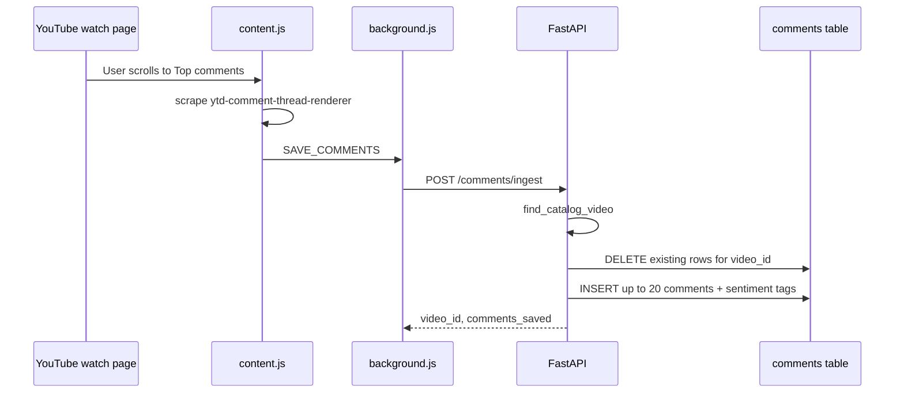

# Comments Ingest Architecture (Phase 2 MVP)

Browser-extracted **top YouTube comments** → Postgres → video intelligence → feed/search reuse. Same pattern as [TRANSCRIPT_EXTENSION_ARCHITECTURE.md](./TRANSCRIPT_EXTENSION_ARCHITECTURE.md).

## Principles

- **No YouTube Data API** for the extension path (DOM extraction only).
- **No queues, workers, or LangGraph changes.**
- **MVP:** max 20 comments, top by likes, replace-on-save per video.
- Existing `comments` table (Alembic `007`) — not a new `video_comments` table; fields match the product spec.

## Components

| Piece | Path | Role |
|-------|------|------|
| Chrome extension | `extension/content.js` | Extract / copy / save comments |
| Ingest API | `POST /api/v1/comments/ingest` | Match video, replace rows |
| List API | `GET /api/v1/videos/{id}/comments` | Top comments by likes |
| Storage | `comments` | `video_id`, `author_name`, `comment_text`, `likes_count`, `created_at` |
| Intelligence | `GET /videos/{id}/intelligence` | `comments` + `audience_intel` (deterministic) |
| Matching | `app/services/ingest/video_match.py` | Shared with transcript ingest |
| Optional API path | `POST /videos/{id}/comments/fetch` | YouTube Data API when `YOUTUBE_API_KEY` set |

## Save flow



### Request

```json
{
  "video_url": "https://www.youtube.com/watch?v=…",
  "title": "…",
  "creator": "…",
  "comments": [
    { "author": "Name", "text": "…", "likes": 1200 }
  ]
}
```

### Matching (same as transcript)

1. YouTube video ID in `videos.channel_url` (when present).
2. Fallback: case-insensitive `title` + `creator_name`.

### Response

```json
{
  "video_id": 2001,
  "matched": true,
  "comments_saved": 12,
  "message": "Saved 12 comments to catalog video."
}
```

## DOM extraction (extension)

- Scroll to `#comments` / `ytd-comments`.
- `ytd-comment-thread-renderer` per thread.
- Author: `#author-text`; text: `#content-text`; likes: `#vote-count-middle`.
- Parse `1.2K` / `999` like counts.
- Sort by likes desc, cap **20**, skip empty/spam lines.
- Extension v0.2.3+ auto-switches to **Top comments** when possible, scroll-loads up to ~80 threads, then saves top **20** by likes.

## Intelligence (`audience_intel`)

No extra LLM on ingest. `AudienceIntelligenceService._aggregate()` builds:

- `comments` — full `CommentsIntelligence` (charts, sentiment %, top list).
- `audience_intel` — slim MVP slice:
  - `top_reactions`
  - `repeated_phrases`
  - `pain_points`
  - `top_comment_preview`

Intelligence **does not** auto-call YouTube API on page load anymore; only stored comments count.

## Feed (optional)

`feed_service._audience_reactions()` already reads high-like comments with tags when rows exist — no new feed pipeline.

## Limitations

| Limitation | Notes |
|------------|--------|
| Visible comments only | No scroll/load-more automation in MVP |
| Top sort manual | User must ensure YouTube shows Top comments |
| Catalog match required | Same as transcript ingest |
| Replace not merge | Re-ingest deletes prior rows for that video |
| No comment embeddings | Out of MVP scope |

## Verification

See `docs/COMMENTS_INGEST_QA.md` after deploy.

Manual: Load unpacked `extension/` → YouTube video in catalog → Extract comments → Save → check `/videos/{id}/comments` and intelligence.
