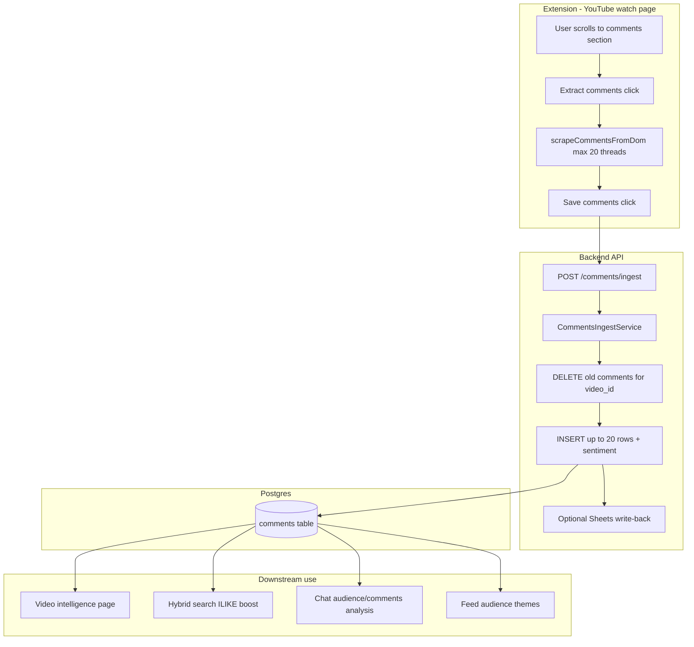
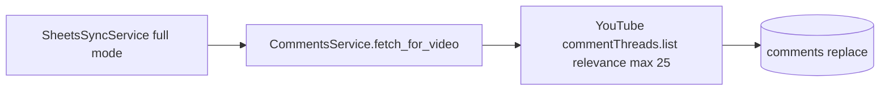

# Comments system — production flow analysis (code truth)

**Date:** 2026-05-25  
**Scope:** How comments work today — extension path, backend ingest, DB, retrieval, AI. No implementation proposals in this doc beyond a final “future improvements” section.

---

## Executive summary (non-technical)

When you save comments from YouTube, the extension reads **only the comment threads currently visible on the page** (usually after you scroll down). It takes **at most 20** top-level threads, sorts them by **like count**, and sends them to the server. The server **deletes old comments for that video** and saves the new set (up to **20**), adds simple **positive/negative/neutral** labels and **topic tags**, and optionally writes a text block to Google Sheets.

Comments are **not** embedded like video titles/transcripts. Search can **find videos** whose stored comments contain your words, but comments are not vector-searchable themselves. AI uses stored comments mainly on the **video intelligence page** and in **Chat** when you ask about audience/comments for a specific video — not across the whole 12k catalog automatically.

A **separate** server path (Full Sync + YouTube API key) can fetch up to **25** comments per video with `relevance` order — only when API is configured and only during sync enrichment, not from the extension.

---

## 1. Extension extraction logic

**Files:** `extension/content.js` — `scrollToComments()`, `scrapeCommentsFromDom()`, `parseLikeCount()`, `handleExtractComments()`, `handleSaveComments()`

### How many comments extracted?

| Limit | Value | Where |
|-------|-------|--------|
| Loop cap while scraping DOM | **20** | `if (items.length >= 20) break` |
| After sort + slice | **20** | `return items.slice(0, 20)` |
| API request max | **20** | `CommentsIngestRequest.comments` — `max_length=20` (Pydantic) |

So: **hard cap = 20** end-to-end.

### Scroll / load more?

- `scrollToComments()` scrolls the comments section into view once (`scrollIntoView`), waits **800ms**.
- **No** code clicks “Load more”, “Show more replies”, or changes YouTube sort to Top/Newest.
- UI hint tells user: *“Scroll to comments (Top sort). Then extract.”* — **behavior depends on what YouTube already rendered**.

### Sort order (extension)

1. Collect threads in **DOM order** (whatever YouTube displayed).
2. `items.sort((a, b) => b.likes - a.likes)` — **by likes descending**.
3. Take first **20**.

**Not** sorted by newest in code. **Not** guaranteed “Top comments” unless the user sorted YouTube UI that way before extract.

### Replies included?

- Selector: `ytd-comment-thread-renderer` only.
- Each thread = typically **one top-level comment** (parent). Nested replies are **not** explicitly scraped as separate items.
- Collapsed reply threads are **not** expanded by the extension.

### Pinned comments?

- **No** special handling for pinned comments in code.

### DOM selectors

| Field | Selectors (first match in thread) |
|-------|----------------------------------|
| Thread root | `ytd-comment-thread-renderer` |
| Author | `#author-text span`, `#author-text`, `ytd-comment-view-model #author-text` |
| Text | `#content-text`, `yt-formatted-string#content-text`, `#content yt-formatted-string` |
| Likes | `#vote-count-middle`, `span#vote-count-middle` |

### Filtering (extension)

Skip if:

- `text.length < 2`
- Text matches `/^(subscribe|liked|view all|show more)/i`

### Like count parsing

`parseLikeCount()` supports plain numbers and `K` / `M` suffixes (e.g. `1.2K` → 1200).

---

## 2. Payload to `POST /api/v1/comments/ingest`

**Route:** `backend/app/api/v1/comments.py` → `CommentsIngestService.ingest()`  
**Auth:** optional `X-Extension-Key` when `EXTENSION_API_KEY` set (`verify_extension_api_key`)

### Request schema (`backend/app/schemas/comment_ingest.py`)

```json
{
  "video_url": "https://www.youtube.com/watch?v=XXXXXXXXXXX",
  "title": "Video title from page",
  "creator": "Channel name from page",
  "comments": [
    {
      "author": "Display name",
      "text": "Comment body",
      "likes": 1200
    }
  ]
}
```

| Field | Constraints |
|-------|-------------|
| `video_url` | 10–512 chars |
| `title` | 1–2000 chars |
| `creator` | 1–255 chars |
| `comments` | **1–20** items required |
| `CommentIngestItem.text` | 2–4000 chars each |
| `CommentIngestItem.author` | max 255, default `""` |
| `CommentIngestItem.likes` | int ≥ 0 |

Extension mapping (`content.js` `handleSaveComments`):

```javascript
comments: commentsData.map((c) => ({
  author: c.author,
  text: c.text,
  likes: c.likes,
}))
```

Page meta from `getPageMeta()`: `location.href` (stripped at `&`), title from watch metadata, creator from channel link.

### Response schema (current production)

```json
{
  "video_id": 1833,
  "matched": true,
  "comments_saved": 12,
  "message": "Saved 12 comments to catalog video.",
  "sheets_rows_updated": 1,
  "sheets_writeback": "ok",
  "sheets_message": "Updated 1 sheet row(s)"
}
```

(`sheets_*` fields present when comments Sheets write-back is deployed — separate from comment storage logic.)

---

## 3. Backend ingest logic

**Service:** `backend/app/services/comments/ingest_service.py` — `CommentsIngestService`

### Video matching

Uses shared `find_catalog_video()` (`backend/app/services/ingest/video_match.py`):

1. YouTube **11-char video ID** in `videos.video_url` or `videos.channel_url`
2. Else case-insensitive **`creator_name` + `title`**

**Does not** match sheet rows or comments content.

### Processing steps (extension ingest)

1. Sort incoming `payload.comments` by **`likes` descending** (again).
2. Normalize text: collapse whitespace.
3. **Dedupe** by lowercase full text (`seen` set) — skip duplicates.
4. Skip if text length `< 2`.
5. Truncate: `text[:4000]`, `author[:255]`.
6. Stop when **`len(cleaned) >= 20`**.
7. **`DELETE FROM comments WHERE video_id = ?`** — full replace, not append.
8. Insert new `Comment` rows.
9. `enrich_comment(text)` → `sentiment` + `emotional_tags` (rule-based, `sentiment.py`).
10. `published_at = None` for extension path.
11. `commit()`.
12. Optional `SheetsCommentsWritebackService` (best-effort, does not affect DB).

### How many stored?

**Up to 20** per video after filtering. Often fewer if duplicates removed or invalid text dropped.

### Second ingest path (not extension)

**Service:** `backend/app/services/comments/comments_service.py`  
**Trigger:** Full Sheets sync only (`SheetsSyncService._enrich_comments_resilient`) when `YOUTUBE_API_KEY` set.

| Setting | Default (`config.py`) |
|---------|------------------------|
| `comments_max_per_video` | **25** |
| `comments_enrich_limit` | **15** videos per sync run |

API: `commentThreads.list`, `order="relevance"`, **top-level comments only** (`topLevelComment`), `maxResults` min(limit, 100). Also **replace** all comments for that `video_id`. Sets `published_at` from API when available.

**Quick Sync** does **not** fetch comments (`sync_service.py` — comments only in `mode == "full"`).

---

## 4. DB schema

**Model:** `backend/app/models/comment.py` — table `comments`  
**Migration:** `backend/alembic/versions/007_create_comments.py`

| Column | Type | Notes |
|--------|------|--------|
| `id` | int PK | autoincrement |
| `video_id` | int FK → `videos.id` | **ON DELETE CASCADE**, indexed |
| `comment_text` | text | required |
| `author_name` | varchar(255) | default `""` |
| `likes_count` | bigint | default 0 |
| `published_at` | timestamptz | **null** for extension ingest |
| `sentiment` | varchar(32) | `positive` / `negative` / `neutral`, indexed |
| `emotional_tags` | JSONB | list of strings |
| `created_at` | timestamptz | server default now |

**Indexes:** `ix_comments_video_id`, `ix_comments_sentiment`

**No** comment embedding column. **No** full-text search index beyond Postgres `ILIKE`.

### Sentiment / tags (`backend/app/services/comments/sentiment.py`)

- Lexicon word sets → positive / negative / neutral.
- Phrase rules → tags: `inspiration`, `motivation`, `confusion`, `curiosity`, `skepticism`, `excitement`.
- Questions (`?` or leading wh-words) add `curiosity` tag.

---

## 5. AI / retrieval usage (code truth)

### Semantic search (pgvector)?

**Comments are NOT embedded.**

`HybridRetrievalService` (`backend/app/services/retrieval_service.py`):

- Title + transcript vectors: **yes**
- Comments: **`_comment_search()`** — SQL `Comment.comment_text ILIKE '%query%'`, join to `Video`, order by `likes_count`, limit **20**
- Matching videos get **`_apply_comment_boost()`** — keyword-style boost (`boost = 0.85`), sets `match_source = "comment"`, `comment_snippet` on `VideoRead`

Used by:

- `GET /api/v1/videos/semantic-search`
- Chat LangGraph retrieval node (default hybrid path)
- Chat `audience_analysis` / `comments_analysis` also calls `CommentsService.search_comment_text(query, limit=10)` to add videos

### OpenAI prompts that include comments

| Feature | Uses comments? | How |
|---------|----------------|-----|
| **Video intelligence** (`VideoIntelligenceService`) | Yes | `AudienceIntelligenceService.build_for_video()` — aggregates all stored comments for that video; optional LLM on refresh (≥3 comments) with top **20** texts × 300 chars |
| **Chat `audience_analysis`** | Yes | Loads video intel + comment search hits |
| **Chat `comments_analysis`** | Yes | `comments_for_graph()` — themes from `CommentsIntelligence` |
| **Chat general / title / trend** | Indirect | Only if hybrid search boosts video via comment ILIKE |
| **Feed** (`FeedService`) | Yes | `_collect_audience_themes()` — top **80** comments by likes globally, bucket by emotional tag / sentiment |
| **Creator intelligence** | Yes | `get_audience()` — up to **50** comments for creator, aggregated |
| **Creator compare GET** | Via audience intel | Precomputed aggregates |
| **Dashboard semantic search UI** | Indirect | Shows videos; may show `comment_snippet` on result if match_source comment |

**LLM sample size for audience:** `sorted(rows, key=likes)[:20]`, each line max **300** chars (`audience_intelligence_service._llm_analyze`).

### Endpoints that read comments

| Endpoint | Behavior |
|----------|----------|
| `POST /api/v1/comments/ingest` | Write (extension) |
| `GET /api/v1/videos/{id}/comments` | List top by likes, limit 1–50, default **20** |
| `POST /api/v1/videos/{id}/comments/fetch` | YouTube API fetch (replaces rows) |
| `GET /api/v1/videos/{id}/intelligence` | Includes `comments` + `audience_intel` |
| `GET /api/v1/creators/{name}/intelligence` | Audience section from comments |
| `GET /api/v1/copilot/feed` | Audience theme cards from comments |
| `GET /api/v1/videos/semantic-search` | Comment ILIKE boost only |

---

## 6. End-to-end flow diagram



**Parallel path (Full Sync + YouTube API):**



---

## 7. Current limitations (from code)

### Extraction (extension)

- Only **visible** DOM threads; no infinite scroll / load-more automation.
- **No** enforced YouTube “Top” sort in code.
- **No** reply trees as separate records.
- **No** pinned detection.
- Fragile to YouTube DOM changes (selectors are specific).
- Max **20** — not representative of full audience.

### Storage / ingest

- **Replace-only** — each save wipes prior comments for that video.
- Extension leaves `published_at` **null**.
- Dedupe by exact text only (case-insensitive).
- Two sources (extension vs YouTube API) can overwrite each other depending on which ran last.

### Retrieval

- **No** comment embeddings / semantic similarity on comment text.
- ILIKE substring search only; weak for paraphrases.
- Comment boost affects **video** ranking, not comment-level search results.

### AI

- LLM sees **at most ~20** comments × ~300 chars for audience analysis.
- No catalog-wide “what does audience think about X topic” beyond video-level hybrid search boosting.
- Rule-based sentiment/tags — not LLM-classified on ingest (except optional refresh on intelligence page).

### Scale

- Feed audience themes scan only **top 80** comments globally (by likes) — not full comment corpus.
- Full sync comments: **15 videos per run** without comments yet — most catalog videos have **zero** stored comments unless extension saved them.

### Sheets (if enabled)

- Comments column write uses same row index as transcripts; requires Quick Sync + column mapping (separate from comment DB logic).

---

## 8. Technical summary table

| Question | Answer |
|----------|--------|
| Max comments saved? | **20** (extension); **25** (YouTube API path) |
| Replace or append? | **Replace** per `video_id` |
| Ranked by? | **Likes desc** (extension + ingest re-sort) |
| Embedded? | **No** |
| Semantic search? | **Video** search boosted via comment **ILIKE** |
| In Chat context? | **Yes** for audience/comments analysis types + search boosts |
| In Feed? | **Yes** — theme cards from top 80 comments |
| Full sync comments? | **Full mode only**, needs `YOUTUBE_API_KEY` |

---

## 9. Recommended future improvements (analysis only)

1. **Extraction:** optional “Load more” / force Top sort click; scrape reply counts configurable; pinned detection.
2. **Storage:** store `published_at` when available from DOM; soft-append history vs hard replace (product decision).
3. **Retrieval:** comment embeddings or dedicated comment search endpoint; return matching **comments** not only videos.
4. **Coverage:** background comment enrichment job beyond 15 videos/sync; coverage metrics on intelligence health.
5. **AI:** aggregate comments per creator/niche across catalog for Chat (with retrieval), not only per-video intel.
6. **Quality:** LLM sentiment on ingest (optional); spam/filter pipeline.
7. **Observability:** ingest metrics (% videos with comments, avg count) — partially on intelligence health today.

---

## Key files index

| Area | Path |
|------|------|
| Extension scrape | `extension/content.js` |
| Ingest API | `backend/app/api/v1/comments.py` |
| Ingest service | `backend/app/services/comments/ingest_service.py` |
| YouTube API fetch | `backend/app/services/comments/comments_service.py` |
| Sentiment rules | `backend/app/services/comments/sentiment.py` |
| Audience intel | `backend/app/services/comments/audience_intelligence_service.py` |
| Search boost | `backend/app/services/retrieval_service.py` (`_comment_search`, `_apply_comment_boost`) |
| Chat retrieval | `backend/app/ai/nodes/retrieval.py` |
| Feed | `backend/app/services/copilot/feed_service.py` (`_collect_audience_themes`) |
| Model | `backend/app/models/comment.py` |
| Schemas | `backend/app/schemas/comment_ingest.py`, `backend/app/schemas/comments.py` |
| Docs (MVP spec) | `docs/COMMENTS_INGEST_ARCHITECTURE.md` |
