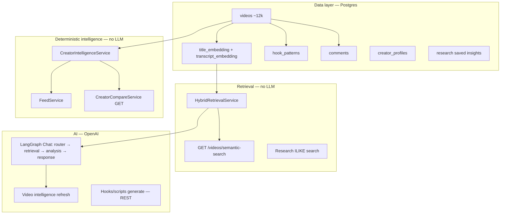
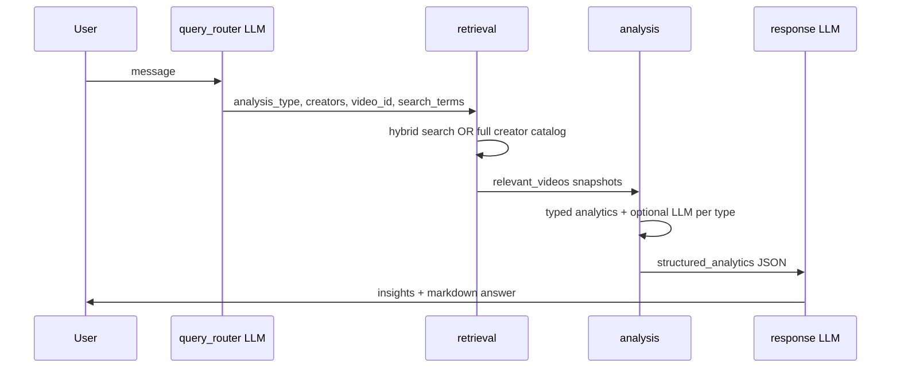

# Current AI Retrieval & Reasoning Architecture (Production Today)

**Date:** 2026-05-25  
**Scope:** What the codebase actually does today — not a roadmap.  
**Audience:** Product / architecture (Denys-style “how does it reason over 12k+ videos?”)

---

## Executive summary

ContentGraph today is **mostly a catalog + analytics platform with semantic search**, plus **one real AI reasoning pipeline** (Chat via LangGraph). It is **not** GraphRAG, **not** multi-hop reasoning, and **not** an agent that explores the full dataset.

| Capability | Status today |
|------------|----------------|
| Store 12k+ videos, creators, hooks, comments | ✅ Postgres after Sheets sync |
| Title + transcript **embeddings** (pgvector) | ✅ When OpenAI key configured |
| **Semantic retrieval** (top‑k similar videos) | ✅ Dashboard, creator search, Chat retrieval node |
| **RAG-style Chat** (retrieve → analyze → answer) | ✅ `POST /api/v1/chat` only |
| Feed “intelligence” | ✅ Deterministic SQL/scoring — **no LLM** |
| Compare page (`/compare`) | ✅ Deterministic reuse of creator intel — **no LLM** |
| Multi-step / multi-hop reasoning over catalog | ❌ Not implemented |
| Graph traversal (creator → hook → transcript → comment chains) | ❌ No graph DB; only SQL joins & string keys |
| AI sees full 12k dataset | ❌ Never — always a **small slice** (typically 15–60 videos) |

**Brutally honest verdict:**  
We have **retrieval + shallow synthesis**, not deep reasoning. Semantic search answers “what looks relevant?” Chat adds **one retrieval pass + one typed analysis + one summary LLM call**. Feed and Compare add **product intelligence UI**, not autonomous conclusion chains.

**Denys’s concern (“how will it reason over huge data and make multi-step conclusions?”):**  
- **Partially solved** for: finding relevant videos/topics and giving a useful narrative answer in **Chat**.  
- **Not solved** for: automatic multi-hop conclusions across the whole catalog without the user asking in Chat, and not at all on Feed/Compare/dashboard semantic search alone.

---

## System map (what talks to what)

---

## 1. When a user asks a complex question — what EXACTLY happens today?

There are **four different “question” surfaces**. They are not the same.

### A) Chat (`/chat`) — the only full AI reasoning path

**Entry:** `POST /api/v1/chat` → `AIChatService` → LangGraph (`backend/app/ai/graph.py`).

**Fixed pipeline (always 4 steps, linear — no loops):**

| Step | What happens | LLM? |
|------|----------------|------|
| 1. **Router** | Classifies into one of **16** `analysis_type` values (e.g. `general_chat`, `creator_comparison`, `transcript_analysis`) | ✅ small structured call |
| 2. **Retrieval** | Loads **15–60 videos** (see table below) — never 12k | Usually no LLM |
| 3. **Analysis** | Runs deterministic stats + sometimes a **second** LLM for that type | Depends on type |
| 4. **Response** | Writes final answer from **structured JSON only** (must not invent metrics) | ✅ |

**Retrieval limits (real code — `backend/app/ai/nodes/retrieval.py`):**

| Question shape | What gets loaded |
|----------------|------------------|
| Default / broad (e.g. “SMB creators should make…”) | `hybrid_retrieve` → **~40 videos** |
| Creator comparison | Up to **50 videos per creator** (full catalogs) |
| Single creator profile | Up to **60 videos** for that creator |
| Specific video (breakdown / transcript / viral / comments) | That video + **~15** same-creator videos; comment search may add **~10** more |
| Script generation for a creator | **50** catalog + **25** topic semantic hits |

Each retrieved video is a **`VideoSnapshot`**, not full transcript:

- id, title, creator, views, dates  
- `transcript_snippet` ≈ **280 chars** (keyword-window excerpt, not full text)  
- `similarity_score`, `match_source` (title / transcript / both / keyword)

**What the final LLM sees:**  
`structured_analytics` JSON + short `analysis_results` notes — **not** raw 12k rows, **not** full transcripts (except video-specific paths that run `VideoIntelligenceService` with up to **5000 chars** of transcript for that one video).

---

### B) Dashboard semantic search — retrieval only, no reasoning

**Entry:** `GET /api/v1/videos/semantic-search?q=...&limit=30`

**Flow:**

1. Embed the query (`text-embedding-3-small`, 1536-dim).  
2. `HybridRetrievalService` (`backend/app/services/retrieval_service.py`):  
   - pgvector on **title_embedding**  
   - pgvector on **transcript_embedding** (if present)  
   - keyword ILIKE on title/creator  
   - comment text boost (top comments matching query)  
   - score blend: ~55% semantic, 25% views, 15% keyword  
3. Return ranked `VideoRead` list.

**No second LLM step.** User interprets the list. This is **semantic retrieval**, not an answer engine.

---

### C) Feed (`/feed`) — proactive cards, no AI reasoning

**Entry:** `GET /api/v1/copilot/feed`

Documented in `docs/FEED_INTELLIGENCE_AUDIT.md`:

- SQL + growth snapshots + hook_patterns + comment tags  
- Deterministic scoring (`feed_scoring.py`, `feed_signal_ranker.py`)  
- Frontend curation (`feed-curate.ts`)  
- **No embeddings, no LangGraph, no ChatGPT on this path**

Feed answers: “what changed / what’s breaking out / what hooks/themes show up in **precomputed signals**?” — not “reason across entire catalog for my strategic question.”

---

### D) Compare (`/compare`) — competitive dashboard, mostly no LLM

**Main page:** `GET /api/v1/compare` → `CreatorCompareService`

- Loads **existing** `CreatorIntelligenceService` payloads for A and B  
- Pairwise math: growth, hooks, audience, title battle, **semantic_overlap**  
- **semantic_overlap** = **title token overlap + keyword overlap** (Jaccard-style) — **not** embedding similarity between creators (`creator_compare_service.py` `_semantic_overlap`)

**Separate:** `POST /api/v1/creators/compare` (creators UI panel) **does** call LLM — not what `/compare` page uses by default.

---

## 2. Does the system retrieve relevant entities before AI?

| Surface | Retrieves first? | How |
|---------|------------------|-----|
| **Chat** | ✅ Yes | Hybrid pgvector + keywords (+ creator catalog branches) |
| **Semantic search** | ✅ Yes | Same hybrid retrieval, no LLM after |
| **Video intelligence page** | Partial | Similar videos via semantic search (8 neighbors); main intel may use LLM on **one** video |
| **Feed** | N/A | Predefined signal generators, not query-driven retrieval |
| **Compare GET** | N/A | Fixed creators A vs B, not query-driven |
| **Research search** | Text only | `ILIKE` on saved insights/notes — **not** catalog embeddings |

**Yes for Chat and semantic search. No for Feed/Compare as query engines.**

---

## 3. Are embeddings used for retrieval or only analytics?

**Both — but retrieval is the main use.**

| Use | Mechanism |
|-----|-----------|
| **Retrieval** | Cosine distance on `videos.title_embedding` and `videos.transcript_embedding` |
| **Dashboard / Chat** | Query embedded on the fly; top‑k neighbors |
| **Similar videos** (video page) | Semantic search on title + transcript prefix, return ≤8 |
| **Analytics display** | Coverage stats (`/videos/catalog-stats`), intelligence health |
| **Feed / Compare GET** | Embeddings **not** used |
| **Creator “nearest creators”** | **Title token overlap**, not vectors (`creator_intelligence_service._nearest_creators`) |
| **Compare semantic_overlap** | **Token/keyword overlap**, not vectors |

Embeddings are **real retrieval**, not decoration — but only where semantic search or Chat retrieval runs.

---

## 4. Does AI ever see the full dataset?

**No.**

| Data | Typical exposure to LLM |
|------|-------------------------|
| Full catalog (~12k videos) | Never |
| Chat retrieval set | ~40 videos × metadata + ~280 char transcript snippet |
| Title analysis in Chat | ~15 sample titles + aggregated metrics JSON |
| Creator comparison in Chat | Structured comparison object built from ≤50 videos per side |
| Single-video intel | One transcript up to **5000 chars** + hooks/comments summaries |
| Feed / Compare | LLM not invoked on default paths |

The system **always filters down** before any expensive reasoning.

---

## 5. Do we already have multi-step reasoning?

**Only in a fixed, shallow sense:**

- Chat = **4 linear LangGraph nodes** (route → retrieve → analyze → respond).  
- No replanning, no “tool loop”, no second retrieval pass, no “if insufficient evidence, search again”.  
- Analysis node picks **one** `analysis_type` — it does not chain multiple analysis types in one question.

**Not present:**

- Agentic multi-step research  
- Hypothesis → verify → refine  
- Cross-entity traversal (“follow this hook → these 20 creators → their audience comments”)  
- Automatic synthesis across Feed + Compare + Chat

---

## 6. Graph-like relationships — do they exist?

**Relational, not a reasoning graph.**

| Relationship | How stored | Used in reasoning? |
|--------------|------------|-------------------|
| Video → comments | FK `comments.video_id` | Comment text boost in retrieval; audience intel per video |
| Video → hook_patterns | FK `hook_patterns.video_id` | SQL aggregates, feed cards, hook analytics |
| Creator → videos | String `creator_name` | Filter / catalog pulls |
| Creator profile | `creator_profiles` table | Cached LLM profile text |
| Video ↔ video similarity | pgvector neighbors | Similar videos list only |
| Creator ↔ creator “nearest” | Title token overlap | Display only |
| Transcript themes across catalog | Only via **embedding nearest neighbors** | No explicit theme graph |

There is **no** entity graph DB, **no** edges like `HOOK_USED_IN` → `PERFORMED_BY` → `AUDIENCE_REACTED` traversed at query time.

Marketing copy sometimes says “intelligence graph” (`intelligence_health`) — that means **pipeline health metrics**, not GraphRAG.

---

## 7. What is this system today? (pick honest labels)

| Label | Fits? | Why |
|-------|-------|-----|
| **Semantic search** | ✅ Strong | Hybrid pgvector + keywords + comment boost |
| **RAG** | ⚠️ Partial | Only Chat: retrieve top‑k → pack context → generate |
| **Analytics engine** | ✅ Strong | Feed, Compare, creator/video intel, growth, hooks SQL |
| **GraphRAG foundation** | ❌ No | No graph retrieval, no community summaries, no hop traversal |
| **UI over embeddings** | ⚠️ Unfair but partly true for Feed/Compare | Those pages barely use vectors |

**Best one-liner:**  
**“Analytics + semantic search catalog, with RAG-style Chat on top of top‑k slices.”**

---

## 8. Current “reasoning depth” (product language)

Think of depth on a 1–5 scale:

| Level | Description | ContentGraph today |
|-------|-------------|-------------------|
| 1 | Keyword search | ✅ ILIKE fallbacks |
| 2 | Semantic “what’s related?” | ✅ Embeddings |
| 3 | Summarize a **small retrieved set** | ✅ Chat response node |
| 4 | Typed analysis (hooks/titles/trends) on retrieved set | ✅ Chat analysis node |
| 5 | Multi-hop strategic reasoning over full catalog | ❌ |

**We are solid at levels 1–4 for Chat and level 2 on dashboard. We are not at level 5.**

**Reasoning style today:**

- **Statistical / pattern** (deterministic): title features, hook types, growth %, comment sentiment tags  
- **Similarity** (vectors): “videos/transcripts like this query”  
- **Narrative glue** (LLM): turns structured JSON into readable bullets — **must not invent numbers** (`response.py` rules)

That is **summarization over retrieved evidence**, not autonomous discovery.

---

## 9. Example: “What content should SMB creators make?”

Assume the user asks this in **Chat** (not semantic search alone).

### Step 1 — Router (LLM)

Likely classifies as **`general_chat`** or **`trend_analysis`** / **`title_analysis`** depending on wording.  
Extracts `search_terms` like `smb`, `creators`, `content`, `business`.

No creator filter unless user names one.

### Step 2 — Retrieval (no LLM)

`hybrid_retrieve(query, keywords, limit=40)`:

- Embeds “What content should SMB creators make?”  
- Pulls top title + transcript vector hits (transcript hits only where transcripts exist — **coverage is low today** for full catalog)  
- Adds keyword matches on title/creator  
- May boost videos whose **comments** mention similar words  
- Merges scores; returns **≤40 videos**

**Does not:**

- Scan all 12k titles for “SMB”  
- Build a creator segment graph  
- Pull all hooks tagged `identity` across SMB niche

### Step 3 — Analysis (LLM + deterministic)

For `general_chat`, code path is **`title_analysis`** (`analysis.py`):

1. `compute_base_metrics` on 40 snapshots (avg views, curiosity %, etc.)  
2. Deterministic title patterns on those 40  
3. LLM receives:  
   - user question  
   - computed metrics JSON  
   - patterns / structures / top keywords  
   - **sample of 15 titles only** — not full transcripts  

**Does not run** unless routed separately: full hook index mining, comment theme clustering across catalog, creator profile deep dive.

### Step 4 — Response (LLM)

Reads **structured JSON** + notes; outputs 3–5 insights + short markdown (Overview / Key patterns / Recommendations).

### What the user actually gets

- An answer **grounded in ~40 semantically related videos** (biased to what’s embedded and what has transcripts).  
- Title/hook **pattern language**, not a proven “SMB segment” unless those videos are in the retrieved set.  
- **No guarantee** the answer represents all SMB-relevant content in the sheet.

### Same question on **Semantic search** only

Returns 30 video rows — **no narrative conclusion**. User must read titles/views.

### Same question on **Feed**

Irrelevant unless SMB themes happen to appear in today’s breakout/hook/audience cards — **not query-driven**.

### Same question on **Compare**

Only if user picks two creators named — not for open strategic questions.

---

## What already works (production strengths)

1. **Hybrid retrieval** — title + transcript vectors + keywords + comment boost + view weighting (`retrieval_service.py`, `retrieval_scoring.py`).  
2. **Chat pipeline** — predictable 4-step LangGraph with structured outputs and anti-hallucination rules on metrics.  
3. **Rich per-entity intel** — video page intelligence, creator pages, hooks index, comments sentiment.  
4. **Feed** — fast, explainable “what’s moving” without LLM cost.  
5. **Compare GET** — fast side-by-side using cached intel.  
6. **Extension ingest** — full transcripts into Postgres (source of truth) + optional Sheets preview write-back.  
7. **Embeddings batch** — titles on sync; transcripts when text exists.

---

## What is NOT implemented yet

| Gap | Impact |
|-----|--------|
| Multi-hop retrieval (retrieve → analyze → retrieve again) | Complex questions stall at first top‑k bias |
| Catalog-wide reasoning without Chat | Feed/Compare don’t answer arbitrary strategy questions |
| Graph traversal (hooks ↔ creators ↔ audience themes) | Can’t “follow” relationships automatically |
| Full transcript in Chat context | Only snippets except single-video modes |
| Low transcript coverage | Semantic search over **content** is weak for most videos |
| Research workspace vector search | Saved notes only — not connected to catalog embeddings |
| Query planning agent | Router picks **one** analysis type — no decomposition |
| True GraphRAG (communities, summaries, hop paths) | Not in repo |
| Automatic multi-conclusion reports | User must prompt Chat each time |

---

## Denys concern — realistic assessment

| Ask | Today |
|-----|-------|
| “Find videos about X across 12k” | ✅ Semantic search + Chat retrieval (top‑k) |
| “Explain patterns in what we found” | ✅ Chat analysis + intel pages |
| “Proactively surface interesting shifts” | ✅ Feed (deterministic) |
| “Compare two creators deeply” | ✅ Compare page (mostly precomputed; overlap is lexical) |
| “Reason across entire catalog in multiple steps without me guiding” | ❌ |
| “Chain hooks → transcripts → comments → creators automatically” | ❌ |
| “Always conclusions, not just search results” | ⚠️ Only in **Chat**, and only over small slices |

**Partially solved:** discovery + narrative for **guided questions in Chat**.  
**Not solved:** autonomous multi-step strategic reasoning over the full knowledge base.

---

## What would need to exist for true multi-hop reasoning later

Plain-English requirements (not a build plan):

1. **Query planner** — break “SMB content strategy” into sub-questions (segments, hooks, audience pains, outperformers).  
2. **Iterative retrieval** — run multiple searches with different embeddings/keywords/filters; merge evidence.  
3. **Entity graph or rich joins** — explicit paths: creator → videos → hooks → comment themes (not only string `creator_name`).  
4. **Evidence objects** — store intermediate conclusions with citations (video ids, comment ids, hook ids).  
5. **Coverage strategy** — transcripts + comments for enough of catalog, or accept title-only blind spots.  
6. **Synthesis layer** — final LLM reads **multi-step evidence pack**, not one `TitleAnalysis` blob.  
7. **Optional:** background jobs that precompute niche summaries (mini “community reports”) — closest honest path toward GraphRAG-like behavior without pretending we have it now.

---

## Quick reference — files to read in codebase

| Topic | Location |
|-------|----------|
| LangGraph pipeline | `backend/app/ai/graph.py`, `nodes/*.py` |
| Hybrid retrieval | `backend/app/services/retrieval_service.py` |
| Scoring thresholds | `backend/app/services/retrieval_scoring.py` |
| Chat entry | `backend/app/api/v1/chat.py`, `services/ai_chat_service.py` |
| Semantic search API | `backend/app/api/v1/videos.py` |
| Feed | `backend/app/services/copilot/feed_service.py` |
| Compare GET | `backend/app/services/creator_intelligence/creator_compare_service.py` |
| Embeddings | `backend/app/services/embeddings/embedding_service.py` |
| Hooks index | `backend/app/services/hooks/hook_index_service.py` |
| Video intel LLM | `backend/app/services/video_intelligence/video_intelligence_service.py` |
| Prior docs | `docs/AI_SYSTEMS.md`, `docs/FEED_INTELLIGENCE_AUDIT.md`, `docs/CREATOR_COMPARE_ARCHITECTURE.md` |

---

## Final verdict (one paragraph)

**Today ContentGraph is a Postgres-backed YouTube research catalog with hybrid semantic search and strong deterministic analytics (Feed, Compare, intel pages). The only place we “reason” in the AI sense is Chat: a fixed four-step LangGraph that retrieves a **small, similarity-ranked slice** of videos, runs **one** typed analysis, and asks an LLM to narrate structured JSON — without seeing 12k rows, without graph hops, and without a second retrieval pass. Embeddings are real and used for retrieval, not just charts. Feed and Compare do not perform that kind of reasoning; they surface precomputed signals. We have RAG-like behavior in Chat only; we do not have GraphRAG or true multi-step conclusion engines yet. Denys’s vision is directionally aligned with Chat + semantic search, but the “multi-step conclusions over huge data” part remains a product gap, not a hidden existing feature.**
