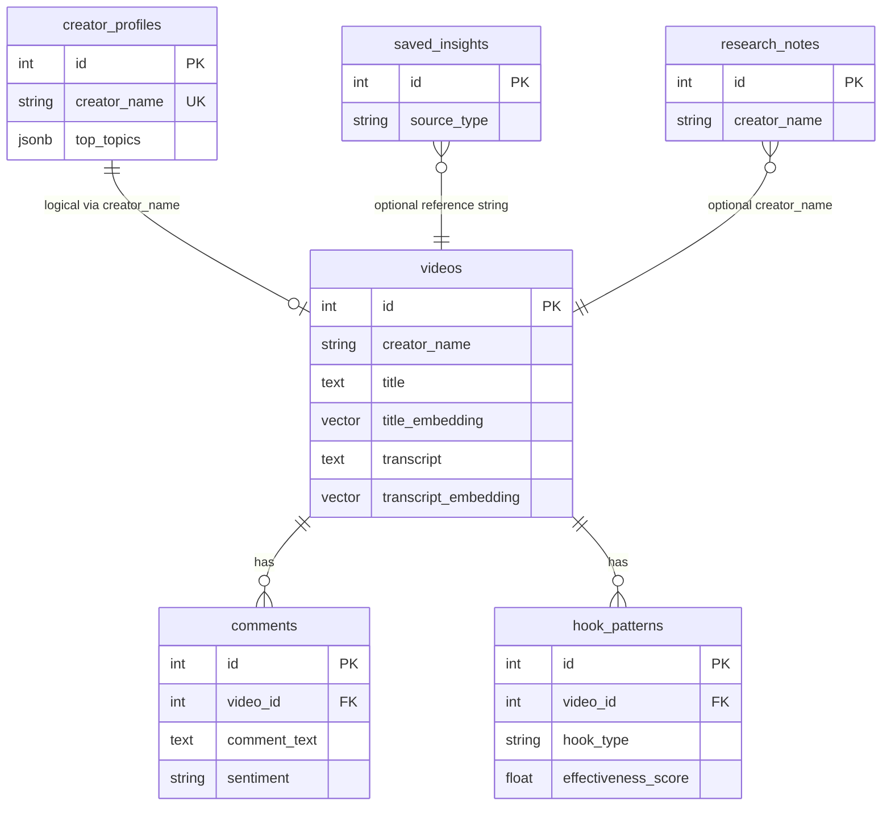

# Database Schema

ContentGraph Lite uses **PostgreSQL 16** with the **pgvector** extension. All tables are managed via **Alembic** migrations in `backend/alembic/versions/`.

---

## Entity Relationship Diagram

---

## Tables

### `videos`

**Purpose:** Canonical catalog row — one YouTube video from Google Sheets, enriched over time.

| Column | Type | Notes |
|--------|------|-------|
| `id` | INTEGER PK | Auto-increment |
| `creator_name` | VARCHAR(255) | Indexed — grouping key |
| `channel_url` | VARCHAR(512) | From Sheets |
| `subscribers_count` | BIGINT | Channel size at sync |
| `title` | TEXT | Video title |
| `views_count` | BIGINT | Indexed — performance metric |
| `published_at` | TIMESTAMPTZ | Nullable |
| `title_embedding` | VECTOR(1536) | pgvector — semantic title search |
| `transcript` | TEXT | Full transcript text |
| `transcript_embedding` | VECTOR(1536) | Semantic content search |
| `created_at` | TIMESTAMPTZ | Server default `now()` |

**Indexes:**
- `ix_videos_creator_name`
- `ix_videos_views_count`

**How videos are stored:**
1. Inserted/updated on Sheets sync (match: creator + title + published_at)
2. Title embedding filled by `EmbeddingService`
3. Transcript fetched asynchronously (limit per sync)
4. Transcript embedding after text available

**Uniqueness:** Application-level match in sync — not a DB unique constraint on title.

---

### `comments`

**Migration:** 007

**Purpose:** Top YouTube comments for audience intelligence.

| Column | Type | Notes |
|--------|------|-------|
| `id` | INTEGER PK | |
| `video_id` | INTEGER FK → `videos.id` | ON DELETE CASCADE, indexed |
| `comment_text` | TEXT | |
| `author_name` | VARCHAR(255) | |
| `likes_count` | BIGINT | |
| `published_at` | TIMESTAMPTZ | Nullable |
| `sentiment` | VARCHAR(32) | Indexed — positive/negative/neutral |
| `emotional_tags` | JSONB | List of tags |
| `created_at` | TIMESTAMPTZ | |

**How comments are stored:**
1. `CommentsService.enrich_missing()` after sync
2. YouTube Data API `commentThreads` (relevance order)
3. Re-fetch replaces comments for that video (service logic)
4. Used in retrieval (comment text boost), video page, audience analysis

---

### `hook_patterns`

**Migration:** 006

**Purpose:** Indexed viral hooks extracted from catalog.

| Column | Type | Notes |
|--------|------|-------|
| `id` | INTEGER PK | |
| `video_id` | INTEGER FK | Nullable CASCADE |
| `hook_text` | TEXT | Extracted hook line |
| `hook_type` | VARCHAR(64) | Indexed — curiosity, identity, etc. |
| `creator_name` | VARCHAR(255) | Indexed |
| `views_count` | BIGINT | Denormalized from video |
| `video_title` | TEXT | Denormalized |
| `effectiveness_score` | FLOAT | Heuristic from views + pattern |
| `confidence_score` | FLOAT | Extraction confidence |
| `keywords` | JSONB | |
| `emotional_triggers` | JSONB | |
| `created_at` | TIMESTAMPTZ | |

**How hooks are stored:**
- Full **rebuild** on every Sheets sync (`HookIndexService.rebuild_index()`)
- Not incrementally patched — ensures consistency with video set

---

### `creator_profiles`

**Migration:** 004

**Purpose:** Cached AI-generated creator intelligence.

| Column | Type | Notes |
|--------|------|-------|
| `id` | INTEGER PK | |
| `creator_name` | VARCHAR(255) | **UNIQUE**, indexed |
| `content_style` | TEXT | |
| `top_topics` | JSONB | List of strings |
| `hook_patterns` | JSONB | List of patterns |
| `communication_style` | TEXT | |
| `emotional_triggers` | JSONB | |
| `audience_type` | TEXT | |
| `creator_summary` | TEXT | |
| `avg_views` | FLOAT | |
| `total_videos` | INTEGER | |
| `total_views` | BIGINT | |
| `updated_at` | TIMESTAMPTZ | |

**Relationship to videos:** Logical — joined on `creator_name` string, not FK.

---

### `saved_insights`

**Migration:** 005

**Purpose:** Persisted research insights from chat or UI.

| Column | Type | Notes |
|--------|------|-------|
| `id` | INTEGER PK | |
| `insight_text` | TEXT | |
| `source_type` | VARCHAR(64) | Indexed — chat, creator_profile, analytics, etc. |
| `source_reference` | VARCHAR(512) | Creator name, query, video id string |
| `tags` | JSONB | |
| `created_at` | TIMESTAMPTZ | |

---

### `research_notes`

**Migration:** 005

**Purpose:** User-written notes in research workspace.

| Column | Type | Notes |
|--------|------|-------|
| `id` | INTEGER PK | |
| `title` | VARCHAR(255) | |
| `content` | TEXT | |
| `type` | VARCHAR(64) | Indexed — general, creator_finding, comparison, observation |
| `creator_name` | VARCHAR(255) | Nullable, indexed |
| `tags` | JSONB | |
| `created_at` | TIMESTAMPTZ | |

---

## Vector Fields

| Table | Column | Dimensions | Model |
|-------|--------|------------|-------|
| `videos` | `title_embedding` | 1536 | text-embedding-3-small |
| `videos` | `transcript_embedding` | 1536 | text-embedding-3-small |

**Extension:** `CREATE EXTENSION IF NOT EXISTS vector` on app startup (`ensure_pgvector_extension`).

**Query pattern:** Cosine distance — lower distance = higher similarity. Combined in `HybridRetrievalService`.

---

## Migrations History

| Rev | File | Description |
|-----|------|-------------|
| 001 | `001_create_videos.py` | Base `videos` table |
| 002 | `002_add_title_embedding.py` | `title_embedding` vector column |
| 003 | `003_add_transcript.py` | `transcript`, `transcript_embedding` |
| 004 | `004_create_creator_profiles.py` | `creator_profiles` |
| 005 | `005_create_research.py` | `saved_insights`, `research_notes` |
| 006 | `006_create_hook_patterns.py` | `hook_patterns` |
| 007 | `007_create_comments.py` | `comments` |

**Apply:** `cd backend && alembic upgrade head`

---

## Data Lifecycle by Feature

### Research embeddings

Not a separate table — research search uses text match on `saved_insights` + `research_notes`.

### Semantic search

Reads `videos.title_embedding` and `videos.transcript_embedding` only.

### Hooks

Derived table `hook_patterns` — rebuilt from `videos` content.

### Comments

Fetched into `comments` — linked by `video_id`.

---

## Storage Considerations

| Data | Growth driver |
|------|---------------|
| Videos | Sheet row count |
| Embeddings | 2 × 1536 floats per enriched video |
| Hook patterns | ~1–3 per video title/transcript |
| Comments | up to 25 × enriched videos |
| Creator profiles | 1 row per unique creator |
| Research | User-generated, unbounded |

---

## Related Docs

- [BACKEND_ARCHITECTURE.md](./BACKEND_ARCHITECTURE.md)
- [DEVELOPMENT_SETUP.md](./DEVELOPMENT_SETUP.md)
