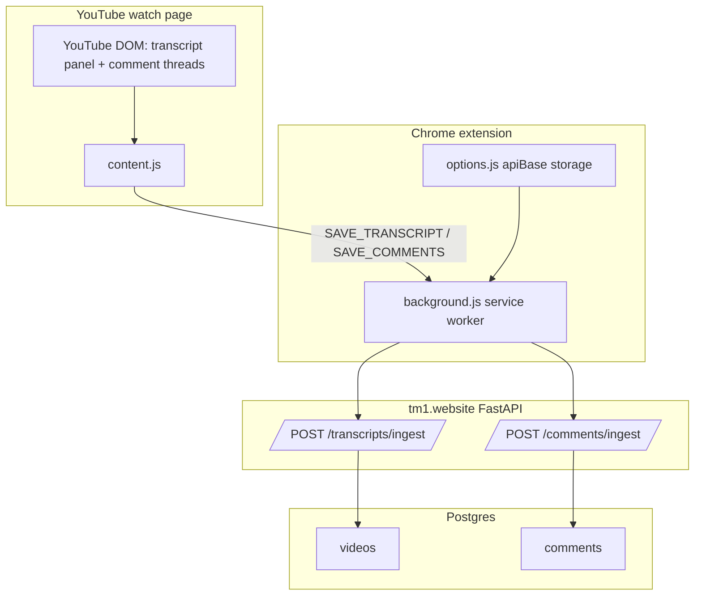
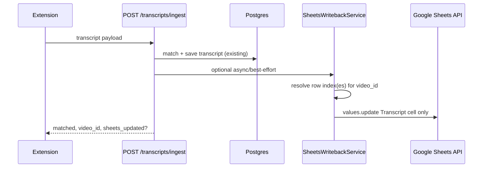

# Extension Transcript → Google Sheets Write-Back — Architecture Analysis

**Status:** Analysis only — no implementation.  
**Date:** 2026-05-25  
**Goal:** Understand how the Chrome extension saves transcripts/comments today, and how to **additionally** write transcript text into the matching Google Sheets row without changing existing comment/backend behavior.

---

## Executive summary

| Question | Answer |
|----------|--------|
| Where does the extension save today? | `POST /api/v1/transcripts/ingest` and `POST /api/v1/comments/ingest` via service worker |
| Does the project write to Google Sheets today? | **No** — only **read** (`spreadsheets.values.get`) with `spreadsheets.readonly` scope |
| Recommended approach | **Option B:** Extension → backend ingest (unchanged) → backend updates **one Transcript cell** per matched sheet row using **service account** |
| Best row key | **Normalized 11-char YouTube `video_id`** matched against **`video_url`** column (fallback: `channel_url`, then title+creator) |
| Comments to Sheets? | **Out of scope** — comments stay backend-only per product requirement |

---

## PART 1 — Current extension architecture

### File map

| File | Role |
|------|------|
| `extension/manifest.json` | MV3: content script on `youtube.com/watch*`, service worker, options, host permissions |
| `extension/content.js` | DOM panel, extract transcript/comments, `chrome.runtime.sendMessage` |
| `extension/background.js` | `fetch` to API (CORS-free), API base from `chrome.storage.sync` |
| `extension/panel.css` | Floating panel styles |
| `extension/options.html` + `options.js` | Configurable API base (default `https://tm1.website/api/v1`) |
| `extension/popup.html` | Short help + link to options |

There is **no popup-driven save** — all work happens in the **content script** on the watch page.

### Component diagram



### Content script flow

#### Transcript

1. User opens YouTube **Transcript** UI (panel does not auto-open on page load).
2. **Extract** → `openTranscriptPanel()` + `ensureTranscriptTabActive()` + DOM scrape (`transcript-segment-view-model`, `#segments-container`, etc.).
3. Text joined into `transcriptText` (plain string, spaces between segments).
4. **Save** → `chrome.runtime.sendMessage({ type: "SAVE_TRANSCRIPT", payload })`.

Payload (from `getPageMeta()` + extracted text):

```json
{
  "video_url": "https://www.youtube.com/watch?v=VIDEO_ID",
  "title": "Page h1 title",
  "creator": "Channel name from #owner",
  "transcript_text": "Full plain text…"
}
```

- `video_url`: `location.href.split("&")[0]` (strips `&t=` etc., keeps `v=`).
- No separate `video_id` field — ID is derived server-side from URL.

#### Comments

1. **Extract comments** → scroll to `#comments`, scrape up to **20** `ytd-comment-thread-renderer` (author, text, likes).
2. **Save** → `SAVE_COMMENTS` with same `video_url`, `title`, `creator` + `comments[]`.

Comments path is **independent** of transcript; product requirement is to **leave this unchanged**.

### Background / message passing

| Message type | Handler | HTTP |
|--------------|---------|------|
| `SAVE_TRANSCRIPT` | `postIngest("/transcripts/ingest", payload)` | `POST {apiBase}/transcripts/ingest` |
| `SAVE_COMMENTS` | `postIngest("/comments/ingest", payload)` | `POST {apiBase}/comments/ingest` |

- **No auth headers** — endpoints are open (documented limitation).
- **No Google credentials** in the extension.
- API base: `chrome.storage.sync.apiBase` or default `https://tm1.website/api/v1`.

### Authentication with tm1.website

| Mechanism | Present? |
|-----------|------------|
| API key / Bearer token | **No** |
| Cookies / session | **No** |
| CORS | Avoided by using **service worker** `fetch` (listed in `host_permissions`) |

Anyone who can reach the API URL can call ingest endpoints.

---

## PART 2 — Current backend save flow

### Endpoints

| Endpoint | Service | Router |
|----------|---------|--------|
| `POST /api/v1/transcripts/ingest` | `TranscriptIngestService.ingest()` | `backend/app/api/v1/transcripts.py` |
| `POST /api/v1/comments/ingest` | `CommentsIngestService.ingest()` | `backend/app/api/v1/comments.py` |

### Transcript ingest (existing — do not rewrite)

```text
TranscriptIngestService.ingest()
  1. find_catalog_video(db, video_url, title, creator)
  2. If None → matched=false, no DB write
  3. video.transcript = text; transcript_embedding = None
  4. flush
  5. TranscriptService.embed_transcript(video)  [OpenAI, if key set]
  6. commit
```

**Extension hook point for Sheets (future):** after step 6 success, when `matched=true` and `video_id` known — call a new write-back service (side effect, failures should not roll back DB if designed as best-effort).

### Comment ingest (unchanged)

```text
CommentsIngestService.ingest()
  1. find_catalog_video(...)
  2. DELETE existing comments for video_id
  3. INSERT up to 20 new Comment rows + sentiment tags
  4. commit
```

No Sheets involvement today or in the proposed feature.

### Video matching (`find_catalog_video`)

**File:** `backend/app/services/ingest/video_match.py`  
**Shared by:** transcript ingest, comment ingest, (same rules as Sheets sync dedup for ID).

| Priority | Rule | Notes |
|----------|------|-------|
| 1 | Extract `video_id` (11 chars) from `video_url` via `TranscriptService.extract_video_id()` | Extension sends watch URL here |
| 2 | `Video.video_url ILIKE '%{id}%' OR Video.channel_url ILIKE '%{id}%'` | If multiple rows: prefer exact **title** match, else highest **views_count** |
| 3 | Fallback: `lower(title)` + `lower(creator_name)` | Single row, highest views |

**Not used for ingest:** published_at, subscribers, sheet row index.

**Implication for Sheets:** DB match can succeed while **multiple sheet rows** share the same watch URL (154 duplicate rows vs 12,093 videos). Write-back policy must decide: update **all** matching sheet rows vs **first** row only.

### DB fields relevant to Sheets matching

| `videos` column | Populated from Sheets sync | Used for ingest match |
|-----------------|--------------------------|------------------------|
| `video_url` | Column **Video URL** | **Primary** (YouTube ID) |
| `channel_url` | Column **URL** (channel) | Secondary ID search |
| `title`, `creator_name` | Name, Titles | Fallback match |
| `transcript` | Column **Transcript** + optional YouTube full sync | Updated by ingest |

There is **no** `youtube_video_id` column and **no** `sheet_row_index` column today.

---

## PART 3 — Google Sheets integration (existing)

### Read path (production today)

| Piece | Location |
|-------|----------|
| Client | `backend/google_sheets/client.py` — `GoogleSheetsClient.fetch_rows()` |
| Discovery / preview | `backend/google_sheets/discovery.py` |
| Column detection | `backend/google_sheets/column_detect.py` — `FIELD_ALIASES` includes `transcript` → headers `transcript`, `transcripts`, `transcription` |
| Sync pipeline | `backend/google_sheets/sync_service.py` |
| Config | `app_settings`: `google_sheets_spreadsheet_id`, `google_sheets_range`, `google_sheets_column_map` (JSON) |

**Scope today:**

```python
SCOPES = ["https://www.googleapis.com/auth/spreadsheets.readonly"]
```

**API used:** `spreadsheets.values.get` only.

### Write path

**Repository search:** no `values().update`, `batchUpdate`, or `append` anywhere.

**Conclusion:** The project **only reads** Sheets. Transcript write-back requires:

1. New write scope on service account (`https://www.googleapis.com/auth/spreadsheets` or `.../spreadsheets` limited to file).
2. New client method(s), e.g. `update_cell(sheet_row, column_letter, value)` or `batch_update`.
3. Re-authorize / re-share spreadsheet with service account (Editor) — already required for read in many setups.

### Where to add write-back (cleanest)

| Layer | Recommendation |
|-------|----------------|
| **Not** in extension | Avoid credentials, quota, and duplicate matching logic in the browser |
| **Yes** in backend | `backend/google_sheets/writeback_service.py` (new), invoked from `TranscriptIngestService` after successful DB save |
| Config reuse | `AppSettingsService.resolve_sheets()` + `resolve_column_mapping()` for spreadsheet ID, tab/range, Transcript column letter |
| Optional flag | `SHEETS_TRANSCRIPT_WRITEBACK_ENABLED=true` to disable in dev |

Keep **sync_service.py** read-only; do not mix 12k-row import with per-ingest writes in the same transaction.

### Transcript column mapping today

- Logical field: `transcript`
- User sheet header: **Transcript** (column H in the reference workbook)
- Stored mapping example: `{ "transcript": "Transcript", "video_url": "Video URL", ... }` in `app_settings.google_sheets_column_map`
- Sync **reads** H into `videos.transcript` when cell non-empty; ingest **overwrites** DB transcript without touching Sheets until write-back exists.

---

## PART 4 — Recommended strategy (one approach)

### Chosen: **Option B — Extension → backend → backend updates Sheets**



### Why not the others

| Option | Verdict |
|--------|---------|
| **A — Extension calls Sheets API** | Reject: service account JSON must not ship in extension; OAuth for end users is heavy; duplicates matching logic |
| **C — Queue / batch later** | Good **Phase 3** optimization; not needed for MVP if writes are single-cell and rate-limited |
| **B** | Credentials stay on server; one matching implementation; extension unchanged except optional response fields |

### Constraints satisfied

- No Google credentials in extension ✓  
- No full sheet rewrite ✓ (single-cell or small batch)  
- Existing ingest logic preserved ✓ (hook after commit)  
- Comments unchanged ✓  

### Design choices for MVP

1. **Best-effort write-back:** DB save succeeds even if Sheets fails; return `sheets_updated: false` + warning in response/message.
2. **Do not block ingest** on Sheets quota or 50k cell limit errors.
3. **Optional** feature flag + Settings toggle later.

---

## PART 5 — Row matching strategy (Sheets)

### What exists today

| Source | Video identity |
|--------|----------------|
| Extension payload | `video_url` = canonical watch URL (`?v=11chars`) |
| DB `videos` | `video_url`, `channel_url`, `title`, `creator_name` |
| Sheets row | **Video URL** column (e.g. `https://www.youtube.com/watch?v=...`) |
| Sheets | **URL** = channel link (often **no** video ID) |

### Recommended primary key

**Normalized YouTube video ID (11 characters)** extracted from:

1. Ingest payload `video_url` (same as DB match), then  
2. DB `video.video_url` when resolving row from `video_id`, then  
3. Each sheet row’s **Video URL** cell (not channel URL alone).

```text
normalize(url) → video_id
match sheet rows where extract_video_id(row.video_url) == video_id
```

### URL normalization rules (align with existing code)

Use `TranscriptService.extract_video_id()`:

- `youtube.com/watch?v=ID`
- `youtu.be/ID`
- Strip tracking params (`&t=`, `&list=`) — extension already strips to `split("&")[0]` for save URL

### Duplicate sheet rows

Observed production: **12,247** sheet rows → **12,093** unique videos (~154 duplicates).

| Policy | Pros | Cons |
|--------|------|------|
| Update **all** rows with same `video_id` | Sheet stays consistent | 2–3 API writes per ingest if duplicates |
| Update **first** row only | Fewer writes | Other duplicate rows stay empty in Sheets |
| **Recommended MVP** | Update **all** matching rows (usually 1, occasionally 2+) | Bounded writes; predictable |

### Fallback matching (only if Video URL empty in sheet)

| Order | Key |
|-------|-----|
| 1 | `video_id` from Video URL column |
| 2 | Exact `title` + `creator_name` (case-insensitive) — same as DB fallback |

Avoid matching on channel URL alone for write-back (ambiguous across many videos on same channel).

### Determinism checklist

- [x] Same extension save on same video → same DB row (given catalog synced)  
- [x] Same `video_id` → same set of sheet rows  
- [ ] Row numbers stable only if sheet row order unchanged — **see Part 6** (index cache invalidation on sync)

---

## PART 6 — Scalability and limits

### Per-ingest cost (MVP without cache)

Naive approach: scan entire column Video URL on every ingest → **O(n)** read per save → **unacceptable** at 12k rows.

### Recommended: row index cache

Build map once, refresh on sync:

```text
video_id → [sheet_row_numbers]   # 1-based row index in configured range/tab
```

| Event | Action |
|-------|--------|
| Sheets sync completes | Rebuild index from `fetch_rows()` loop (already iterates all rows) |
| Transcript ingest | O(1) lookup + 1–3 `values.update` calls |
| Sheet structure change without sync | Stale index risk → TTL or version counter on sync_run |

Store cache options:

| Store | Fit |
|-------|-----|
| Postgres table `sheet_row_index` | Durable, survives API restart |
| In-memory + Redis | Faster; optional Phase 2 |
| Re-read sheet every ingest | Simple MVP for **low volume only** |

### Google Sheets API quotas (typical project limits)

Approximate (Google Sheets API v4, subject to Google Cloud project):

| Operation | Quota (indicative) |
|-----------|-------------------|
| Read (`values.get`) | 300 requests / minute / project |
| Write (`values.update`) | 60 requests / minute / user / project |
| Per-cell write | Counts as 1 request per `update` call (batchUpdate can combine) |

### Volume scenarios (extension-driven writes)

Assumes **one `values.update` per sheet row** (or one `batchUpdate` per ingest).

| Volume | Writes/day | Risk |
|--------|------------|------|
| 100/day | 100 | Low |
| 1,000/day | ~1,000 | OK with batching; watch 60/min burst |
| 5,000/day | 5,000 | Needs batching + backoff; consider queue (Phase 3) |

**Batching:** `spreadsheets.values.batchUpdate` — up to 100 ranges per HTTP request → group duplicate row updates.

### Cell size limit

Google Sheets cell **~50,000 characters**. Long transcripts must be **truncated** for Sheets (DB can keep full text) or write-back fails with clear warning.

### Lookup complexity summary

| Approach | 12k rows | Per ingest |
|----------|----------|------------|
| Full sheet scan | 1 read ~12k rows | Bad |
| Cached `video_id → rows` | Built on sync O(n) | O(1) lookup + 1 write |
| `QUERY` / Apps Script | Extra moving parts | Not recommended for MVP |

---

## PART 7 — Recommended implementation plan (no code yet)

### Phase 1 — Minimal MVP

**Goal:** After successful transcript ingest, update Transcript column in Sheets for matching row(s).

| Item | Detail |
|------|--------|
| Scope change | Service account: add **spreadsheets** (read+write) scope |
| New module | `google_sheets/writeback_service.py` — `update_transcript_cells(video_id, text)` |
| Row index | Build `video_id → [row]` map at end of `SheetsSyncService.sync()` and persist to DB table or JSON file on settings |
| Hook | `TranscriptIngestService.ingest()` after `commit`: if matched, call write-back (try/except, log warning) |
| API response | Extend `TranscriptIngestResponse` with optional `sheets_rows_updated: int`, `sheets_error: str | null` |
| Extension | **No change required** (optional: show “Sheet updated” if new fields returned) |
| Comments | **No changes** |
| Truncate | Sheets cell max 50k chars |
| Feature flag | Env `SHEETS_WRITEBACK_ENABLED=1` |

**Exact write flow:**

1. Ingest saves transcript to `videos` (existing).  
2. Load `video` by `video_id`; `yt_id = extract_video_id(video.video_url)`.  
3. Load index for configured `spreadsheet_id` + tab.  
4. For each `row_num` in `index[yt_id]`:  
   - Compute A1: `{tab}!{TranscriptColumn}{row_num}`  
   - `values.update(range, [[truncated_text]], valueInputOption=USER_ENTERED)`  
5. Return count of cells updated.

**Risks:**

| Risk | Mitigation |
|------|------------|
| Stale row index after manual sheet edits | Rebuild index on every full/quick sync |
| Service account not Editor | Document in Settings; 403 → clear error |
| Transcript too long for cell | Truncate + `sheets_partial=true` in response |
| Duplicate rows | Update all or cap at N rows per video |
| Ingest succeeds, Sheets fails | Best-effort; user sees warning |

### Phase 2 — Optimization

- `batchUpdate` multiple cells per ingest (one HTTP call).  
- Debounce: coalesce multiple ingests for same `video_id` within 30s.  
- Settings UI toggle: “Write transcripts back to Google Sheet”.  
- Invalidate index when `sync_runs` completes.  
- Metrics: `sheets_writeback_success_total` / failures.

### Phase 3 — Scaling

- Background queue (DB table `sheets_writeback_jobs`) for high extension volume.  
- Rate limiter aligned to 60 writes/min.  
- Optional: store `sheet_row_id` on `videos` at sync time (schema migration) for zero-cache lookups.  
- Still **no** extension-side Sheets access.

---

## Proposed API design (additive)

### `POST /api/v1/transcripts/ingest` response (extended)

```json
{
  "video_id": 123,
  "matched": true,
  "transcript_saved": true,
  "embedding_created": true,
  "transcript_chars": 45000,
  "message": "Transcript saved to catalog video.",
  "sheets_rows_updated": 1,
  "sheets_writeback": "ok"
}
```

On failure:

```json
{
  "sheets_rows_updated": 0,
  "sheets_writeback": "failed",
  "sheets_message": "No sheet row for video ID dQw4w9WgXcQ"
}
```

No new extension endpoint required if hook is server-side only.

### Optional future endpoint (not required for MVP)

`POST /api/v1/sheets/writeback/transcript` — manual retry from dashboard; only if you want UI-triggered repair without re-saving from extension.

---

## File map (future implementation)

| Action | Path |
|--------|------|
| New | `backend/google_sheets/writeback_service.py` |
| New | `backend/google_sheets/row_index.py` (build/load cache) |
| New | `backend/app/models/sheet_video_index.py` + migration (optional) |
| Extend | `backend/google_sheets/client.py` — write scope + `update_values()` |
| Extend | `backend/app/services/transcripts/ingest_service.py` — post-commit hook |
| Extend | `backend/google_sheets/sync_service.py` — rebuild index after commit |
| Extend | `backend/app/schemas/transcript_ingest.py` — response fields |
| Docs | This file + `TRANSCRIPT_EXTENSION_ARCHITECTURE.md` cross-link |
| **Do not change** | `extension/content.js` save payloads; `CommentsIngestService` |

---

## Open questions (product)

1. Update **all** duplicate sheet rows or only one?  
2. Truncate transcript in Sheets at 50k — show note in extension UI?  
3. Should write-back run when transcript ingest **updates** an existing DB transcript vs only first save?  
4. Require successful **quick sync** index before write-back, or on-demand rebuild?  

---

## Related docs

- [TRANSCRIPT_EXTENSION_ARCHITECTURE.md](./TRANSCRIPT_EXTENSION_ARCHITECTURE.md) — current extension + ingest flow  
- [SHEETS_SYNC_PROGRESS_IMPLEMENTATION.md](./SHEETS_SYNC_PROGRESS_IMPLEMENTATION.md) — sheet → DB sync  
- [SHEETS_SYNC_POLISH_PASS.md](./SHEETS_SYNC_POLISH_PASS.md) — quick vs full sync (YouTube enrichment on full only)

---

## Screenshots / QA (for later implementation)

Not in scope for this analysis. After implementation, verify:

- [ ] Extension Save → DB transcript present  
- [ ] Same video → Transcript cell in Google Sheet updated  
- [ ] Duplicate URL rows in sheet all updated (if policy = all)  
- [ ] Comment Save → **no** Sheets change  
- [ ] 50k+ char transcript → DB full, Sheets truncated or warned
