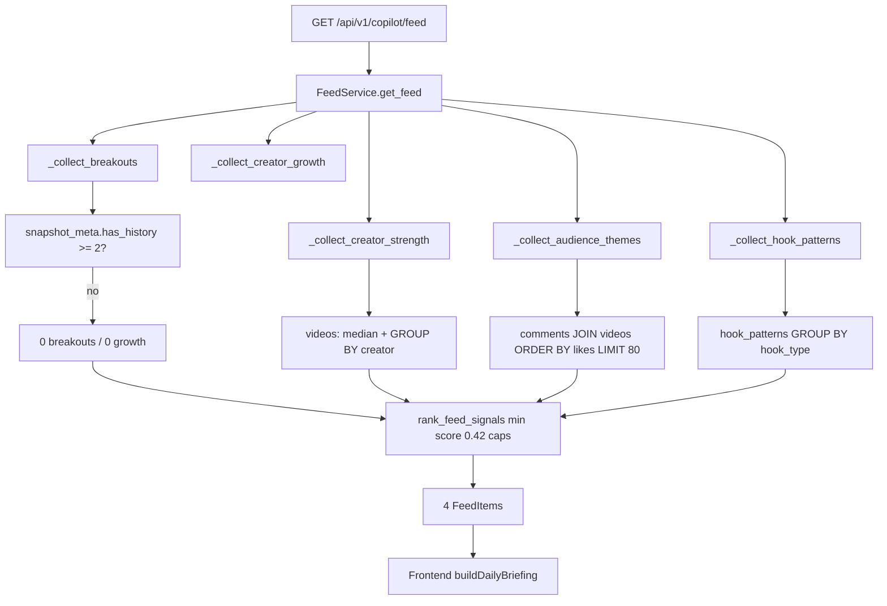

# Feed Production QA + Data Integrity Audit

**Target:** https://tm1.website/feed  
**Audit date:** 2026-05-23 (UTC)  
**Method:** Live browser inspection + `GET /api/v1/copilot/feed?limit=8` + Postgres queries on production stack (`contentgraph-postgres-1`) + backend candidate enumeration in `FeedService`  
**Scope:** Read-only verification — no code changes in this pass  

**Screenshots:** Browser QA captured at `/feed` (hero, snapshot banner, research path, three sections). Full-page capture: `feed-qa-full-page.png` (Cursor browser session, 2026-05-23).

---

## Executive verdict

**Overall: PARTIALLY TRUSTWORTHY — not production-grade as a daily research intelligence product yet.**

The feed is **not hallucinated** and **not showing fake momentum** while `has_snapshot_history: false`. Core numbers on the hero card (8 comments, 5,932 likes, 2 related videos, Jon Law 3.8× median) **match the database and backend code** when traced line-by-line.

However, the **briefing UX overstates signal strength** relative to data volume (46 comments on 5 videos), **duplicates the same audience insight** in “Emerging themes” and the research path, and **cannot surface hook patterns at all** with the current `hook_patterns` cardinality rule. Operators risk treating editorial layout as independent intelligence when several blocks are **the same API row re-labeled**.

| Area | Verdict |
|------|---------|
| API ↔ UI parity (hero, counts, titles) | **Correct** |
| Snapshot gating / no fake breakouts | **Correct** |
| Creator strength math (median, ratio) | **Correct** |
| Audience likes / evidence_count | **Correct** |
| final_score ordering & hero pick | **Correct** (per documented rules) |
| Emerging themes | **Misleading** (duplicate of existing audience card) |
| Research path | **Weak** (redundant steps, omits Matthew Berman) |
| Hook / “Underused patterns” section | **Operationally empty** (0 candidates — by design) |
| Cross-channel / “emerging” language | **Statistically weak** (46 comments, 3 videos dominate) |
| Caching / staleness | **No evidence of stale API cache** |

---

## 1. What the live UI shows (2026-05-23)

### Page framing

- Title: **Daily research briefing**
- Subhead: **What should we study today?**
- Meta: **5 study leads · 12,522 videos in catalog**
- **Snapshot notice (amber):** “Momentum insights need several days of daily snapshots. Today's briefing is based on catalog structure and synced comments only.”

### Hero (“Today’s lead”)

| UI field | Value |
|----------|--------|
| Title | Audience theme: curiosity and follow-up questions (8 top comments) |
| Summary bullets | 5,932 combined likes · lead video: Volodymyr Zelenskyy… |
| Evidence | 8 evidence points |
| Related videos | 2 related videos in catalog |
| why_appeared (footer) | ≥2 high-engagement comments tagged curiosity… |

### Research sections present

| Section | Content |
|---------|---------|
| What audiences reacted to | 1 card: **positive** theme (10 top comments) |
| Creators worth studying | Jon Law 3.8×, Matthew Berman 3.3× |
| Emerging themes | **Recurring positive signals across multiple channels** |
| What accelerated | **Absent** (expected — no snapshot history) |
| Underused winning patterns | **Absent** (no hook candidates) |

### Suggested research path (4 steps)

1. Audience theme: curiosity… (hero — **duplicate title of hero**)
2. Audience theme: strong positive reinforcement…
3. Jon Law consistently exceeds catalog median…
4. Recurring positive signals across multiple channels (**duplicate of positive theme / emerging block**)

---

## 2. API trace

**Request:** `GET https://tm1.website/api/v1/copilot/feed?limit=8`  
**Response time:** 200 OK, no `Cache-Control` header (computed per request).

```json
{
  "items": [
    { "id": "audience-theme-curiosity", "final_score": 0.835, "evidence_count": 8, ... },
    { "id": "audience-theme-positive", "final_score": 0.817, "evidence_count": 10, ... },
    { "id": "strength-Jon Law", "final_score": 0.722, "performance_ratio": 3.8, ... },
    { "id": "strength-Matthew Berman", "final_score": 0.722, "performance_ratio": 3.32, ... }
  ],
  "catalog_video_count": 12522,
  "briefing": {
    "signals_considered": 10,
    "signals_selected": 4,
    "min_final_score": 0.42,
    "snapshot_date_latest": "2026-05-22",
    "snapshot_days_max": 1,
    "comment_count": 46,
    "has_snapshot_history": false
  }
}
```

**UI uses the same 4 API items.** Frontend adds layout only (`buildDailyBriefing` in `frontend/lib/feed-briefing.ts`): hero, section caps, emerging-themes rewrite, research path.

---

## 3. Pipeline trace (code → SQL)



### Tables touched

| Signal | Tables | Key SQL / logic |
|--------|--------|-----------------|
| Breakout | `video_stats_history`, `videos` | Gated off when `distinct snapshot_date < 2` |
| Creator growth | `creator_stats_history` | Same gate |
| Creator strength | `videos` | `AVG(views_count)`, `COUNT(*)`, `statistics.median(all views)` |
| Audience | `comments`, `videos` | Top 80 by `likes_count`, bucket by `emotional_tags` / sentiment |
| Hook pattern | `hook_patterns` | `AVG(views_count)` per type; **only types with 3 ≤ count ≤ 15** |

---

## 4. Backend candidate pool (production, enumerated in container)

| Pool | Candidates | In ranked feed (4) |
|------|------------|---------------------|
| Breakouts | 0 | — |
| Creator growth | 0 | — |
| Creator strength | 6 (all `final_score` 0.722) | 2 (Jon Law, Matthew Berman) |
| Audience | 4 (curiosity, positive, motivation, negative) | 2 (curiosity, positive) |
| Hook patterns | **0** | — |

**Dropped by ranker (score ≥ 0.42 but caps):** Derek Cheung, Tina Huang, Dan Martell, Caleb Ralston (creator_strength cap = 2); motivation (0.599), negative (0.507) (audience cap = 2, lower rank).

---

## 5. Item-by-item verification

### 5.1 Hero — `audience-theme-curiosity`

| Claim | UI | API | DB / code | Status |
|-------|----|-----|-----------|--------|
| evidence_count = 8 | 8 evidence points | 8 | Python bucket: 8 comments with first tag `curiosity` in top-80 | **Correct** |
| combined likes = 5,932 | 5,932 combined likes | summary | `SUM(likes_count)=5932` on same 8 rows | **Correct** |
| 2 related videos | 2 related videos | 2 in `supporting_videos` | Distinct `video_id` in bucket: 7094, 4266, 4384 → dedupe cap 3 returns 2 | **Correct** |
| 3 creators | (in API only) | Lex, Tech With Tim, Jeff Su | `COUNT(DISTINCT creator_name)=3` | **Correct but weak sample** |
| Lead video | Zelenskyy / Lex | href `/videos/7094` | `group[0]` = first top-80 row assigned to bucket (id 44, 3200 likes), still video 7094 | **Correct href; “lead” is not highest-like in theme** |
| final_score 0.835 | (not shown) | 0.835 | `score_audience_theme(8, 5932, curiosity)` → 0.835 | **Correct math** |

**Audience SQL (curiosity bucket replication):**

```sql
-- Top-80 pool then theme=curiosity (excluding confusion-first tag assignment)
SELECT SUM(likes_count) FROM (
  SELECT c.likes_count, c.emotional_tags::text AS tags
  FROM comments c JOIN videos v ON v.id = c.video_id
  ORDER BY c.likes_count DESC LIMIT 80
) t
WHERE tags LIKE '%curiosity%' AND tags NOT LIKE '%confusion%';
-- Result: 5932
```

**Comment concentration (integrity context):**

```sql
SELECT video_id, COUNT(*) FROM comments GROUP BY video_id ORDER BY 2 DESC;
-- 7094: 20, 4266: 16, 4384: 8  (46 total, 5 videos)
```

**Trust:** Numbers are real rows. **Untrust:** “Today's lead” implies daily priority; data is **static comment clustering** on a **tiny, video-skewed** corpus (mostly one Lex interview).

---

### 5.2 Audience section — `audience-theme-positive`

| Claim | Value | Verified |
|-------|-------|----------|
| evidence_count | 10 | **Correct** (`sentiment=positive`, no theme tag in top-80) |
| combined likes | 12,645 | **Correct** (DB sum on 10 rows) |
| creators | Lex, Jeff Su, Tech With Tim | **Correct** |

**Not duplicated in hero** (curiosity excluded). **Trustworthy** as a second row in API.

---

### 5.3 Creators — Jon Law & Matthew Berman

| Creator | UI/API ratio | DB avg views | DB count | Median | Computed ratio |
|---------|--------------|--------------|----------|--------|----------------|
| Jon Law | 3.8× | 113,896 | 173 | 30,000 | 113896/30000 = **3.797** → rounds **3.8** |
| Matthew Berman | 3.3× | 99,646 | 437 | 30,000 | 99646/30000 = **3.32** |

```sql
SELECT percentile_cont(0.5) WITHIN GROUP (ORDER BY views_count) FROM videos;
-- 30000 (matches Python statistics.median on 12522 rows)
```

| Field | Status |
|-------|--------|
| Median 30,000 in summary | **Correct** |
| evidence_count = video_count | **Correct** (173 / 437) — label “evidence” overloads “indexed videos” |
| why_appeared ≥135% median | **Correct** (3.8 > 1.35) |
| final_score 0.722 both | **Correct** (identical inputs → identical scores) |
| Ranker picks Jon + Matthew only | **Correct** (per-category cap 2; order in sorted list) |

**Not misleading mathematically.** **Weak operationally:** creator_strength is **catalog structure**, not “what accelerated today”; banner says so, hero does not use creator_strength.

---

### 5.4 Emerging themes (frontend-only)

| UI title | Source |
|----------|--------|
| Recurring **positive** signals across multiple channels | `buildEmergingThemes()` rewrites **`audience-theme-positive`** (hero excluded from `audienceAll`, first remaining audience item) |

**Same metrics as positive card:** 12,645 likes, same lead video, same `href` `/videos/7094`.

| Check | Result |
|-------|--------|
| Separate API signal? | **No** |
| Separate SQL aggregation? | **No** |
| Duplicate of section card? | **Yes** |
| “Emerging” justified? | **No** — positive theme already surfaced; 46 comments is not an emerging cross-catalog trend |

**Classification: UNTRUSTWORTHY as an independent insight** (UI duplication / editorial overclaim).

---

### 5.5 Snapshot gating

```sql
SELECT COUNT(DISTINCT snapshot_date) FROM video_stats_history;
-- 1
SELECT COUNT(DISTINCT snapshot_date) FROM creator_stats_history;
-- 1
```

| Rule | Code | Production |
|------|------|------------|
| `has_snapshot_history` | `max_days >= 2` | **false** (1 day) |
| Breakouts / growth collected | only if `has_history` | **0 candidates** |
| UI momentum banner | `!hasSnapshotHistory` | **Shown** |

**No fake momentum cards.** **Correct and honest** on gating.

---

### 5.6 Hook patterns — operational empty

```sql
SELECT hook_type, COUNT(*) cnt FROM hook_patterns
GROUP BY hook_type HAVING COUNT(*) BETWEEN 3 AND 15;
-- 0 rows
```

All indexed hook types have **count > 15** (smallest shown: identity 162). Code in `_collect_hook_patterns`:

```python
if count > 15:
    continue  # too common to be an "opportunity"
```

**Result:** `hooks: 0 candidates` always with this catalog → **“Underused winning patterns” section never appears.**

**Not a bug in UI** — **product/logic mismatch**: briefing promises hook gaps; pipeline cannot emit them.

---

## 6. Ranking, deduplication, hero selection

### final_score ordering (ranked feed)

1. curiosity **0.835**
2. positive **0.817**
3. Jon Law **0.722**
4. Matthew Berman **0.722**

Matches `rank_feed_signals` sort + category caps. **Valid.**

### Hero selection (`feed-briefing.ts`)

- `has_snapshot_history === false` → highest `final_score` overall → **curiosity**. **Matches docs** (`docs/FEED_DAILY_BRIEFING_UX.md`).

### Deduplication (`feed_signal_ranker.py`)

- Per-category caps: audience 2, creator_strength 2 — **working**
- One creator_strength per creator name — **working** (6 candidates → 2 selected)
- Audience themes deduped by `audience_theme` — **working**

**Frontend does not dedupe** emerging themes vs audience section → **duplicate presentation**.

### Research path issues

| Step | Issue |
|------|--------|
| 1 | Repeats hero title (by design, low value) |
| 4 | Repeats **positive / emerging** insight (misleading) |
| — | **Matthew Berman** in API but not in path (cap 4 steps; crowded by duplicate) |

---

## 7. UI vs API vs Postgres summary

| Element | UI | API | Postgres | Match? |
|---------|----|-----|----------|--------|
| Catalog videos | 12,522 | 12,522 | 12,522 | Yes |
| Study leads count | 5 | 4 items + layout | — | Yes (5 = 1 hero + 4 blocks; 1 is duplicate) |
| Hero id | curiosity | audience-theme-curiosity | — | Yes |
| Likes 5,932 | Yes | Yes | 5932 | Yes |
| Evidence 8 | Yes | 8 | 8 rows | Yes |
| Related videos 2 | Yes | 2 | 2 distinct vids | Yes |
| Jon 3.8× / 113,895 avg | Yes | Yes | 113,896 avg | Yes (rounding) |
| Matthew 3.3× | Yes | Yes | 99,646 avg | Yes |
| Snapshot banner | Shown | has_snapshot_history: false | 1 snapshot day | Yes |
| Hook section | Hidden | 0 hook items | 0 eligible types | Yes (empty) |
| Emerging themes | Shown | **No API id** | N/A | **UI-only duplicate** |

---

## 8. Trustworthy vs untrustworthy classification

### Trustworthy (safe for operators)

- Catalog video count and creator median/ratio cards **when labeled as catalog outliers**
- Audience **numeric** fields (likes sum, evidence_count) for defined buckets
- Snapshot absence banner and **lack** of breakout/growth cards
- `final_score` ordering among API items
- Save-to-research / href targets (`/videos/7094`, `/creators/Jon Law`)

### Misleading (use with caution)

- **“Today's lead”** on comment themes with no daily delta and 46 total comments
- **“(8 top comments)”** — means 8 in theme bucket from top-80 pool, not global top 8
- **“lead video”** — first bucket assignment in traversal order, not best-in-theme
- **“Emerging themes”** — relabeled positive card, not new intelligence
- **Research path step 4** — same as positive/emerging
- **“Cross-channel” / “3 creators”** — technically true, **statistically thin** (5 videos, 20 on one interview)
- **“5 study leads”** — counts UI blocks including duplicate

### Untrustworthy (do not treat as independent signals)

- **Emerging themes block** (duplicate of `audience-theme-positive`)
- **Any momentum language** if snapshots were enabled without verifying 7d deltas (not active today)
- **Hook “underused” section** — pipeline cannot produce cards today

### Operationally weak (empty / starved)

- Breakouts / accelerated section (needs ≥2 snapshot days)
- Hook patterns (0 types with 3–15 rows)
- Audience pool (46 comments, 80-row cap barely utilized)
- Creator strength ties (6 creators at identical 0.722 — rank order arbitrary)

---

## 9. What is mathematically wrong?

**No critical arithmetic errors found** on verified cards.

Minor notes:

- Display **113,895** vs DB avg **113,896** — integer rounding in `summary` (`int(avg_f)`).
- Ratio **3.8×** vs float **3.797** — one-decimal rounding in title.
- `evidence_count` for creators = **video count**, not independent evidence — semantically loose, not wrong math.

**Scoring tie:** six `creator_strength` items share **identical** inputs pattern (ratio > 1.35, high n) → identical **0.722** — ranker order is **implementation-dependent**, not merit-based among ties.

---

## 10. Caching / staleness

- Feed page: client `fetchIntelligenceFeed(8)` on mount (`frontend/app/feed/page.tsx`) — no Next.js static cache.
- API: 200 OK, **no cache headers** — fresh DB read per request.
- `generated_at` in API: `2026-05-23T02:39:23Z` (observed during audit).

**No stale cached feed response detected.**

---

## 11. Real production examples (trace IDs)

| id | category | final_score | evidence | href |
|----|----------|-------------|----------|------|
| `audience-theme-curiosity` | audience | 0.835 | 8 / 5932 likes | /videos/7094 |
| `audience-theme-positive` | audience | 0.817 | 10 / 12645 likes | /videos/7094 |
| `strength-Jon Law` | creator_strength | 0.722 | 173 videos | /creators/Jon Law |
| `strength-Matthew Berman` | creator_strength | 0.722 | 437 videos | /creators/Matthew Berman |

**Dropped but scored:** `audience-theme-motivation` (0.599), `strength-Derek Cheung | AI Agents Automation` (0.722), etc.

---

## 12. Recommended fixes (by impact)

| Priority | Fix | Why |
|----------|-----|-----|
| **P0** | **Deduplicate emerging themes** — skip if theme already in audience section or use next distinct `audience_theme` | Stops false “second insight” on same row |
| **P0** | **Research path dedupe by `insight.id`** and drop step-1 hero echo | Path currently wastes steps on duplicates |
| **P1** | **Hook collector rule** — e.g. relative rarity vs catalog, or top-N types by lift with min 3 videos | “Underused patterns” permanently empty |
| **P1** | **Run daily snapshots ≥7 days** | Unlock breakouts/growth; hero should prefer momentum when real |
| **P2** | **Audience: require ≥2 distinct `video_id` per theme** for “cross-channel” copy | Aligns language with evidence |
| **P2** | **Relabel “8 top comments” → “8 synced comments in theme (from top-80 pool)”** | Reduces operator misread |
| **P2** | **Lead video = max likes within bucket**, not first append | Fairer representation |
| **P3** | **Tie-break creator_strength** by ratio desc, then video_count | Jon vs Derek at 0.722 becomes intentional |
| **P3** | **Raise comment corpus** before briefing is audience-dominated | 46 comments / 12k videos is structurally thin |

---

## 13. Audit checklist (requested items)

| Check | Result |
|-------|--------|
| Counts correct | Yes (8, 10, 173, 437, 12522) |
| Likes correct | Yes (5932, 12645) |
| Names match DB | Yes |
| evidence_count correct | Yes (per backend definition) |
| Related videos count | Yes (2) |
| Snapshot claims truthful | Yes (banner + no momentum cards) |
| No fake momentum without history | Yes |
| No duplicated API signals | Yes (4 unique ids) |
| No duplicated **UI** signals | **No** (emerging = positive duplicate) |
| No stale cache | Yes (fresh API) |
| final_score ordering | Yes |
| Section grouping | Mostly yes; emerging is frontend overlay |
| Hero selection vs docs | Yes |
| Audience aggregation | **Correct math, weak sample** |
| Emerging themes | **Misleading duplicate** |
| Creator strength / median | **Correct** |
| Deduplication (backend) | **Correct** |
| Snapshot gating | **Correct** |
| Feed ranking order | **Correct** |

---

## 14. References

- Pipeline code: `backend/app/services/copilot/feed_service.py`, `feed_scoring.py`, `feed_signal_ranker.py`
- Briefing layout: `frontend/lib/feed-briefing.ts`
- UX spec: `docs/FEED_DAILY_BRIEFING_UX.md`
- Prior audit: `docs/FEED_INTELLIGENCE_AUDIT.md`
- Live UI: https://tm1.website/feed
- Live API: https://tm1.website/api/v1/copilot/feed?limit=8

---

*This audit is read-only. No UI or backend changes were made during verification.*
