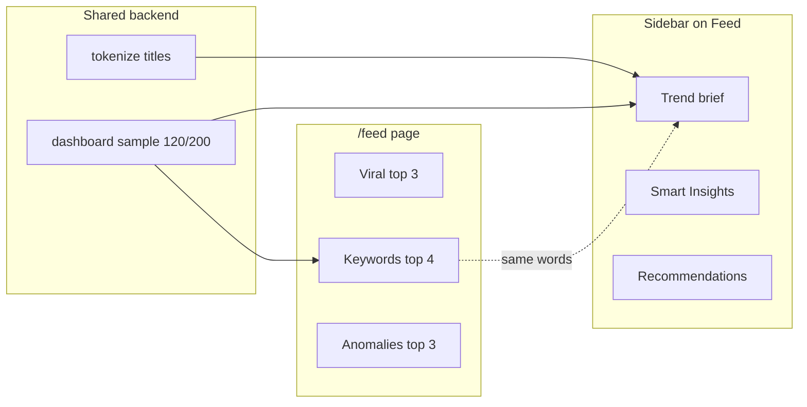

# Intelligence Feed — Product & QA Audit

**URL:** https://tm1.website/feed  
**Date:** 2026-05-21  
**Scope:** Exploratory browser walkthrough, UX/product analysis, API/DB consistency, explainability  

**Update (2026-05-21):** Lightweight **UX/content cleanup** deployed (frontend/i18n only) — see [§11](#11-ux-content-cleanup-2026-05-21).

---

## Executive summary

| Area | Verdict | Notes |
|------|---------|-------|
| Page load & layout | **PASS** | Loads in ~1s; 2-column grid; responsive |
| Honest catalog-only copy | **PASS** | Header + intro say “not global YouTube trends” |
| Viral trend cards = top videos | **PASS** | UI/API/DB top-3 by `views_count` match |
| Rising keywords | **WARN** | Same tokens as Copilot Topics; top-120 sample; not “rising” |
| Creator anomalies | **WARN** | Math OK; top-3 uses string sort — **Fireship omitted** |
| Audience reactions | **FAIL** (data) | 0 comments in DB → **no cards** (copy warns) |
| Hook opportunities | **FAIL** (data) | **0 cards** — no hook types pass `count ≤ 8` rule |
| Copilot overlap | **WARN** | Trend brief + keywords duplicate sidebar |
| Prompt chips | **WARN** | Labels imply feed filters; **navigate to Chat** |
| “Today” label | **WARN** | Static “Today” on every card — not a calendar day |
| Product value | **WARN** | Useful as **catalog digest**, weak as **daily feed** |

**Overall:** Feed is a **deterministic, honest catalog digest** with strong explainability. It is **not** a real-time or “rising” intelligence product. Best role: **research starting point** after sync, not a separate daily-news surface.

---

## 1. What is the Feed tab?

### Product definition (plain language)

**Intelligence Feed** is a **read-only bulletin board** built from your **synced Postgres catalog** (Google Sheets → videos, hooks, optional comments). Each card is a **precomputed signal**:

| Card type | What it really is |
|-----------|-------------------|
| **Viral trend** | Top 3 videos by view count (full catalog). |
| **Rising keyword** | Frequent words in **top 120 titles by views**, ranked by avg views in that sample. |
| **Creator anomaly** | Creators (≥2 videos) whose **avg views ≥ 150%** of catalog mean. |
| **Audience reaction** | Top liked comments with emotion tags — **only if comments exist**. |
| **Hook opportunity** | Hook types with **high avg views** but **≤8 indexed rows** (rare + strong). |

**How it is generated**

- **No LLM** on `/feed` (explicit in UI).
- Backend: `FeedService` (`backend/app/services/copilot/feed_service.py`) — SQL + `DashboardAnalyticsService.get_dashboard(sample_size=120)` for keywords.
- API: `GET /api/v1/copilot/feed?limit=20` (default **10 items** returned in practice: 3+4+3).
- Refreshes when you **open the page** (client `fetchIntelligenceFeed()`).

**Real intelligence vs heuristics**

| Claim in UI | Reality |
|-------------|---------|
| “Intelligence Feed” | **Heuristic aggregation**, not ML forecasting. |
| “Rising keyword” | **Misleading name** — static frequency in top-N sample, not velocity. |
| “Viral trend” | **Top performers**, not new viral spikes. |
| “Today” badge | **Generated now** — intro footnote explains this well. |
| “AI Copilot” sidebar on Feed | **Same trend brief** as dashboard — not feed-specific AI. |

**Fake AI vibes?** **Low** on the feed body (good footnotes). **Medium** in nav/branding (“Intelligence”, “AI Copilot”, prompt chips that open Chat).

---

## 2. Job-to-be-done & purpose

### Intended jobs (inferred)

1. **Daily inspiration** — “what’s hot in *my* library?”
2. **Trend discovery** — keywords/hooks to imitate.
3. **Creator monitoring** — who overperforms baseline.
4. **Research starting point** — jump to video, creator, analytics, hooks.
5. **Comment/audience signals** — when comment sync is enabled.

### Does it deliver today?

| Job | Delivers? | Why |
|-----|-----------|-----|
| Daily inspiration | **Partial** | Top videos useful; “Today” overpromises. |
| Trend discovery | **Partial** | Keywords are **viral-title debris** (`rejection`, `let`, `compete`). |
| Creator monitoring | **Partial** | Anomalies work; **Fireship** hidden by sort bug. |
| Research entry | **Yes** | Cards link to `/videos/{id}`, `/creators/{name}`, `/analytics`, `/hooks`. |
| Audience signals | **No** | 0 comments synced. |
| Hook opportunities | **No** | No qualifying hook types in DB. |

**Best fit:** **Post-sync catalog orientation** for a creator researcher who already uses Dashboard + Analytics, wants a **scannable list of anchors** (top videos, loud keywords, strong creators).

**Poor fit:** **Global trend radar**, **day-over-day change**, or **audience pulse** without comment pipeline.

---

## 3. Browser walkthrough

### Tested (production, EN)

| Action | Result |
|--------|--------|
| Cold load `/feed` | Spinner → intro + 10 cards |
| Scroll | All cards visible in one viewport (no infinite scroll) |
| Card click → video | Navigates to `/videos/2001` — **PASS** |
| Card click → creator anomaly | `/creators/Design%20Theory` loads — **PASS** |
| Keyword card href | `/analytics` — **PASS** |
| Prompt “Today’s trends” | Opens **Chat** with prefilled query — **not feed filter** |
| Prompt “Rising keywords” / “Audience signals” | Same pattern → Chat |
| Copilot sidebar | Trend brief + Smart Insights + **“Open Intelligence Feed →”** while **on Feed** |
| UA locale | Not re-tested line-by-line; strings exist in `uk.ts` |
| Mobile/responsive | Not device-tested; grid uses `md:grid-cols-2` |
| Console/hydration | No errors observed in automation; no “0 items” flash |

### Screenshots

| File | Content |
|------|---------|
| `docs/audit/feed-2026-05-21/01-feed-overview.png` | Header, intro box, viral + keyword cards, copilot rail |

*(Browser tool may also store copies under Cursor screenshots temp.)*

---

## 4. Data verification (UI = API = DB)

### Catalog metadata

| Field | UI | API | DB |
|-------|-----|-----|-----|
| Catalog videos | 6621 (intro) | `catalog_video_count: 6621` | `COUNT(videos)=6621` |
| Keyword sample | 120 (intro) | `keyword_sample_size: 120` | `get_dashboard(120)` |
| Card count | 10 | `len(items)=10` | — |

### Viral trends (top 3)

| Rank | UI/API title | Views | Creator | DB `videos` |
|------|----------------|-------|---------|-------------|
| 1 | Give me 58 sec..i'll DELETE your fear of rejection | 8,600,000 | Dan Martell | id **2001** ✓ |
| 2 | I Let 3 AIs Compete to Build the Same App… | 4,900,000 | Tech With Tim | id **4384** ✓ |
| 3 | 40 Brutal Truths I Wish I Knew in My 20s | 4,400,000 | Dan Martell | id **2055** ✓ |

**Verdict:** **PASS** — viral cards are literally **top videos by views**.

### Rising keywords (top 120 sample)

| Keyword | UI/API | count | avg_views | Notes |
|---------|--------|-------|-----------|-------|
| rejection | ✓ | 1 | 8,600,000 | From Dan Martell #1 title |
| fear | ✓ | 2 | 4,900,000 | |
| let | ✓ | 1 | 4,900,000 | Stop-word / title fragment |
| compete | ✓ | 1 | 4,900,000 | |

Same tokens as Copilot trend brief: `Topics: rejection, fear, compete`.

**Verdict:** **PASS** for consistency with analytics sample; **WARN** for product meaning (“rising”, token quality).

### Creator anomalies (≥150% catalog avg)

Catalog avg views ≈ **136,048** → threshold ≈ **204,072**.

| Creator | UI/API avg | Videos | DB check |
|---------|------------|--------|----------|
| Design Theory | 819,142 | 14 | ✓ |
| Jeff Su | 525,571 | 45 | ✓ |
| theMITmonk | 507,426 | 57 | ✓ |

**Missing from feed but qualifies:** **Fireship** (1,019,315 avg, 124 videos) — excluded because feed keeps **top 3** after `sorted(..., key=summary, reverse=True)` (**lexicographic on summary string**, not avg views).

**Verdict:** **WARN** — displayed anomalies are **correct** but **incomplete** vs DB.

### Audience reactions

| UI | API | DB |
|----|-----|-----|
| 0 cards | 0 items | `COUNT(comments)=0` |

Intro still lists “Audience reaction” type — honest “only if comments synced”.

**Verdict:** **FAIL** (empty feature) — **expected** with current data; copy OK.

### Hook opportunities

| UI | API | DB |
|----|-----|-----|
| 0 cards | 0 items | No `hook_patterns` group with `avg ≥ 1.2× global` **and** `count ≤ 8` |

**Verdict:** **FAIL** (empty feature) — criteria too strict for this catalog (9836 hook rows).

---

## 5. Copilot / Feed overlap

| Content | Feed | Copilot sidebar (on Feed) | Overlap |
|---------|------|---------------------------|---------|
| Top videos | 3 cards w/ links | In brief indirectly | **Medium** |
| Keywords | 4 cards | Topics + Keywords bullets | **High** |
| Hook types | 0 cards | “Top hook types” in brief | Copilot only |
| Creator strength | 3 anomaly cards | Smart insights creators | **Medium** |
| LLM chat | Prompt chips → Chat | Recommendations → Chat | **Low** |

**Unique to Feed**

- Clickable **card grid** with per-card explainers.
- **Intro legend** (best explainability in product).
- Direct deep links (video, creator, analytics).

**Noise / redundant**

- Copilot **“Open Intelligence Feed →”** link **on the Feed page itself**.
- Prompt chip **“Today’s trends”** does not filter feed — opens Chat.
- Repeated keyword tokens (Feed cards + Copilot brief + Analytics trending).

---

## 6. Explainability & trust audit

### Strong copy (PASS)

- Page subtitle: *“Signals from your synced catalog — not global YouTube trends”*
- Intro: `No ChatGPT`, sample size 120, 6621 catalog count.
- Per-card footers: e.g. viral *“Not a new daily trend — your top performer right now.”*
- Footnote: *“Today means generated now…”* and `sec..i'll` fragment warning.
- `InfoTip` on header → glossary entry for intelligence feed.

### Confusing copy (WARN/FAIL)

| Text | Issue |
|------|-------|
| **“Rising keyword”** | Implies growth over time; data is **static top-N word frequency**. |
| **“Today’s trends”** chip | Sounds like feed filter; **opens Chat**. |
| **“Intelligence Feed”** + glossary “Daily signals” | Glossary still says **“Daily”** (`lib/glossary.ts`) while page denies daily YouTube delta. |
| **“Audience signals”** chip | No audience cards when comments empty — chip still shown. |
| **Badge “Today”** on every card | Users may read as “posted today”. |
| **“Viral”** badge | Means **high views in catalog**, not platform viral breakouts. |

**Trust score:** High for **“this is my data”**; medium for **“this is actionable trend intelligence”**.

---

## 7. UX audit

### Strongest

- **Intro panel** — clearest product education on the site.
- **Per-card explanations** — reduces “fake AI” feeling.
- **Consistent visual system** — category labels, badges, hover states.
- **Deep links** — good research workflow.

### Weakest

- **Two empty signal types** (audience, hooks) still documented but invisible — feels incomplete.
- **Prompt chips** — misleading vs behavior.
- **Copilot sidebar** — low value on Feed (self-link, duplicate brief).
- **Keyword quality** — `let`, `compete` weaken credibility.
- **No refresh control** — only implicit on mount (no “Refresh” button).

### Overloaded / repetitive

- Intro legend + card footers + Copilot brief = **triple** explanation of keywords.
- Dan Martell dominates viral + rejection keyword.

### Polished vs “AI theater”

| Polished | AI theater |
|----------|------------|
| Intro + footnotes | “Intelligence” naming |
| Deterministic numbers | “Today’s trends” chip → Chat |
| No ChatGPT on feed | Sidebar still “AI Copilot” |

---

## 8. PASS / WARN / FAIL table

| # | Check | Status |
|---|-------|--------|
| 1 | Page loads, 10 cards | **PASS** |
| 2 | Catalog-only messaging | **PASS** |
| 3 | Viral = top videos (UI/API/DB) | **PASS** |
| 4 | Keywords = dashboard sample 120 | **PASS** |
| 5 | Anomaly math for shown creators | **PASS** |
| 6 | Anomaly ranking completeness | **WARN** (Fireship) |
| 7 | Audience cards | **FAIL** (no comments) |
| 8 | Hook opportunity cards | **FAIL** (no matches) |
| 9 | Copilot overlap | **WARN** |
| 10 | Prompt chips behavior | **WARN** |
| 11 | “Today” semantics | **WARN** |
| 12 | Video/creator navigation | **PASS** |
| 13 | Keyword → analytics link | **PASS** |
| 14 | Glossary vs page copy | **WARN** |

---

## 9. Product recommendation

### Is Feed valuable?

**Yes, narrowly:** as a **synced-catalog digest** with good transparency — especially for **new users** post-sync who want clickable highlights without opening Dashboard + Analytics.

**No, broadly:** as a **daily intelligence product** — no date dimension, no “rising” detection, half the card types empty on production data.

### Redundant?

**~40% redundant** with Dashboard Copilot trend brief + Analytics trending lists. **Unique value** is the **card grid + pedagogy**, not the underlying numbers.

### Should it stay?

**Yes**, but **scoped**:

1. **Keep** Feed as **“Catalog signals”** (rename optional later) — honest digest, not “news feed”.
2. **Do not** invest in LLM-on-feed until comment/transcript pipelines feed audience cards.
3. **Fix** (future, out of scope here): anomaly sort by `avg_views`; hide empty categories or show explicit empty states; remove self-link in Copilot on `/feed`; rename “Rising” → “Top keywords”; align glossary “Daily” wording.

### Merge with Copilot?

**Partial merge OK:** Feed = **main surface**, Copilot on Feed = **collapsed by default** or feed-specific recommendations only (not duplicate trend brief).

### Smaller?

**Optional:** Show **5–6 cards** (viral + keywords + 1–2 anomalies) and drop unused types until data exists — reduces “broken promise” feeling.

---

## 10. Code reference (for auditors)

| Piece | Path |
|-------|------|
| Feed aggregation | `backend/app/services/copilot/feed_service.py` |
| API route | `backend/app/api/v1/copilot.py` → `GET /feed` |
| Page UI | `frontend/app/feed/page.tsx` |
| Intro / cards | `frontend/components/feed/feed-intro.tsx`, `feed-card.tsx` |
| i18n | `frontend/lib/i18n/locales/en.ts` → `feed.*` |
| Copilot context on Feed | `frontend/components/copilot/copilot-route-sync.tsx` |

---

*Initial audit performed on production https://tm1.website/feed.*

---

## 11. UX / content cleanup (2026-05-21)

**Scope:** Frontend + i18n only. **No** `feed_service.py` changes, no LangGraph, no new features.

### Repositioned copy

| Before | After (EN) |
|--------|------------|
| Intelligence Feed | **Catalog signals** |
| Today's trends (chip) | **Catalog leaders** → Chat |
| Rising keywords | **Title keywords** / **High-performing keyword** |
| Viral trend | **Catalog leader** |
| Rising: {word} (card title) | **{word}** only |
| Badge “Viral” / “Today” | **Leader** / **From current catalog** |
| Glossary “Daily signals” | **Catalog signals from synced database** |

Subtitle: *Strong patterns in your synced catalog — not global or realtime YouTube trends.*

### Explainability (intro)

- Rewrote intro: synced catalog only, deterministic Postgres rules, no ChatGPT, no live YouTube, refresh on page open after sync.
- Legend shows **only categories with cards** (3 types on prod).
- Compact notes when empty: **no synced comments yet**, **no hook-opportunity signals right now**.
- Removed misleading “Today means…” footnote; replaced with token-fragment note.

### Copilot overlap reduced

| Change | File |
|--------|------|
| Hide trend brief on `/feed` | `copilot-panel.tsx` |
| Hide “Open Intelligence Feed →” on `/feed` | `copilot-panel.tsx` |
| Sidebar note: cards on left, hooks/shortcuts here | `feed.copilotSidebarNote` |
| Copilot **collapsed by default** on Feed | `feed/page.tsx` |
| Filter `/feed` from recommendations on Feed | `copilot-panel.tsx` |

### Hidden empty categories

- Intro legend: audience + hook_opportunity **not listed** when no cards.
- Italic one-liners explain why those sections are absent (not blank cards).

### Files touched

- `frontend/lib/i18n/locales/en.ts`, `uk.ts` — `feed.*`, `prompts.feed.*`, `home.intelligenceFeed`, glossary
- `frontend/components/feed/feed-intro.tsx`, `feed-card.tsx`
- `frontend/app/feed/page.tsx`
- `frontend/components/copilot/copilot-panel.tsx`
- `frontend/lib/glossary.ts`

### Post-cleanup verification (browser)

| Check | Result |
|-------|--------|
| Page title **Catalog signals** | **PASS** |
| No “Today” / “Rising” in UI | **PASS** |
| Keyword cards show **rejection** not “Rising: rejection” | **PASS** |
| Empty audience/hooks → intro notes only | **PASS** |
| Copilot: no self-link; sidebar note visible | **PASS** |
| No trend brief duplicate on Feed | **PASS** |
| Video/creator links | **PASS** (unchanged) |

### Screenshots

| File | When |
|------|------|
| `docs/audit/feed-2026-05-21/01-feed-overview.png` | Pre-cleanup audit |
| `docs/audit/feed-2026-05-21/02-feed-after-cleanup.png` | Post-cleanup (copilot open) |

### Remaining WARN (unchanged backend)

- Keyword tokens (`let`, `compete`) still from top-120 sample.
- Fireship still omitted from anomaly top-3 (string sort in `feed_service` — not changed).
- Prompt chips still route to **Chat** (labels now honest: “Catalog leaders”, not “filter feed”).
