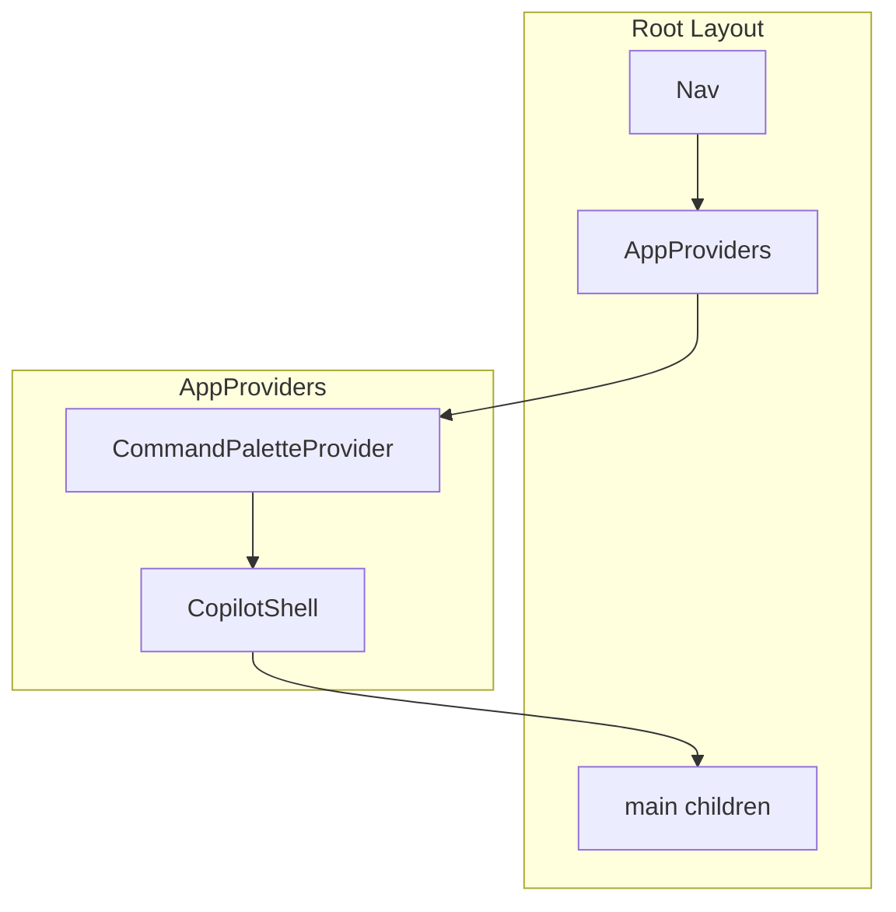
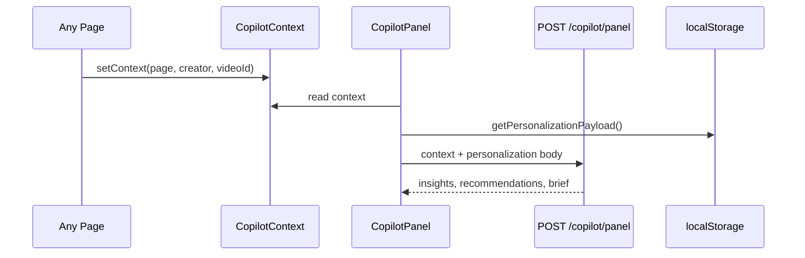

# Frontend Architecture

The frontend is a **Next.js 15** application using the **App Router**, **React 19**, **Tailwind CSS**, and a thin **fetch-based API client**. There is **no Zustand** store — state uses React Context, component-local state, and `localStorage` for onboarding/personalization.

---

## Tech Stack

| Layer | Choice |
|-------|--------|
| Framework | Next.js 15 App Router |
| Styling | Tailwind + custom UI primitives (`components/ui/`) |
| Charts | Recharts (analytics, creator page, video page, hooks) |
| Fonts | Geist Sans / Geist Mono |
| API | `frontend/services/api.ts` → `NEXT_PUBLIC_API_URL` |

---

## App Router Structure

```
frontend/app/
├── layout.tsx              # Root layout: Nav + AppProviders + main
├── page.tsx                # Redirect / home
├── welcome/page.tsx        # Onboarding
├── dashboard/page.tsx      # Video catalog + sync
├── feed/page.tsx           # Intelligence feed
├── chat/page.tsx           # AI copilot chat (Suspense for searchParams)
├── creators/
│   ├── page.tsx            # Creator list
│   └── [name]/page.tsx     # Creator intelligence page
├── videos/[id]/page.tsx    # Video breakdown + comments + charts
├── hooks/page.tsx          # Hook workspace
├── scripts/page.tsx        # Script workspace
├── research/page.tsx       # Research workspace
└── analytics/page.tsx      # Dashboard analytics charts
```



---

## Global Layout & Providers

### `app/layout.tsx`

- Loads global CSS
- Wraps all pages with `AppProviders` then `Nav` then `<main>`
- Max width `6xl`, responsive padding

### `components/layout/app-providers.tsx`

```tsx
CommandPaletteProvider → CopilotShell → {children}
```

**Critical ordering:** `Nav` must be *inside* `AppProviders` because nav triggers use `useCommandPalette()`.

---

## Copilot Sidebar

### Components (`components/copilot/`)

| Component | Role |
|-----------|------|
| `copilot-shell.tsx` | Layout wrapper: main content + fixed sidebar |
| `copilot-panel.tsx` | Fetches panel, shows insights + recommendations |
| `copilot-context.tsx` | React Context: current page, creator, videoId |

### Data flow



- Panel loads on context change
- Personalization sends `recentSearches`, `viewedCreators` from `lib/personalization.ts`
- Briefs link to `/copilot/brief/*` endpoints for expanded markdown summaries

---

## Command Palette (⌘K)

`components/command-palette/`:

- Provider registers global keydown (`meta+k` / `ctrl+k`)
- Actions: navigate to pages, run example prompts, semantic search shortcuts
- Prompts sourced from `lib/prompts.ts` (`PAGE_PROMPTS`, `GLOBAL_ACTIONS`)

---

## Chat UX

`app/chat/page.tsx`:

- Message list with user/assistant roles
- `AiThinking` loading component during `POST /chat`
- Displays: reply markdown, insights chips, structured analytics preview, relevant videos, **follow-up suggestions** (click to send)
- URL query `?q=` pre-fills first message (wrapped in `<Suspense>` for static generation)

---

## Page-by-Page Architecture

### Dashboard (`/dashboard`)

- Lists videos from `GET /videos`
- Keyword + semantic search bars
- **Sync Google Sheets** button → `POST /sheets/sync` with progress/result stats
- Empty states with prompts from `PAGE_PROMPTS.dashboard`

### Creators (`/creators`, `/creators/[name]`)

- List: `GET /creators`
- Detail: slug in URL (`creatorSlug` utils), fetches profile + `CreatorPageAnalytics`
- Charts: views distribution, hook types, topics
- Save insight buttons → research API
- Sets copilot context to `creator`

### Videos (`/videos/[id]`)

- `GET /videos/{id}` + `GET /videos/{id}/intelligence`
- Sections: breakdown, transcript intelligence, viral factors, similar videos, **audience/comments**
- Optional `POST /videos/{id}/comments/fetch` for manual refresh
- Recharts for sentiment distribution

### Hooks (`/hooks`)

- Workspace stats: `GET /hooks/workspace`
- Search: `GET /hooks/search?q=`
- Generate/compare via dedicated POST endpoints + chat fallback
- Reindex trigger: `POST /hooks/reindex`

### Scripts (`/scripts`)

- Workspace: `GET /scripts/workspace`
- Generate/analyze/compare forms → script API
- Save insights to research

### Research (`/research`)

- Tabs: saved insights, notes
- Search: `GET /research/search`
- Export markdown: `GET /research/export/markdown`
- Research assistant hints from copilot API

### Feed (`/feed`)

- `GET /copilot/feed` — card list (trends, hooks, anomalies)
- Prompt chips for chat follow-up

### Analytics (`/analytics`)

- `GET /analytics/dashboard` — full dashboard charts
- Pattern cards, keyword trends, hook performance

### Welcome (`/welcome`)

- Onboarding steps; marks completion in `localStorage` (`contentgraph_onboarding_complete`)
- Redirect logic on home page

---

## API Layer

`frontend/services/api.ts`:

- Base URL: `process.env.NEXT_PUBLIC_API_URL ?? "http://localhost:8000/api/v1"`
- Generic `request<T>(path, options)` with JSON + error text
- Typed imports from `frontend/types/*`
- Copilot panel uses POST with personalization body
- All exported functions are async (e.g. `syncSheets`, `sendChat`, `fetchCopilotPanel`)

No React Query / SWR — pages call `useEffect` + `useState` or event handlers directly.

---

## State Management

| Concern | Mechanism |
|---------|-----------|
| Copilot page context | `CopilotContext` |
| Command palette open | `CommandPaletteContext` |
| Form inputs / lists | Component `useState` |
| Onboarding flag | `localStorage` |
| Personalization | `localStorage` → sent to copilot API |
| Chat history | In-memory per session (not persisted server-side) |

**There is no global Zustand/Redux store.**

---

## UI System

`components/ui/` — design-system primitives:

- `Button`, `Card`, `Badge`, `Input`, `Skeleton`, `Tabs`, etc.
- Consistent spacing, muted foreground, accent colors in `globals.css`

Shared UX components:

- `AiThinking` — animated loading for AI calls
- `EmptyState` — icon + title + prompt chips
- `InsightCard`, `SaveInsightButton` — research integration

---

## Routing & Navigation

`components/layout/nav.tsx`:

- Links: Dashboard, Creators, Hooks, Scripts, Research, Feed, Chat, Analytics
- Highlights active route via `usePathname()`
- Copilot toggle does not unmount pages — sidebar is persistent in `CopilotShell`

### Home (`/`)

Typically redirects to dashboard or welcome based on onboarding state.

---

## Loading UX

| Pattern | Where |
|---------|-------|
| `Skeleton` components | Lists, cards while fetching |
| `AiThinking` | Chat, heavy AI actions |
| Disabled buttons | During `syncSheets` |
| Optimistic UI | Minimal — waits for server response |

---

## Personalization

`lib/personalization.ts`:

- Tracks `recentSearches`, `viewedCreators` in `localStorage`
- `getPersonalizationPayload()` attached to copilot panel POST
- Backend boosts recommendations for familiar creators/topics

`lib/prompts.ts`:

- Central `PAGE_PROMPTS` and `GLOBAL_ACTIONS` for empty states, ⌘K, chips

`lib/creator-slug.ts`:

- URL-safe creator slugs ↔ display names

---

## Types

`frontend/types/` mirror backend schemas:

- `video.ts`, `creator.ts`, `hooks.ts`, `scripts.ts`, `chat.ts`, `copilot.ts`, `research.ts`, `analytics.ts`, etc.

---

## Charts (Recharts)

Used on:

- Analytics dashboard (bar, line, pie patterns)
- Creator page (hook distribution, views)
- Video page (comment sentiment)
- Hooks workspace (type performance)

Charts receive pre-aggregated API data — no client-side heavy analytics.

---

## Build & Deploy

- Dockerfile in `frontend/` for production Next standalone
- `NEXT_PUBLIC_API_URL` must point to reachable backend (Docker Compose sets `http://localhost:8000/api/v1`)

---

## Related Docs

- [USER_GUIDE.md](./USER_GUIDE.md) — how to use each page
- [API_REFERENCE.md](./API_REFERENCE.md) — endpoint details
- [PROJECT_OVERVIEW.md](./PROJECT_OVERVIEW.md) — system-wide flow
