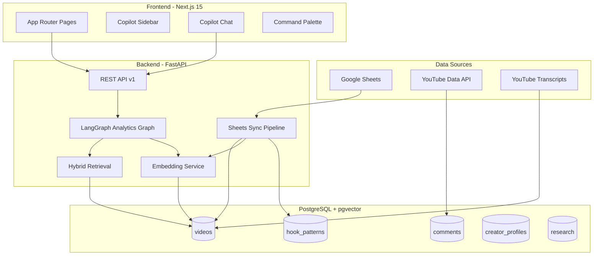

# ContentGraph Lite — Project Overview

## What is ContentGraph Lite?

**ContentGraph Lite** is an internal AI research product for YouTube creator analytics. It turns a **Google Sheets catalog** of videos into a queryable intelligence layer: structured data in PostgreSQL, semantic search via pgvector, and a **LangGraph-powered copilot** that answers research questions with typed analytics—not generic chat text alone.

The product is intentionally **lightweight**: no multi-tenant auth, no workflow automation platform, no autonomous agents. It is optimized for a small team doing **creator research**, hook/script ideation, and audience insight from real catalog data.

---

## System Goal

| Goal | How the system achieves it |
|------|----------------------------|
| Centralize video metadata | Google Sheets → Postgres `videos` table |
| Understand content semantically | Title + transcript embeddings (OpenAI `text-embedding-3-small`, 1536 dims) |
| Research creators deeply | Creator profiles, page analytics, comparison |
| Extract viral patterns | Hook index from titles/transcripts |
| Generate creator-aware assets | Hook + script intelligence (LLM) |
| Understand audience | YouTube comments + sentiment + audience briefs |
| Save and export research | Research workspace (insights + notes + markdown export) |
| Proactive guidance | AI Copilot sidebar + Intelligence Feed |

---

## Primary Use Cases

1. **Catalog research** — “What topics and hooks perform best in our sheet?”
2. **Creator deep dives** — “What makes Creator X successful?” with AI profile + charts
3. **Video forensics** — Breakdown, transcript intelligence, viral factors, similar videos
4. **Hook ideation** — Search indexed hooks, generate new hooks, compare types/creators
5. **Script drafting** — Generate scripts aligned to a creator’s style and hooks
6. **Audience intelligence** — Pain points, questions, sentiment from top comments
7. **Saved research** — Persist insights from chat/pages; export markdown for reports
8. **Daily signals** — Feed of viral trends, keywords, anomalies, hook opportunities

---

## High-Level Architecture



---

## End-to-End Data Flow

### 1. Ingestion (source of truth: Google Sheets)

1. User maintains a spreadsheet with columns: **Name, URL, Subscribers, Titles, Views, Date** (flexible header matching).
2. User clicks **Sync Google Sheets** on the Dashboard (or calls `POST /api/v1/sheets/sync`).
3. Backend reads rows via service account, upserts `videos` (match on creator + title + published_at).
4. **Post-sync enrichment** runs inline (no job queue):
   - Title embeddings for rows missing `title_embedding`
   - Transcript fetch (youtube-transcript-api) for up to `TRANSCRIPT_ENRICH_LIMIT` videos
   - Transcript embeddings
   - Full **hook_patterns** rebuild from all videos
   - YouTube **comments** fetch for up to `COMMENTS_ENRICH_LIMIT` videos (if `YOUTUBE_API_KEY` set)

### 2. Exploration (UI)

- **Dashboard** — list/search/semantic search videos
- **Creators** — list creators, open `/creators/[slug]` for full intelligence page
- **Videos** — `/videos/[id]` for breakdown, transcript, comments, viral analysis
- **Hooks / Scripts** — dedicated workspaces with generation APIs
- **Research** — saved insights and notes
- **Feed** — deterministic daily intelligence cards
- **Chat** — natural language → LangGraph pipeline

### 3. AI question answering (LangGraph)

```
User question
    → query_router (classify analysis_type + extract entities)
    → retrieval (hybrid semantic + keywords + creator catalogs)
    → analysis (structured analytics per type)
    → response (insights + markdown summary + chat suggestions)
```

### 4. Copilot (proactive, mostly deterministic)

- Sidebar loads `POST /copilot/panel` with page context + optional personalization from `localStorage`
- Returns smart insights, recommendations, and context briefs without running full LangGraph on every page view

---

## AI Capabilities Summary

| Capability | Mechanism | LLM required? |
|------------|-----------|---------------|
| Semantic search | pgvector cosine on title + transcript | Embeddings only |
| Chat analytics | LangGraph 4-node pipeline | Yes |
| Creator profile | LLM + video catalog | Yes (on demand) |
| Hook generation | LLM + creator context | Yes |
| Script generation | LLM + hooks/transcripts | Yes |
| Video intelligence | Deterministic transcript parse + optional LLM refresh | Optional |
| Comments sentiment | Rule-based lexicon | No |
| Audience brief | Template + optional LLM on refresh | Optional |
| Copilot insights | SQL aggregates + dashboard stats | No |
| Dashboard analytics | Deterministic pattern detection | No |

---

## LangGraph Orchestration (Conceptual)

A **linear** graph (not a multi-agent swarm):

1. **query_router** — Structured output: `analysis_type`, `creator_filter`, `creator_names`, `video_id`, `hook_type`, `topic`, etc.
2. **retrieval** — Loads relevant `VideoSnapshot` list based on analysis type
3. **analysis** — Produces `StructuredAnalytics` (typed Pydantic payload per type)
4. **response** — Synthesizes `insights[]` + `final_response` markdown for the user

Chat also returns **follow-up suggestions** via `SuggestionService` (rule-based, no extra LLM call).

See [AI_SYSTEMS.md](./AI_SYSTEMS.md) for full detail.

---

## Semantic Search

- Query text is embedded with the same model as stored vectors
- **Hybrid retrieval** merges:
  - Title vector similarity
  - Transcript vector similarity
  - Keyword matches (title, creator, transcript preview)
  - **Comment text** matches (boosts parent video, `match_source: comment`)
  - View-count normalization as popularity prior
- Used in: API semantic search, LangGraph retrieval, creator-scoped search

---

## Copilot System

The copilot is a **UX + lightweight intelligence layer**, not a second LangGraph:

- **InsightEngine** — SQL/hook/comment aggregates (“Identity hooks outperform by 42%”)
- **BriefService** — Scannable briefs (creator, video, audience, trend)
- **FeedService** — Feed page cards
- **SuggestionService** — Chat follow-ups + research tag hints
- **Personalization** — Client sends recent searches/viewed creators; server boosts recommendations

---

## Research Workflow

1. User runs analyses in Chat or on Creator/Video/Hook pages
2. Clicks **Save Insight** → `POST /research/insights`
3. Writes notes → `POST /research/notes`
4. Searches workspace → `GET /research/search`
5. Exports → `GET /research/export/markdown`

No collaboration features—single-user, local-first personalization only.

---

## Technology Stack

| Layer | Technology |
|-------|------------|
| API | FastAPI, async SQLAlchemy, asyncpg |
| DB | PostgreSQL 16 + pgvector |
| Migrations | Alembic |
| AI orchestration | LangGraph + LangChain OpenAI |
| Embeddings / chat | OpenAI API |
| Sheets | Google Sheets API (service account) |
| Transcripts | youtube-transcript-api |
| Comments | YouTube Data API v3 |
| Frontend | Next.js 15 App Router, React 19, Tailwind, Recharts |
| Deploy | Docker Compose (postgres, backend, frontend) |

---

## Repository Layout (Top Level)

```
YT/
├── backend/           # FastAPI application
│   ├── app/           # API, services, models, AI graph
│   ├── alembic/       # DB migrations
│   └── google_sheets/ # Sheets client + sync
├── frontend/          # Next.js UI
├── docs/              # This documentation set
├── docker-compose.yml
└── README.md
```

---

## Related Documentation

| Document | Contents |
|----------|----------|
| [BACKEND_ARCHITECTURE.md](./BACKEND_ARCHITECTURE.md) | Services, modules, API structure |
| [FRONTEND_ARCHITECTURE.md](./FRONTEND_ARCHITECTURE.md) | Pages, copilot, state, UX |
| [AI_SYSTEMS.md](./AI_SYSTEMS.md) | LangGraph, intelligence layers |
| [DATABASE_SCHEMA.md](./DATABASE_SCHEMA.md) | Tables, vectors, migrations |
| [API_REFERENCE.md](./API_REFERENCE.md) | All HTTP endpoints |
| [USER_GUIDE.md](./USER_GUIDE.md) | How to use the product |
| [DEVELOPMENT_SETUP.md](./DEVELOPMENT_SETUP.md) | Local dev and env setup |

---

## Design Principles

1. **Sheets as source of truth** — Postgres is a derived, enriched cache
2. **Structured over prose** — Chat returns typed analytics + insights, not only free text
3. **Enrichment inline** — Sync triggers embeddings/transcripts/hooks/comments in-process
4. **Creator-focused** — Prompts and insights emphasize hooks, audience, reusable frameworks
5. **No enterprise scope** — No auth, notifications, or automation orchestration in v1
