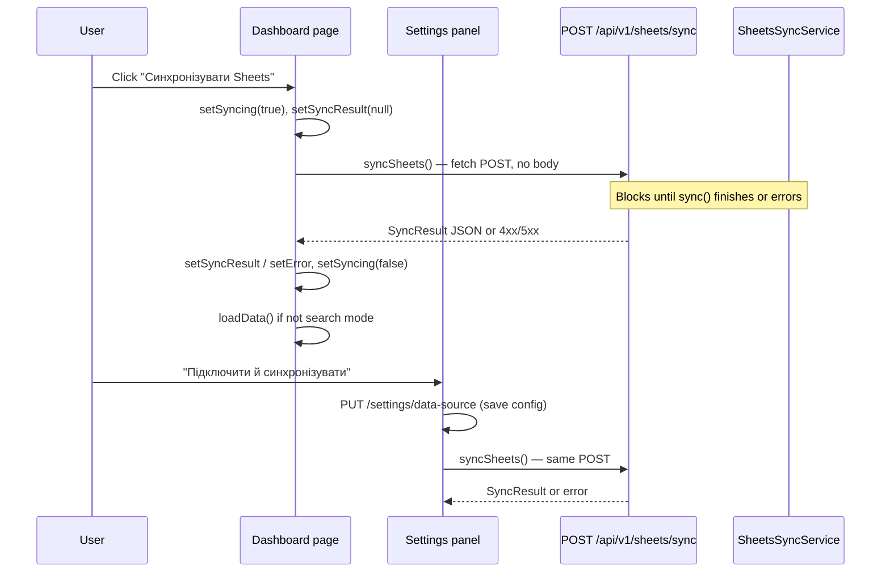
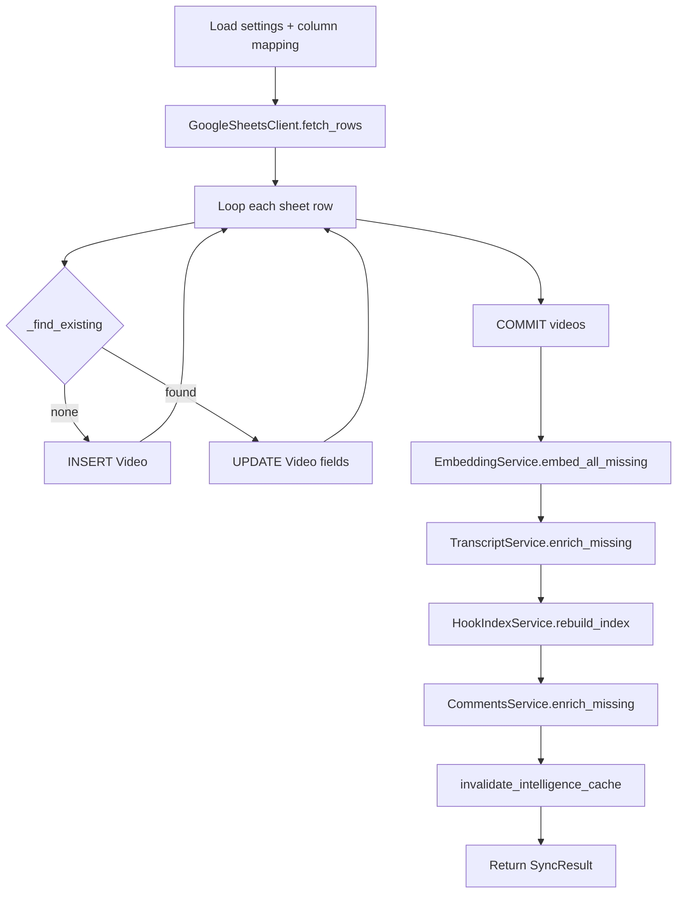

# Sheets sync — full flow analysis & progress UX architecture

**Date:** 2026-05-25  
**Scope:** Analysis only — no implementation.  
**Button:** «Синхронізувати Sheets» / `dashboard.syncSheets`  
**Goal:** Understand the real pipeline before building UI progress.

---

## Executive summary

| Question | Answer |
|----------|--------|
| Sync model | **Single synchronous HTTP request** — no background job, no WebSocket, no SSE |
| Progress today | **None during run** — spinner only; summary **only after success** |
| Can we show real % today? | **No** — server exposes no mid-flight state |
| Typical duration (12k videos) | **~3–6+ minutes** (observed **341s** then **500** on transcript step) |
| Best next build | **Job + DB status row + polling** (reuse `snapshot_runs` pattern) |
| Overkill now | Full Celery/Redis, WebSocket hub, resumable multi-hour jobs |

---

## 1. Current flow map

### 1.1 Frontend entry points (two buttons, one API)



| Layer | File | Function / element |
|-------|------|-------------------|
| Dashboard button | `frontend/app/dashboard/page.tsx` | `handleSync()` → `syncSheets()` |
| Settings save+sync | `frontend/components/settings/app-settings-panel.tsx` | `handleSaveAndSync()` → `updateDataSourceSettings()` then `syncSheets()` |
| API client | `frontend/services/api.ts` | `syncSheets()` → `POST /sheets/sync` |
| Loading UI | Dashboard | `syncing` → `Loader2` on button, `disabled={syncing}` |
| Success UI | Dashboard | `syncResult` banner — `total_rows`, `created`, `updated`, optional `comments_fetched` |
| Error UI | Dashboard / Settings | `setError` / toast — raw API body text |
| Types | `frontend/types/video.ts` | `SyncResult` interface |

**Request payload:** none (`POST` with empty body).  
**Auth:** none on this endpoint (internal tool).  
**Config source:** `app_settings` row (spreadsheet id, range, `google_sheets_column_map`) via `AppSettingsService.resolve_sheets()`.

### 1.2 Backend route

| File | Handler |
|------|---------|
| `backend/app/api/v1/sheets.py` | `sync_sheets()` |
| `backend/app/api/v1/router.py` | includes sheets router under `/api/v1` |

Errors: `ValueError` → 400, Google `HttpError` 403 → friendly share message, other exceptions → **500** (no staged rollback of earlier commits).

### 1.3 Sync pipeline (real order)



| # | Stage | Code | External I/O |
|---|--------|------|----------------|
| 0 | Resolve config | `AppSettingsService.resolve_sheets()` / `resolve_column_mapping()` | Postgres `app_settings` |
| 1 | **Fetch sheet** | `GoogleSheetsClient.fetch_rows()` | Google Sheets API `values.get` (one range) |
| 2 | **Upsert videos** | Loop + `_find_existing` + add/update `Video` | Postgres — **~2 queries per row** (N+1) |
| 3 | **Commit catalog** | `await self._db.commit()` | Postgres |
| 4 | **Title embeddings** | `EmbeddingService.embed_all_missing()` | OpenAI embeddings API, batches of 100, commit per batch |
| 5 | **Transcript fetch** | `TranscriptService.enrich_missing()` | YouTube transcript API, **max 30 videos** (`transcript_enrich_limit`) |
| 6 | **Transcript embeddings** | Inside enrich_missing → `embed_transcripts_missing()` | OpenAI, batches of 100 |
| 7 | **Hook index rebuild** | `HookIndexService.rebuild_index()` | DELETE all `hook_patterns`, scan **all** videos, CPU |
| 8 | **Comments fetch** | `CommentsService.enrich_missing()` | YouTube Data API, **max 15 videos** (`comments_enrich_limit`) |
| 9 | **Cache** | `invalidate_intelligence_cache()` | In-process dict clear |
| 10 | **Response** | `SyncResult` pydantic model | JSON to client |

**Not in this pipeline:** creator_profiles upsert, analytics snapshots, semantic reindex beyond embeddings/hooks, separate “creators” table.

**Sheet row fields stored:** `creator_name`, `channel_url`, `video_url`, `subscribers_count`, `title`, `views_count`, `published_at`, `transcript` (from column mapping).

---

## 2. Stage analysis (measurable? trackable?)

| Stage | Total known upfront? | Incremental progress? | Logged today? | Blocking | Typical share of time |
|-------|---------------------|------------------------|---------------|----------|------------------------|
| Fetch sheet | Yes (`len(values)-1`) | No | No | Yes | Small (seconds) |
| Upsert videos | Yes (row count) | **Possible** (row index) | No | Yes | **Large** on 10k+ rows (N+1 DB) |
| Commit catalog | — | No | No | Yes | Small |
| Title embeddings | Yes (count missing) | **Possible** (batch index) | No | Yes | Medium–large if many new titles |
| Transcript fetch | Cap 30/run | **Possible** (1..30) | No | Yes | **Unbounded risk** — network, IP blocks |
| Transcript embed | Yes (missing count) | Possible | No | Yes | Medium |
| Hook rebuild | Yes (video count) | Possible (video index) | No | Yes | Medium on full catalog |
| Comments | Cap 15/run | Possible | No | Yes | Small unless API slow |
| Finish | — | — | Only in response | — | — |

**Metrics already returned (end only):**

```json
{
  "created": 0,
  "updated": 12093,
  "total_rows": 12093,
  "embeddings_created": 0,
  "transcripts_fetched": 12,
  "transcript_embeddings_created": 0,
  "hooks_indexed": 0,
  "comments_fetched": 0
}
```

(`SyncResult` in `backend/app/schemas/video.py` — frontend does not show embeddings/transcripts/hooks counts on dashboard today, only rows/created/updated/comments.)

---

## 3. Current limitations (honest)

### 3.1 Architecture

- **One long blocking request** — browser `fetch` waits entire pipeline.
- **No job ID, no status table, no SSE/WebSocket** in codebase.
- **Partial commits** — video commit and embedding batches commit **before** later steps; failure mid-pipeline leaves DB **partially updated** (see QA).
- **No cancellation** — closing tab does not stop server work.
- **No resume** — restart = full pipeline again.

### 3.2 Progress & UX

- Cannot show truthful % without server-side stage state.
- Cannot show ETA without historical timings per stage/catalog size.
- “Stuck” feeling is likely during upsert loop, OpenAI batches, or YouTube transcript/hook rebuild — user sees only spinner.

### 3.3 Reliability (QA)

Manual test: `POST http://127.0.0.1:8001/api/v1/sheets/sync` with **~12,093** videos in DB.

| Observation | Detail |
|-------------|--------|
| Duration | **341s** (~5m41s) then **HTTP 500** |
| Failure | `youtube_transcript_api.RequestBlocked` in `enrich_missing` (cloud IP / rate limit) |
| Catalog | `videos` count unchanged at 12,093 (mostly updates) |
| Title embeddings | **0** missing after run → title embed step **completed** |
| Hooks | **0** rows — hook rebuild **not reached** |
| Nginx | `proxy_read_timeout 300s` on `/api/v1/` — production may return **504** before backend finishes if sync > 5 min |

**Implication:** User may see gateway timeout + unclear state (some DB steps committed, no success banner).

### 3.4 Performance bottlenecks

1. **Per-row `_find_existing`** — up to 2 SQL queries × N rows (no bulk upsert).
2. **Hook rebuild** — full table delete + reprocess every video every sync.
3. **Transcript fetch** — sequential YouTube calls (30 cap) can throw and **kill entire request**.
4. **Large sheet range** — full tab loaded into memory in one Google API call.

---

## 4. Recommended UX (A / B / C)

### A. Minimal (frontend-only, no backend job)

- Disable button + **stage labels** cycling from known pipeline order (copy only — **not real progress**).
- After success, show full `SyncResult` breakdown (including embeddings, transcripts, hooks).
- Warning: “Sync may take several minutes; do not close the page.”

**Pros:** Hours, not days.  
**Cons:** Misleading if stages take uneven time; still no recovery on 504/500.

### B. Better (recommended first real step)

- **Progress modal** on Dashboard + Settings.
- **Backend:** `sync_runs` table (mirror `snapshot_runs`) + refactor pipeline to update `stage`, `processed`, `total`, `message`, `error` after each phase.
- **API:**
  - `POST /sheets/sync` → `{ run_id, status: "running" }` (202) and run pipeline in `BackgroundTasks` or asyncio task.
  - `GET /sheets/sync/runs/{id}` → poll every 1–2s.
- UI: stage name, bar = `processed/total` when total known, indeterminate when not, final summary from run row.

**Pros:** Truthful, works with existing stack, no WebSocket infra.  
**Cons:** ~2–4 days eng; must handle partial failure display honestly.

### C. Ideal (later)

- Persistent sync history list in Settings.
- Optional **SSE** stream for live log lines (nice for transcript/hook stages).
- Split **core sync** (sheet → DB) vs **enrichment** (transcripts, comments) buttons or auto-queue.
- Retry/resume, cancel token, `TRANSCRIPT_HTTP_PROXY` health in UI.
- Separate worker process if sync exceeds HTTP timeouts regularly.

---

## 5. Polling vs WebSocket vs SSE

| Approach | Fit for this codebase | Notes |
|----------|----------------------|--------|
| **Polling** | **Best first choice** | Matches `snapshot_runs` mental model; works behind nginx; easy in Next client |
| **SSE** | Good second step | One long-lived GET; server yields stage events; harder with some proxies |
| **WebSocket** | Overkill | No WS today; adds infra for one feature |

**Recommendation:** `POST` starts job → poll `GET /sheets/sync/runs/{id}` every **1.5s** until `status` ∈ `completed|failed`.

---

## 6. What to build next (practical)

### Phase 1 — Observability & safety (high value, medium effort)

1. Add `sync_runs` + progress fields (`stage`, `processed`, `total`, `error_message`, timestamps).
2. Run `SheetsSyncService.sync()` in background; return `run_id` immediately.
3. Wrap transcript enrichment: catch `RequestBlocked`, record warning, **continue** to hooks/comments (do not 500 whole sync).
4. Dashboard modal: poll + show stage + counts; show full result on complete.

### Phase 2 — Performance (reduces “frozen” time)

1. Bulk upsert or batched `_find_existing` (load keys in memory / temp table).
2. Optional `POST /sheets/sync?depth=core` — sheet + commit only (~fast progress).
3. Hook index: incremental update instead of full delete/rebuild (larger change).

### Phase 3 — Polish

1. Show all `SyncResult` fields in UI.
2. Sync history page + last run status on Dashboard.
3. SSE log stream (optional).

**Do not build first:** Celery, Redis queue, WebSocket server, enterprise job framework.

---

## 7. Frontend architecture (target)

```
SyncProgressModal
├── StageLabel (i18n: sheetsSync.stage.fetch | upsert | embeddings | …)
├── ProgressBar (determinate when total known)
├── Counters: "12,450 / 12,093 rows" (context-dependent)
├── Elapsed time (client-side)
├── Collapsible log (poll messages[])
└── Done: SyncResultSummary | ErrorPanel
```

**State:** `runId`, `pollInterval`, `runStatus` from API — not derived from spinner timer.

**Files to touch (later):** `dashboard/page.tsx`, `app-settings-panel.tsx`, `services/api.ts`, new `components/sync/sync-progress-modal.tsx`, i18n `sheetsSync.*`.

---

## 8. Backend architecture (target)

```
POST /sheets/sync
  → create SyncRun(status=running, stage=starting)
  → background_task(run_sync, run_id)
  → 202 { run_id }

GET /sheets/sync/runs/{id}
  → SyncRunRead(stage, processed, total, result_json, error_message, …)

SheetsSyncService.sync(progress: SyncProgressCallback)
  → after each stage: UPDATE sync_runs SET stage=..., processed=...
```

Reuse patterns from:

- `backend/app/models/snapshot_run.py`
- `backend/app/services/analytics/snapshot_runner.py` (status + duration)

---

## 9. Risks & edge cases

| Risk | Mitigation |
|------|------------|
| Gateway 504 (>300s) | Background job + poll (no long HTTP hold) |
| Partial DB updates on failure | Document in UI; mark run `failed` with `stage` + `partial_result` |
| YouTube transcript IP block | Try/catch per video; surface warning count; don’t abort hooks |
| Double-click sync | Disable button; reject second `POST` if run `running` |
| Settings save+sync | Chain: save settings → start run (same as now, with run_id) |
| Huge sheets | Stream/batch sheet rows in future; show row count early |
| Comments use `channel_url` for ID | Prefer `video_url` when present (`CommentsService` improvement) |

---

## 10. Complexity estimate

| Item | Effort |
|------|--------|
| Analysis doc (this) | Done |
| `sync_runs` migration + model | 0.5 d |
| Refactor sync with progress callback | 1 d |
| Background task + poll API | 1 d |
| Frontend modal + dashboard/settings wire-up | 1 d |
| i18n + error/partial states | 0.5 d |
| QA on 10k+ sheet | 0.5 d |
| **Phase 1 total** | **~4–5 dev days** |
| Bulk upsert / core-only mode | +2–3 d |
| SSE / history UI | +2 d |

---

## 11. QA checklist (performed)

| Step | Result |
|------|--------|
| Trace button → API → service | Documented above |
| Inspect network | Single `POST /sheets/sync`, no poll |
| Backend logs | 500 at `TranscriptService.enrich_missing` after ~341s |
| DB after failed run | Videos 12,093; title embeddings complete; hooks 0; pipeline incomplete |
| Progress endpoint | **Does not exist** |
| WebSocket/SSE | **None in repo** |

---

## 12. Verdict

**Today:** «Синхронізувати Sheets» is a **monolithic synchronous job** with **end-only metrics**. Real multi-stage progress is **not possible without backend changes**.

**Build next:** Background **sync run + polling + progress modal**, plus **don’t fail entire sync on one transcript error**. That gives a modern, honest UX (Supabase-import style) without overengineering.

**Defer:** WebSocket, Celery, fake %-based spinners.

---

## Appendix — key file index

| Area | Path |
|------|------|
| API route | `backend/app/api/v1/sheets.py` |
| Sync service | `backend/google_sheets/sync_service.py` |
| Sheets client | `backend/google_sheets/client.py` |
| Column detect | `backend/google_sheets/column_detect.py` |
| Embeddings | `backend/app/services/embeddings/embedding_service.py` |
| Transcripts | `backend/app/services/transcripts/transcript_service.py` |
| Hooks | `backend/app/services/hooks/hook_index_service.py` |
| Comments | `backend/app/services/comments/comments_service.py` |
| Config limits | `backend/app/core/config.py` (`transcript_enrich_limit=30`, `comments_enrich_limit=15`) |
| Dashboard UI | `frontend/app/dashboard/page.tsx` |
| Settings UI | `frontend/components/settings/app-settings-panel.tsx` |
| API client | `frontend/services/api.ts` |
| Prior art (runs) | `backend/app/models/snapshot_run.py` |
