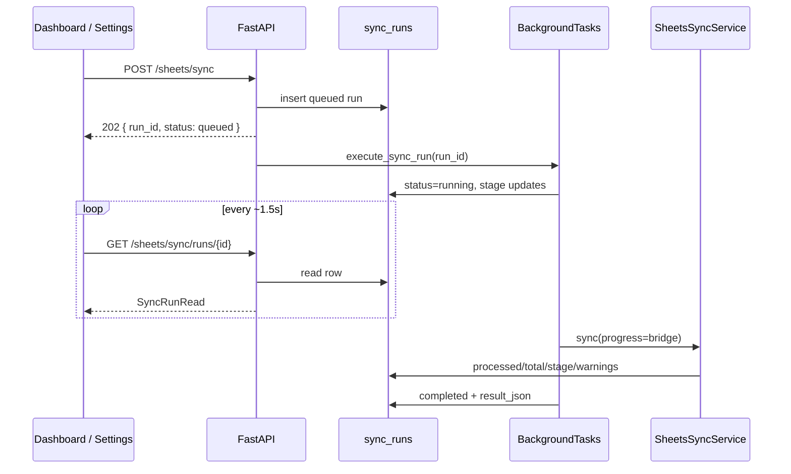

# Sheets Sync Progress — Phase 1 Implementation

Background Google Sheets sync with DB-backed progress, HTTP polling, and a dismissible floating progress panel. No Celery, Redis, or WebSockets.

## Architecture



- **Source of truth:** `sync_runs` table.
- **Execution:** FastAPI `BackgroundTasks` + dedicated `AsyncSessionLocal` in `sync_runner.py`.
- **Progress:** `SyncProgressBridge` writes stage, counts, and warnings during `SheetsSyncService.sync()`.
- **Recovery:** `GET /sheets/sync/runs/active` on load; `localStorage` stores `run_id` while active.

## API

| Method | Path | Description |
|--------|------|-------------|
| `POST` | `/api/v1/sheets/sync` | Start sync. **202** `{ run_id, status: "queued" }`. **409** if another run is queued/running. |
| `GET` | `/api/v1/sheets/sync/runs/{id}` | Full run state for polling. |
| `GET` | `/api/v1/sheets/sync/runs/active` | Latest queued/running run, or `null`. |

### Response fields (`SyncRunRead`)

- `status`: `queued` \| `running` \| `completed` \| `failed`
- `stage`: human-facing pipeline stage key (see below)
- `processed` / `total`: real counts when known; `total: null` → indeterminate UI bar
- `current_entity_name`: optional item label (e.g. video title during hook scan)
- `warning_count` / `warnings`: non-fatal issues collected during enrich steps
- `result`: summary JSON on completion (rows, transcripts, comments, etc.)
- `error_message`: only on hard failure
- `started_at` / `finished_at` / `duration_seconds`

## Database schema

Table: `sync_runs` (migration `015_create_sync_runs.py`)

| Column | Type | Notes |
|--------|------|-------|
| `id` | int PK | |
| `status` | varchar(16) | indexed |
| `stage` | varchar(32) | |
| `processed` | int | default 0 |
| `total` | int nullable | |
| `message` | varchar(512) nullable | |
| `current_entity_name` | varchar(255) nullable | |
| `warning_count` | int | |
| `warnings_json` | JSONB | `[{code, detail}]` |
| `result_json` | JSONB | completion payload |
| `error_message` | text nullable | |
| `started_at` | timestamptz | indexed |
| `finished_at` | timestamptz nullable | |
| `duration_seconds` | int nullable | |

## Stage model (UI copy)

Internal keys map to i18n `sheetsSync.stage.*`:

| Stage key | User-facing meaning |
|-----------|---------------------|
| `reading_sheet` | Reading videos from Sheets |
| `saving_videos` | Saving videos to workspace |
| `analyzing_titles` | Looking for title patterns |
| `processing_transcripts` | Processing transcripts |
| `finding_hook_patterns` | Finding hook patterns |
| `syncing_comments` | Syncing audience comments |
| `finalizing` | Finalizing workspace intelligence |

Technical steps (embeddings, cache invalidation, hook index internals) are not exposed as stage names.

## Error strategy

- **Transcripts / comments:** per-item `try/except`; warning appended via `progress.warning()`; pipeline continues.
- **Hard fail:** uncaught exception in background task → `status=failed`, `error_message` set.
- **HTTP:** start endpoint no longer blocks 3–6+ minutes; avoids gateway 504 on long sync.

## Frontend UX

- **`SheetsSyncProvider`** in `app-providers.tsx` (global).
- **Floating panel** bottom-right: stage, bar, elapsed, warnings, completion summary.
- **Close / minimize:** sync continues; pill “Sheets sync in progress” reopens panel.
- **Polling:** 1.5s while `queued` or `running`.
- **Reload:** `fetchActiveSyncRun()` + stored `run_id`.
- **Dashboard:** `SHEETS_SYNC_COMPLETE_EVENT` triggers catalog reload.
- **Settings:** Save & Sync → save settings then `startSync()`.

Entry points unchanged: Dashboard “Sync Sheets”, Settings “Connect & Sync”.

## Key files

**Backend**

- `backend/app/models/sync_run.py`
- `backend/alembic/versions/015_create_sync_runs.py`
- `backend/app/services/sheets/sync_run_service.py`
- `backend/app/services/sheets/sync_progress.py`
- `backend/app/services/sheets/sync_runner.py`
- `backend/app/api/v1/sheets.py`
- `backend/google_sheets/sync_service.py`

**Frontend**

- `frontend/components/sync/sheets-sync-context.tsx`
- `frontend/components/sync/sheets-sync-progress-panel.tsx`
- `frontend/types/sync-run.ts`
- `frontend/services/api.ts` — `startSheetsSync`, `fetchSyncRun`, `fetchActiveSyncRun`

## Limitations (Phase 1)

- Background work is **in-process** (same API worker). Restarting the backend loses in-flight tasks; DB row may stay `running` until manual cleanup.
- No job queue / horizontal worker scaling.
- Concurrent syncs blocked at API (409); not a distributed lock.
- Progress granularity depends on each step emitting updates (sheet rows every 50 rows, etc.).

## Future improvements

- Stale `running` detection + admin “cancel sync”
- Server-sent events or WebSockets only if polling becomes insufficient
- Separate worker process without Redis (e.g. dedicated subprocess) for API restart safety
- Persist “last completed sync” banner on dashboard from latest `sync_runs` row

## QA checklist

| Scenario | Expected |
|----------|----------|
| Start sync from Dashboard | 202 immediately; panel opens; stages advance |
| Close panel during sync | Pill visible; sync continues |
| Reload during sync | Active run restored; pill or reopen panel |
| Transcript blocked / error | Warning count increases; sync completes |
| Second sync while running | 409 or client “already running” message |
| Completion | Summary bullets + catalog refresh on dashboard |
| Mobile width | Panel `min(100vw-2rem, 24rem)` |

### Manual API checks

```bash
# Start
curl -s -X POST http://127.0.0.1:8001/api/v1/sheets/sync

# Poll
curl -s http://127.0.0.1:8001/api/v1/sheets/sync/runs/1

# Active
curl -s http://127.0.0.1:8001/api/v1/sheets/sync/runs/active
```

Screenshots: capture floating panel (running), pill (minimized), and completion summary from production/staging after deploy.
