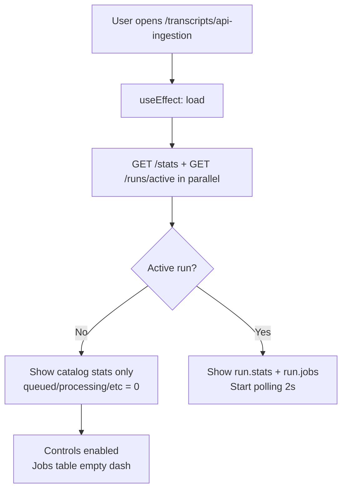
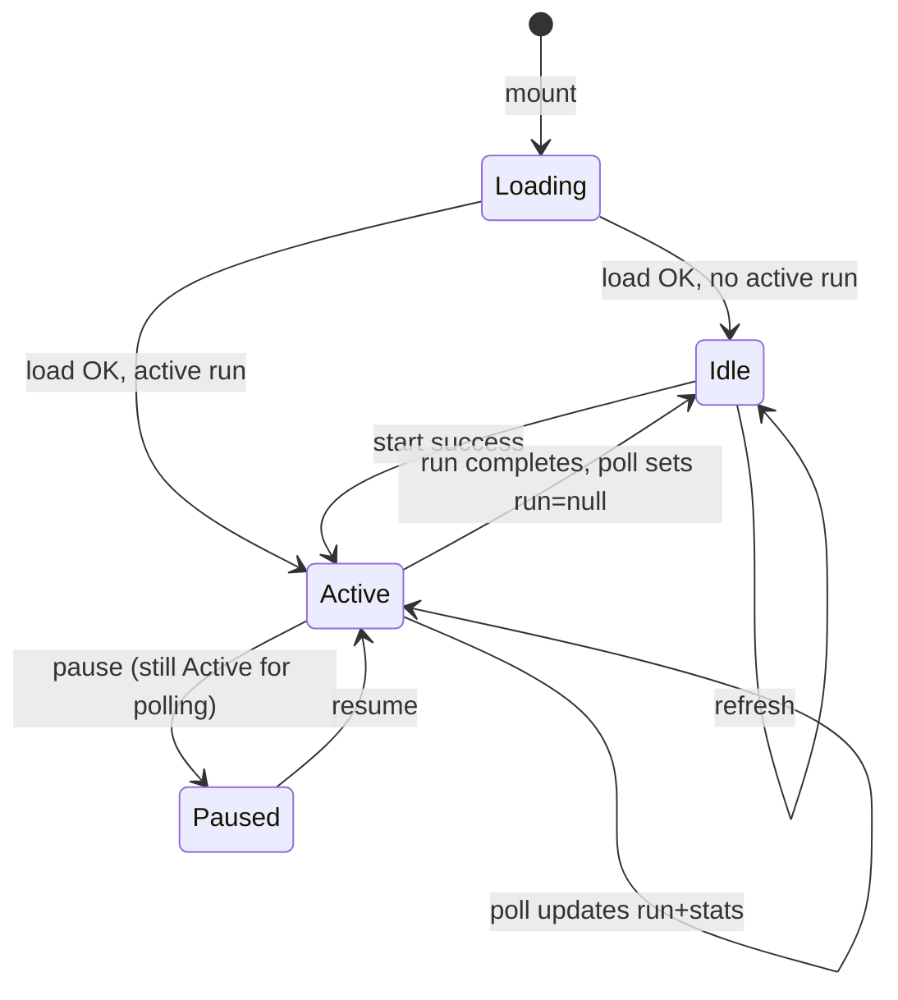

# Transcript API Ingestion — Frontend Analysis

**Status:** Analysis only — no code changes.  
**Date:** 2026-05-26  
**Route:** `/transcripts/api-ingestion`  
**Purpose:** Document current UI/UX, component map, state/polling behavior, and gaps vs a production-grade ingestion dashboard.

---

## Executive summary

| Question | Answer |
|----------|--------|
| How does the page look today? | Single-page ops dashboard: header, 9 stat tiles, 2-column layout (controls card + jobs table card) |
| Dedicated feature components? | **One** file: `api-ingestion-page.tsx` (~430 lines); route is a thin wrapper |
| Progress bar? | **No** |
| Live updates? | **Yes** — HTTP polling every **2s** while run is active |
| Counters / stats? | **Yes** — catalog counts + per-run job status counts |
| queued / processing / success / failed / unavailable visible? | **Yes** in stat tiles; **skipped_existing** too; table shows per-job status badges |
| Pause / resume UI? | **Yes** — conditional buttons when `run.status` is `running` or `paused` |
| ETA / estimated progress? | **No** |
| Transcript coverage %? | **No** — only raw `with_transcript` / `without_transcript` counts |
| Embeddings coverage %? | **No** — not on this page (see `/intelligence/health`) |
| Jobs table | Plain HTML `<table>`, 8 columns, color-coded status pills |
| Pagination / virtualization? | **No** |
| Usable for 10k+ jobs? | **No** — backend returns max **200** jobs; UI renders all rows in DOM |

**Verdict:** Solid **MVP ops panel** for runs up to ~500 jobs with manual refresh semantics. Not yet a production-scale ingestion dashboard for 10k+ rows or operator-grade observability.

---

## 1. Current page layout (visual overview)

No screenshots are checked into the repo. Below is a structural wireframe matching the implemented JSX.

```
┌─────────────────────────────────────────────────────────────────────────────┐
│ [FileText] API transcript ingestion                    [Refresh]             │
│ Fetch missing transcripts from YouTube via API — no browser or extension.  │
├─────────────────────────────────────────────────────────────────────────────┤
│ Intelligence health · Chrome extension                                        │
├─────────────────────────────────────────────────────────────────────────────┤
│ [optional red error banner]                                                   │
├─────────────────────────────────────────────────────────────────────────────┤
│ STATS GRID (responsive 2×4 on lg) — 9 StatCard tiles:                       │
│  Total | With transcript | Without | Queued | Processing | Success |         │
│  Failed | Unavailable | Skipped (existing)                                    │
├──────────────────────────────┬──────────────────────────────────────────────┤
│ CONTROLS CARD (~320px)       │ JOBS TABLE CARD (flex)                        │
│ Run status: running (#12)    │ Jobs                                          │
│ ☐ Only missing transcripts   │ [run.message as description]                  │
│ ☐ Latest videos first        │ ┌──────────────────────────────────────────┐ │
│ Creator filter [text input]  │ │ Title | Creator | Status | Chars | ...   │ │
│ Max videos [500] Workers [5] │ │ ... up to 200 rows, scroll horizontal    │ │
│ [Start] [Pause|Resume]       │ └──────────────────────────────────────────┘ │
│ [Retry failed] (conditional) │                                              │
└──────────────────────────────┴──────────────────────────────────────────────┘
```

**Layout tokens**

- Page container: `max-w-6xl`, `px-4 py-8 pb-16` (inner; root layout also adds `max-w-6xl` on `<main>`)
- Stats: `grid gap-3 sm:grid-cols-2 lg:grid-cols-4`
- Main split: `lg:grid-cols-[minmax(0,320px)_1fr]`

**Navigation discovery**

| Entry | Path |
|-------|------|
| More menu | `nav-more-menu.tsx` → `/transcripts/api-ingestion` (icon `FileUp`) |
| Command palette | `command-palette.tsx` — keys: `api ingest batch youtube transcript missing` |
| Cross-links on page | `/intelligence/health`, `/extension` |

**Not linked from:** primary top nav (Dashboard, Feed, etc.). Copilot route sync does not special-case this path (stays generic `"other"` context).

---

## 2. UI components inventory

### Feature-specific (new)

| Component | Location | Role |
|-----------|----------|------|
| `ApiIngestionPage` | `frontend/components/transcripts/api-ingestion-page.tsx` | Entire page UI + logic |
| `StatCard` | same file (inline) | Label + large number tile |
| `JobsTable` | same file (inline) | Renders job rows |
| `statusBadge()` | same file (helper) | Tailwind classes per status |
| `formatUtc()` | same file (helper) | ISO → `YYYY-MM-DD HH:mm:ss UTC` |

### Route shell

| File | Lines | Role |
|------|-------|------|
| `frontend/app/transcripts/api-ingestion/page.tsx` | 7 | `"use client"` → re-exports `ApiIngestionPage` |

### Shared design system (reused)

| Component | Path |
|-----------|------|
| `PageHeader` | `components/ui/page-header.tsx` |
| `Button` | `components/ui/button.tsx` |
| `Card`, `CardHeader`, `CardTitle`, `CardDescription`, `CardContent` | `components/ui/card.tsx` |
| Icons | `lucide-react`: `FileText`, `Loader2`, `Pause`, `Play`, `RefreshCw`, `RotateCcw` |
| `cn()` | `lib/utils.ts` |
| `useT()` | `lib/i18n` |
| `Link` | `next/link` |

### Intentionally **not** used (but exist elsewhere)

| Pattern | Where it lives | Relevance |
|---------|----------------|-----------|
| Sheets sync progress panel | `components/sync/sheets-sync-progress-panel.tsx` | Has **stage stepper**, **progress %**, elapsed time, floating panel |
| Sheets sync context | `components/sync/sheets-sync-context.tsx` | Global provider + 1.5s poll + localStorage run recovery |
| Intelligence health metrics | `app/intelligence/health/page.tsx` | **Transcript %** and **embedding %** per creator |
| `PageSkeleton` / `EmptyState` | `components/ui/` | Not used on api-ingestion page |
| Data table / virtualization | — | Not in project for this feature |

**Component count:** effectively **1 feature component file** + **1 route file**; no `components/transcripts/` subtree beyond that.

---

## 3. Current UX flow

### 3.1 First visit (idle)



1. Page mounts → `load()` fetches stats + active run.
2. User sees catalog totals (total / with / without transcript) and zeroed run counters if no active run.
3. Jobs table shows `—` (no rows).
4. Controls default: `limit=500`, `workers=5`, `onlyMissing=true`, `latestOnly=false`, empty creator filter.

### 3.2 Start ingestion

1. User configures filters → clicks **Start ingestion**.
2. `POST /runs/start` with body `{ limit, worker_count, creator_filter, latest_only, only_missing }`.
3. On success: `setRun(res.run)`, `setStats(res.run.stats)`; buttons disable per `isActive`.
4. Polling starts (run status `queued` | `running` | `paused`).
5. Stat tiles update: run job counts overlay catalog fields in `displayStats = run?.stats ?? stats`.

### 3.3 During run

- **Pause** (only when `run.status === "running"`): `POST .../pause` → polling continues but workers idle server-side; UI still polls.
- **Resume** (when `paused`): `POST .../resume` → workers rescheduled.
- **Refresh** (header): manual `load()` anytime.
- Jobs table fills with up to **200** most recently updated jobs (`updated_at DESC` on backend).

### 3.4 After completion

- When run leaves active states (`completed` | `failed`), polling **stops**.
- `fetchActiveTranscriptApiIngestionRun()` returns `null` → **`run` state is set to `null` on poll** — jobs table may **clear** even though a completed run existed.
- **Retry failed** visible if `run.stats.failed > 0` OR `run.status === "completed"` (while `run` still in React state).
- User can start a new run only when no active run on server (409 if conflict).

### 3.5 Failure paths

- Load/start/pause/resume/retry errors → red banner at top (`error` string).
- Poll errors → silently ignored (last known state kept).

---

## 4. Component / file map

```
frontend/
├── app/transcripts/api-ingestion/page.tsx          # Route entry
├── components/transcripts/api-ingestion-page.tsx   # All UI + state
├── types/transcript-api-ingestion.ts               # TS types + isApiIngestionRunActive()
├── services/api.ts                                 # 6 API functions (lines ~517–571)
├── lib/i18n/locales/en.ts                          # transcriptApiIngestion.* keys
├── lib/i18n/locales/uk.ts                          # Ukrainian copy
├── components/layout/nav-more-menu.tsx             # Nav link
└── components/command-palette/command-palette.tsx  # Palette entry

backend (frontend contract only)
├── GET  /api/v1/transcripts/api-ingestion/stats
├── GET  /api/v1/transcripts/api-ingestion/runs/active
├── GET  /api/v1/transcripts/api-ingestion/runs/{id}
├── POST /api/v1/transcripts/api-ingestion/runs/start
├── POST /api/v1/transcripts/api-ingestion/runs/{id}/pause|resume|retry-failed
└── to_run_read(..., jobs_limit=200)                # Hard cap on jobs in response
```

---

## 5. State management flow

**Pattern:** Local React state only — **no** Context, **no** Zustand, **no** React Query/SWR.

| State variable | Type | Purpose |
|----------------|------|---------|
| `stats` | `TranscriptApiIngestionStats \| null` | Last `/stats` or merged from run |
| `run` | `TranscriptApiIngestionRun \| null` | Active run + embedded `jobs[]` |
| `loading` | `boolean` | Initial load spinner |
| `error` | `string \| null` | User-visible API errors |
| `actionLoading` | `boolean` | Disables action buttons during POST |
| `limit`, `workers`, `creatorFilter`, `latestOnly`, `onlyMissing` | form | Start request parameters |

**Derived**

- `isActive = isApiIngestionRunActive(run)` → true for `queued` \| `running` \| `paused`
- `displayStats = run?.stats ?? stats` → prefers run-embedded stats when run object exists



**Gap:** When polling sees `active === null` after completion, React `run` becomes `null` → user loses jobs table and run summary unless they still have stale state from before last poll tick.

---

## 6. Polling behavior

| Aspect | Behavior |
|--------|----------|
| Trigger | `useEffect` when `run?.id` exists AND `isApiIngestionRunActive(run)` |
| Interval | **2000 ms** (`setInterval`) |
| Requests per tick | 2 sequential: `fetchActiveTranscriptApiIngestionRun()` then `fetchTranscriptApiIngestionStats()` |
| Cleanup | `cancelled` flag + `clearInterval` on unmount or when run becomes inactive |
| Error handling | Empty `catch` — no user feedback on poll failure |
| Comparison | Sheets sync uses **1500 ms** poll + dedicated context + localStorage run id recovery |

**What polling updates**

- Run status, message, `jobs` array (≤200 rows), embedded `stats` with per-run job counts.
- Global `/stats` also refreshes (catalog counts + active run job counts when server has active run).

**What polling does *not* do**

- WebSocket / SSE
- Adaptive backoff
- Partial/delta job updates
- Poll individual run by id after active clears

---

## 7. Feature checklist (detailed)

### 7.1 Progress bar

| | |
|-|-|
| **Present?** | No |
| **Alternative** | Numeric stat tiles only; no `success / jobs_total` bar, no `<progress>` element |
| **Reference** | Sheets sync has `syncRunProgressPercent()` + stage stepper UI |

### 7.2 Live updates

| | |
|-|-|
| **Present?** | Yes, conditional polling |
| **Scope** | Stats + jobs table while run active |
| **Limitation** | Stops when run completes; may clear UI when active endpoint returns null |

### 7.3 Counters / stats

**Nine `StatCard` tiles:**

| Tile | Source field | Meaning |
|------|--------------|---------|
| Total videos | `total_videos` | Full catalog size |
| With transcript | `with_transcript` | Has non-empty transcript |
| Without transcript | `without_transcript` | Missing transcript |
| Queued | `queued` | Jobs in queue (active run only) |
| Processing | `processing` | Jobs in flight |
| Success | `success` | Completed OK |
| Failed | `failed` | Errors (retryable) |
| Unavailable | `unavailable` | No YouTube transcript |
| Skipped (existing) | `skipped_existing` | Transcript already in DB |

When **no active run**, `/stats` returns catalog fields only; job counters default to **0**.

### 7.4 Job statuses in UI

| Status | Stat tile | Table badge color |
|--------|-----------|-------------------|
| `queued` | Yes | muted gray |
| `processing` | Yes | blue |
| `success` | Yes | green |
| `failed` | Yes | red |
| `unavailable` | Yes | amber |
| `skipped_existing` | Yes | purple |

Run-level statuses (`running`, `paused`, `completed`, `failed`) appear in controls card description text only — not as a dedicated run badge component.

### 7.5 Pause / resume UI

| Control | Visible when | API |
|---------|--------------|-----|
| **Pause** | `run.status === "running"` | `POST .../pause` |
| **Resume** | `run.status === "paused"` | `POST .../resume` |
| **Start** | disabled when `isActive` | `POST .../start` |
| **Retry failed** | `run && (failed > 0 \|\| status === "completed")` | `POST .../retry-failed` |

No keyboard shortcuts, no confirmation dialogs.

### 7.6 ETA / estimated progress

| | |
|-|-|
| **Present?** | No |
| **Missing** | `jobs_total`, processed count, throughput (jobs/min), `duration_seconds`, `finished_at` not shown in UI |
| **Backend has** | `jobs_total`, `duration_seconds`, `started_at`, `finished_at` on run model — unused in frontend |

### 7.7 Transcript coverage %

| | |
|-|-|
| **Present?** | **No percentage** |
| **Raw data available** | `with_transcript`, `without_transcript`, `total_videos` — user can mentally compute |
| **Better source today** | `/intelligence/health` — `transcript_pct` per creator, overview cards |

### 7.8 Embeddings coverage %

| | |
|-|-|
| **Present?** | **No** |
| **Per-job** | Table column shows `✓` or `—` for `embedding_created` only |
| **Catalog-level** | Not fetched on this page |
| **Better source** | `/intelligence/health` — `embedding_pct`, `missingEmbeddings` |

### 7.9 Jobs table

**Columns (8):**

1. **Title** — truncated `max-w-[200px]`, link to `/videos/{video_id}`
2. **Creator** — `creator_name`
3. **Status** — colored pill, raw status string
4. **Chars** — `transcript_chars` or `—`
5. **Embedding** — `✓` if `embedding_created`
6. **Sheets** — `sheets_writeback` + optional `(rows_updated)`
7. **Error** — truncated `error_message`, full text in `title` tooltip
8. **Updated** — `updated_at` as UTC string

**Table behavior**

- `min-w-[640px]` + parent `overflow-x-auto` → horizontal scroll on narrow viewports
- No sorting, filtering, column resize, row selection, bulk actions
- No status tabs (e.g. “show only failed”)
- Empty state: single `—` paragraph

### 7.10 Pagination / virtualization

| Layer | Limit |
|-------|-------|
| **Backend** | `jobs_limit=200` in `to_run_read()` — newest by `updated_at` |
| **Frontend** | Renders **all** `run.jobs` in memory — no pagination UI |
| **Virtualization** | None |

**Implication:** A run with 5,000 jobs shows at most **200** rows; remaining 4,800 are invisible. DOM would be heavy even if API returned more.

### 7.11 Usability at 10k+ jobs

| Dimension | Assessment |
|-----------|------------|
| **Enqueue 10k** | API allows `limit` up to **5000** per start; would need multiple runs for 10k+ |
| **Monitor 10k** | Stat aggregates scale OK (counts from SQL `GROUP BY`) |
| **Inspect 10k** | **Not usable** — 200-row cap + no search/filter/pagination |
| **Browser perf** | Would degrade if jobs array grew (no virtualization) |
| **Polling load** | 2 req/2s × large JSON payload if job limit increased |

**Conclusion:** Page is appropriate for **hundreds** of jobs per run, not **thousands** of visible rows.

---

## 8. API ↔ UI data contract notes

### `TranscriptApiIngestionStats` merging (backend)

`GET /stats` returns:

- Always: catalog `total_videos`, `with_transcript`, `without_transcript`
- If active run exists: overwrites `queued`…`skipped_existing` with **that run’s** job counts

Frontend displays merged object as single grid — **does not separate** “catalog” vs “this run” visually.

### Active run endpoint

`fetchActiveTranscriptApiIngestionRun()` uses raw `fetch` to allow `null` body (standard `request()` would not handle empty/null cleanly).

Returns `null` when no run in `queued|running|paused` — including after **completed** runs.

### Unused API

`fetchTranscriptApiIngestionRun(runId)` is defined in `api.ts` but **not called** by the page — no way to reload a completed run by id from UI.

---

## 9. i18n

- Namespace: `transcriptApiIngestion.*` (~45 keys)
- Locales: `en.ts`, `uk.ts`
- Nav: `nav.transcriptApiIngestion`

All user-facing strings go through `useT()` — no hardcoded English in JSX except status strings from API (`success`, `queued`, etc.) shown verbatim in badges.

---

## 10. Comparison to peer pages

| Capability | API ingestion | Intelligence health | Sheets sync |
|------------|---------------|---------------------|-------------|
| Coverage % | No | Yes (transcript, embed, comments) | No |
| Progress bar | No | No | Yes (% + stages) |
| Live poll | 2s, page-local | Manual refresh button | 1.5s, global context |
| Floating progress | No | No | Yes (panel) |
| Run recovery | No | N/A | localStorage run id |
| Historical runs | No | N/A | Last sync status |
| Table scale | 200 rows max | Creator table (~100 rows) | N/A |

---

## 11. What’s needed for a production-grade ingestion dashboard

Prioritized by impact for **10k+ / day** operations:

### P0 — Must have

1. **Run progress bar** — `processed / jobs_total` using terminal statuses; show `%` and counts.
2. **Persist completed run in UI** — after active clears, keep `runId` and fetch `GET /runs/{id}` so jobs/history don’t vanish.
3. **Paginated jobs API** — `?status=&page=&page_size=` (or cursor) instead of fixed 200 rows.
4. **Separate stat sections** — “Catalog coverage” vs “Current run” to avoid confusing merged stats.
5. **Transcript coverage %** — `with_transcript / total_videos` (+ trend delta optional).
6. **Embedding coverage %** — catalog-level `videos with transcript_embedding / with_transcript`.

### P1 — Operator experience

7. **ETA / throughput** — rolling jobs/min from `duration_seconds` + processed count.
8. **Jobs table filters** — tabs or dropdown: All | Queued | Processing | Failed | Unavailable.
9. **Virtualized table** — `@tanstack/react-virtual` or similar for large lists.
10. **Run history list** — last N runs with status, duration, success rate.
11. **Poll backoff** — e.g. 2s active → 10s paused → stop when completed.
12. **Error surfacing on poll failure** — stale indicator if API unreachable.

### P2 — Polish

13. **Dedicated progress component** — reuse patterns from `sheets-sync-progress-panel.tsx`.
14. **Export CSV** — failed/unavailable jobs for offline review.
15. **Creator autocomplete** — instead of exact-match text field.
16. **Confirmation modals** — start 5000 jobs, retry N failed.
17. **Copilot context** — route-aware hints on this page.
18. **Empty / skeleton states** — `PageSkeleton`, `EmptyState` when no runs yet.
19. **WebSocket optional** — reduce poll load for multi-operator setups.

### P3 — Observability alignment

20. Link tiles to **Intelligence health** with query params.
21. Show `full_transcript_url` / Sheets write-back warnings in expandable row detail.
22. Worker count + proxy/block status banner when `ip_blocked` failures spike.

---

## 12. P0 implementation (2026-05-26)

The following P0 items were implemented without changing extension ingest, comments, or Sheets write-back services.

### Delivered

| P0 item | Implementation |
|---------|----------------|
| Progress bar | `RunProgressPanel` — `processed/jobs_total`, `%`, queued/processing/success/failed/unavailable chips, Sheets-sync-style bar |
| Completed run persistence | `localStorage` run id + `GET /runs/{id}` when active clears; **Dismiss run** to clear view |
| Stats separation | `CatalogStatsSection` vs `RunProgressPanel` / `run_stats` |
| Coverage % | Catalog: `transcript_coverage_pct`, `embedding_coverage_pct`; Run: `success_pct`, `unavailable_pct` |
| Jobs filters + pagination | `GET /runs/{id}/jobs?status=&offset=&limit=` + filter chips + **Load more** (50/page) |
| ETA / throughput | `computeThroughput()` — jobs/min, ETA, elapsed, started_at |
| Run status badges | `RunStatusBadge` component |
| Polling | 2s while active only; terminal fetch by id; minimal state flicker |
| Operator UX | `PageSkeleton`, `EmptyState`, sticky progress when active, sticky `PageHeader` |

### New / updated files

**Backend (minimal)**

- `app/schemas/transcript_api_ingestion.py` — `CatalogCoverageStats`, `RunJobStats`, `TranscriptApiIngestionJobsPage`
- `app/services/transcripts/api_ingestion/run_service.py` — `catalog_coverage()`, `list_jobs()`, split stats
- `app/api/v1/transcript_api_ingestion.py` — `GET /runs/{id}/jobs`

**Frontend**

- `components/transcripts/api-ingestion-page.tsx` — orchestrator
- `components/transcripts/api-ingestion/catalog-stats-section.tsx`
- `components/transcripts/api-ingestion/run-progress-panel.tsx`
- `components/transcripts/api-ingestion/run-status-badge.tsx`
- `components/transcripts/api-ingestion/jobs-table-panel.tsx`
- `lib/transcript-api-ingestion-storage.ts`
- `lib/transcript-api-ingestion-metrics.ts`

### Remaining for later (not P0)

- Virtualized table (10k rows in DOM still avoided via pagination; very large “load more” lists may still be heavy)
- Run history list
- CSV export
- WebSocket / SSE

---

## 13. Related docs

- [EXTENSION_TRANSCRIPT_SHEETS_ANALYSIS.md](./EXTENSION_TRANSCRIPT_SHEETS_ANALYSIS.md) — extension + Sheets write-back (unchanged by this UI)
- Backend implementation: `backend/app/api/v1/transcript_api_ingestion.py`, `backend/app/services/transcripts/api_ingestion/`

---

## 14. Quick reference — files to read

| Concern | File |
|---------|------|
| Page orchestrator | `frontend/components/transcripts/api-ingestion-page.tsx` |
| Progress UI | `frontend/components/transcripts/api-ingestion/run-progress-panel.tsx` |
| Jobs table | `frontend/components/transcripts/api-ingestion/jobs-table-panel.tsx` |
| Route | `frontend/app/transcripts/api-ingestion/page.tsx` |
| Types | `frontend/types/transcript-api-ingestion.ts` |
| API client | `frontend/services/api.ts` |
| Jobs API | `GET /api/v1/transcripts/api-ingestion/runs/{id}/jobs` |
| Copy EN | `frontend/lib/i18n/locales/en.ts` → `transcriptApiIngestion` |
