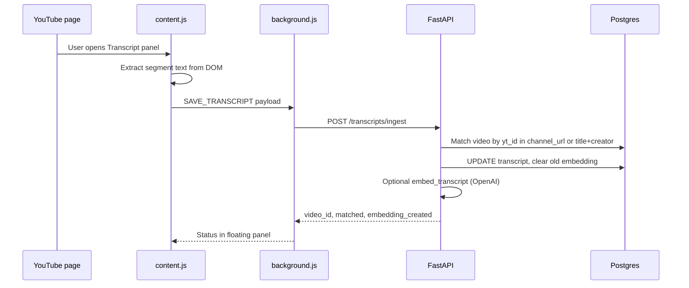

# Transcript Extension Architecture

Lightweight data enrichment for ContentGraph: browser-extracted YouTube transcripts → Postgres → optional semantic embedding. No queues, workers, or YouTube Data API for transcripts.

## Components

| Piece | Path | Role |
|-------|------|------|
| Chrome extension | `extension/` | DOM extraction, copy/export, save |
| Ingest API | `POST /api/v1/transcripts/ingest` | Match catalog video, save text, embed |
| Storage | `videos.transcript`, `videos.transcript_embedding` | Existing columns (no new migration) |
| Enrichment (batch) | `TranscriptService.enrich_missing()` | Still used after Sheets sync via `youtube-transcript-api` |

## Save flow



### Request body

```json
{
  "video_url": "https://www.youtube.com/watch?v=VIDEO_ID",
  "title": "Video title from page",
  "creator": "Channel name",
  "transcript_text": "Full plain text…"
}
```

### Matching rules

1. **YouTube video ID** from `video_url` → `videos.channel_url ILIKE '%VIDEO_ID%'` (when sheet URL contains the watch ID).
2. **Fallback**: case-insensitive `title` + `creator_name` (same row as Google Sheets sync).
3. If no row: `matched: false` — transcript is **not** stored (avoids polluting the catalog with orphan rows).

### After save

- Video intelligence (`/videos/{id}/intelligence`) and keyword search use `videos.transcript`.
- Semantic search uses `transcript_embedding` when OpenAI key is set and embed succeeds.

## Why no YouTube API (transcripts)

- **UX**: Dennis wants Glasp-like flow — transcript visible on the page, copy/export/save from what the user sees.
- **Reliability**: Official captions are often available in the UI when API/transcript-api blocks or rate-limits.
- **Scope**: No API keys in the extension, no quota billing, no OAuth for MVP.
- **Product**: Data enrichment phase, not a new ingestion platform.

Existing server-side `youtube-transcript-api` in `TranscriptService` remains for **batch** enrichment after Sheets sync; the extension is the **manual, high-quality** path when automation misses or captions differ.

## Extension UX

- Floating panel (bottom-right) on `youtube.com/watch*`
- Minimal: Extract → Copy / Export / Save
- API base configurable in extension options (default production `https://tm1.website/api/v1`)
- Saves via **service worker** `fetch` with `host_permissions` (no CORS dependency on page origin)

## Limitations (MVP)

| Limitation | Notes |
|------------|--------|
| Catalog match required | Video must exist from Sheets sync |
| DOM-dependent | YouTube UI changes may break selectors; user must open Transcript panel |
| No auth | Endpoint is open; add API key or token later if needed |
| Sheet `channel_url` often channel page | Title+creator fallback is critical |
| No auto-create videos | Unmatched saves return a clear message |
| Phase 2/3 not included | Daily stats snapshots and top comments are separate |

## Future enrichment path (not implemented)

1. **Phase 2**: Daily cron → `channel_stats_history`, `video_stats_history` (subscribers/views snapshots).
2. **Phase 3**: Top 10–20 liked comments via YouTube Data API (small batch, existing `CommentsService` pattern).
3. **Transcript**: Optional extension auth header; richer match (store `youtube_video_id` on `videos`); re-open panel if YouTube changes selectors.

## Verification checklist

- [ ] Load unpacked extension on a catalog video
- [ ] Extract + Copy works
- [ ] Save returns `video_id` when title/creator match
- [ ] `/videos/{id}` shows full transcript
- [ ] Semantic search improves as `transcript_embedding_count` grows
- [ ] Dashboard/search regression smoke (existing pytest + manual)

## API reference

```
POST /api/v1/transcripts/ingest
```

Response:

```json
{
  "video_id": 123,
  "matched": true,
  "transcript_saved": true,
  "embedding_created": true,
  "transcript_chars": 12000,
  "message": "Transcript saved to catalog video."
}
```
